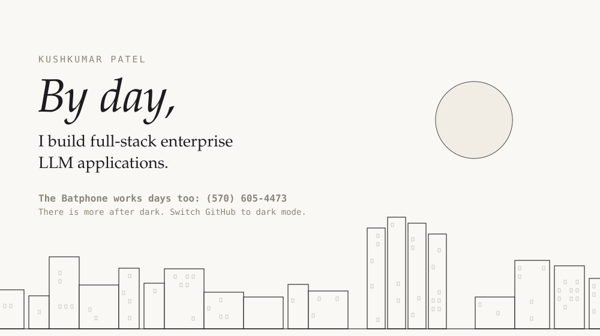

<a href="https://vlayers.ai">
  <picture>
    <source media="(prefers-color-scheme: dark)" srcset="assets/night.svg">
    
  </picture>
</a>

**[VLayer](https://vlayers.ai)** is an open SDK for production AI phone agents: `npm i @voicelayer/sdk`
**[Tuvora](https://tuvora.co)** is an IPTV player for your own playlists on phone, TV, Mac and Windows.

### The homelab

Four Lenovo M720q nodes run k3s with Argo CD and Longhorn. Everything above runs on them. Drag the rack to rotate it.

```stl
solid homelab
facet normal 0 0 -1
outer loop
vertex 0.0 0.0 0.0
vertex 0.0 14.0 0.0
vertex 14.0 14.0 0.0
endloop
endfacet
facet normal 0 0 -1
outer loop
vertex 0.0 0.0 0.0
vertex 14.0 14.0 0.0
vertex 14.0 0.0 0.0
endloop
endfacet
facet normal 0 0 1
outer loop
vertex 0.0 0.0 236.0
vertex 14.0 0.0 236.0
vertex 14.0 14.0 236.0
endloop
endfacet
facet normal 0 0 1
outer loop
vertex 0.0 0.0 236.0
vertex 14.0 14.0 236.0
vertex 0.0 14.0 236.0
endloop
endfacet
facet normal 0 -1 0
outer loop
vertex 0.0 0.0 0.0
vertex 14.0 0.0 0.0
vertex 14.0 0.0 236.0
endloop
endfacet
facet normal 0 -1 0
outer loop
vertex 0.0 0.0 0.0
vertex 14.0 0.0 236.0
vertex 0.0 0.0 236.0
endloop
endfacet
facet normal 0 1 0
outer loop
vertex 0.0 14.0 0.0
vertex 0.0 14.0 236.0
vertex 14.0 14.0 236.0
endloop
endfacet
facet normal 0 1 0
outer loop
vertex 0.0 14.0 0.0
vertex 14.0 14.0 236.0
vertex 14.0 14.0 0.0
endloop
endfacet
facet normal -1 0 0
outer loop
vertex 0.0 0.0 0.0
vertex 0.0 0.0 236.0
vertex 0.0 14.0 236.0
endloop
endfacet
facet normal -1 0 0
outer loop
vertex 0.0 0.0 0.0
vertex 0.0 14.0 236.0
vertex 0.0 14.0 0.0
endloop
endfacet
facet normal 1 0 0
outer loop
vertex 14.0 0.0 0.0
vertex 14.0 14.0 0.0
vertex 14.0 14.0 236.0
endloop
endfacet
facet normal 1 0 0
outer loop
vertex 14.0 0.0 0.0
vertex 14.0 14.0 236.0
vertex 14.0 0.0 236.0
endloop
endfacet
facet normal 0 0 -1
outer loop
vertex 0.0 186.0 0.0
vertex 0.0 200.0 0.0
vertex 14.0 200.0 0.0
endloop
endfacet
facet normal 0 0 -1
outer loop
vertex 0.0 186.0 0.0
vertex 14.0 200.0 0.0
vertex 14.0 186.0 0.0
endloop
endfacet
facet normal 0 0 1
outer loop
vertex 0.0 186.0 236.0
vertex 14.0 186.0 236.0
vertex 14.0 200.0 236.0
endloop
endfacet
facet normal 0 0 1
outer loop
vertex 0.0 186.0 236.0
vertex 14.0 200.0 236.0
vertex 0.0 200.0 236.0
endloop
endfacet
facet normal 0 -1 0
outer loop
vertex 0.0 186.0 0.0
vertex 14.0 186.0 0.0
vertex 14.0 186.0 236.0
endloop
endfacet
facet normal 0 -1 0
outer loop
vertex 0.0 186.0 0.0
vertex 14.0 186.0 236.0
vertex 0.0 186.0 236.0
endloop
endfacet
facet normal 0 1 0
outer loop
vertex 0.0 200.0 0.0
vertex 0.0 200.0 236.0
vertex 14.0 200.0 236.0
endloop
endfacet
facet normal 0 1 0
outer loop
vertex 0.0 200.0 0.0
vertex 14.0 200.0 236.0
vertex 14.0 200.0 0.0
endloop
endfacet
facet normal -1 0 0
outer loop
vertex 0.0 186.0 0.0
vertex 0.0 186.0 236.0
vertex 0.0 200.0 236.0
endloop
endfacet
facet normal -1 0 0
outer loop
vertex 0.0 186.0 0.0
vertex 0.0 200.0 236.0
vertex 0.0 200.0 0.0
endloop
endfacet
facet normal 1 0 0
outer loop
vertex 14.0 186.0 0.0
vertex 14.0 200.0 0.0
vertex 14.0 200.0 236.0
endloop
endfacet
facet normal 1 0 0
outer loop
vertex 14.0 186.0 0.0
vertex 14.0 200.0 236.0
vertex 14.0 186.0 236.0
endloop
endfacet
facet normal 0 0 -1
outer loop
vertex 240.0 0.0 0.0
vertex 240.0 14.0 0.0
vertex 254.0 14.0 0.0
endloop
endfacet
facet normal 0 0 -1
outer loop
vertex 240.0 0.0 0.0
vertex 254.0 14.0 0.0
vertex 254.0 0.0 0.0
endloop
endfacet
facet normal 0 0 1
outer loop
vertex 240.0 0.0 236.0
vertex 254.0 0.0 236.0
vertex 254.0 14.0 236.0
endloop
endfacet
facet normal 0 0 1
outer loop
vertex 240.0 0.0 236.0
vertex 254.0 14.0 236.0
vertex 240.0 14.0 236.0
endloop
endfacet
facet normal 0 -1 0
outer loop
vertex 240.0 0.0 0.0
vertex 254.0 0.0 0.0
vertex 254.0 0.0 236.0
endloop
endfacet
facet normal 0 -1 0
outer loop
vertex 240.0 0.0 0.0
vertex 254.0 0.0 236.0
vertex 240.0 0.0 236.0
endloop
endfacet
facet normal 0 1 0
outer loop
vertex 240.0 14.0 0.0
vertex 240.0 14.0 236.0
vertex 254.0 14.0 236.0
endloop
endfacet
facet normal 0 1 0
outer loop
vertex 240.0 14.0 0.0
vertex 254.0 14.0 236.0
vertex 254.0 14.0 0.0
endloop
endfacet
facet normal -1 0 0
outer loop
vertex 240.0 0.0 0.0
vertex 240.0 0.0 236.0
vertex 240.0 14.0 236.0
endloop
endfacet
facet normal -1 0 0
outer loop
vertex 240.0 0.0 0.0
vertex 240.0 14.0 236.0
vertex 240.0 14.0 0.0
endloop
endfacet
facet normal 1 0 0
outer loop
vertex 254.0 0.0 0.0
vertex 254.0 14.0 0.0
vertex 254.0 14.0 236.0
endloop
endfacet
facet normal 1 0 0
outer loop
vertex 254.0 0.0 0.0
vertex 254.0 14.0 236.0
vertex 254.0 0.0 236.0
endloop
endfacet
facet normal 0 0 -1
outer loop
vertex 240.0 186.0 0.0
vertex 240.0 200.0 0.0
vertex 254.0 200.0 0.0
endloop
endfacet
facet normal 0 0 -1
outer loop
vertex 240.0 186.0 0.0
vertex 254.0 200.0 0.0
vertex 254.0 186.0 0.0
endloop
endfacet
facet normal 0 0 1
outer loop
vertex 240.0 186.0 236.0
vertex 254.0 186.0 236.0
vertex 254.0 200.0 236.0
endloop
endfacet
facet normal 0 0 1
outer loop
vertex 240.0 186.0 236.0
vertex 254.0 200.0 236.0
vertex 240.0 200.0 236.0
endloop
endfacet
facet normal 0 -1 0
outer loop
vertex 240.0 186.0 0.0
vertex 254.0 186.0 0.0
vertex 254.0 186.0 236.0
endloop
endfacet
facet normal 0 -1 0
outer loop
vertex 240.0 186.0 0.0
vertex 254.0 186.0 236.0
vertex 240.0 186.0 236.0
endloop
endfacet
facet normal 0 1 0
outer loop
vertex 240.0 200.0 0.0
vertex 240.0 200.0 236.0
vertex 254.0 200.0 236.0
endloop
endfacet
facet normal 0 1 0
outer loop
vertex 240.0 200.0 0.0
vertex 254.0 200.0 236.0
vertex 254.0 200.0 0.0
endloop
endfacet
facet normal -1 0 0
outer loop
vertex 240.0 186.0 0.0
vertex 240.0 186.0 236.0
vertex 240.0 200.0 236.0
endloop
endfacet
facet normal -1 0 0
outer loop
vertex 240.0 186.0 0.0
vertex 240.0 200.0 236.0
vertex 240.0 200.0 0.0
endloop
endfacet
facet normal 1 0 0
outer loop
vertex 254.0 186.0 0.0
vertex 254.0 200.0 0.0
vertex 254.0 200.0 236.0
endloop
endfacet
facet normal 1 0 0
outer loop
vertex 254.0 186.0 0.0
vertex 254.0 200.0 236.0
vertex 254.0 186.0 236.0
endloop
endfacet
facet normal 0 0 -1
outer loop
vertex 0.0 0.0 0.0
vertex 0.0 200.0 0.0
vertex 254.0 200.0 0.0
endloop
endfacet
facet normal 0 0 -1
outer loop
vertex 0.0 0.0 0.0
vertex 254.0 200.0 0.0
vertex 254.0 0.0 0.0
endloop
endfacet
facet normal 0 0 1
outer loop
vertex 0.0 0.0 8.0
vertex 254.0 0.0 8.0
vertex 254.0 200.0 8.0
endloop
endfacet
facet normal 0 0 1
outer loop
vertex 0.0 0.0 8.0
vertex 254.0 200.0 8.0
vertex 0.0 200.0 8.0
endloop
endfacet
facet normal 0 -1 0
outer loop
vertex 0.0 0.0 0.0
vertex 254.0 0.0 0.0
vertex 254.0 0.0 8.0
endloop
endfacet
facet normal 0 -1 0
outer loop
vertex 0.0 0.0 0.0
vertex 254.0 0.0 8.0
vertex 0.0 0.0 8.0
endloop
endfacet
facet normal 0 1 0
outer loop
vertex 0.0 200.0 0.0
vertex 0.0 200.0 8.0
vertex 254.0 200.0 8.0
endloop
endfacet
facet normal 0 1 0
outer loop
vertex 0.0 200.0 0.0
vertex 254.0 200.0 8.0
vertex 254.0 200.0 0.0
endloop
endfacet
facet normal -1 0 0
outer loop
vertex 0.0 0.0 0.0
vertex 0.0 0.0 8.0
vertex 0.0 200.0 8.0
endloop
endfacet
facet normal -1 0 0
outer loop
vertex 0.0 0.0 0.0
vertex 0.0 200.0 8.0
vertex 0.0 200.0 0.0
endloop
endfacet
facet normal 1 0 0
outer loop
vertex 254.0 0.0 0.0
vertex 254.0 200.0 0.0
vertex 254.0 200.0 8.0
endloop
endfacet
facet normal 1 0 0
outer loop
vertex 254.0 0.0 0.0
vertex 254.0 200.0 8.0
vertex 254.0 0.0 8.0
endloop
endfacet
facet normal 0 0 -1
outer loop
vertex 0.0 0.0 228.0
vertex 0.0 200.0 228.0
vertex 254.0 200.0 228.0
endloop
endfacet
facet normal 0 0 -1
outer loop
vertex 0.0 0.0 228.0
vertex 254.0 200.0 228.0
vertex 254.0 0.0 228.0
endloop
endfacet
facet normal 0 0 1
outer loop
vertex 0.0 0.0 236.0
vertex 254.0 0.0 236.0
vertex 254.0 200.0 236.0
endloop
endfacet
facet normal 0 0 1
outer loop
vertex 0.0 0.0 236.0
vertex 254.0 200.0 236.0
vertex 0.0 200.0 236.0
endloop
endfacet
facet normal 0 -1 0
outer loop
vertex 0.0 0.0 228.0
vertex 254.0 0.0 228.0
vertex 254.0 0.0 236.0
endloop
endfacet
facet normal 0 -1 0
outer loop
vertex 0.0 0.0 228.0
vertex 254.0 0.0 236.0
vertex 0.0 0.0 236.0
endloop
endfacet
facet normal 0 1 0
outer loop
vertex 0.0 200.0 228.0
vertex 0.0 200.0 236.0
vertex 254.0 200.0 236.0
endloop
endfacet
facet normal 0 1 0
outer loop
vertex 0.0 200.0 228.0
vertex 254.0 200.0 236.0
vertex 254.0 200.0 228.0
endloop
endfacet
facet normal -1 0 0
outer loop
vertex 0.0 0.0 228.0
vertex 0.0 0.0 236.0
vertex 0.0 200.0 236.0
endloop
endfacet
facet normal -1 0 0
outer loop
vertex 0.0 0.0 228.0
vertex 0.0 200.0 236.0
vertex 0.0 200.0 228.0
endloop
endfacet
facet normal 1 0 0
outer loop
vertex 254.0 0.0 228.0
vertex 254.0 200.0 228.0
vertex 254.0 200.0 236.0
endloop
endfacet
facet normal 1 0 0
outer loop
vertex 254.0 0.0 228.0
vertex 254.0 200.0 236.0
vertex 254.0 0.0 236.0
endloop
endfacet
facet normal 0 0 -1
outer loop
vertex -4.0 -3.0 16.0
vertex -4.0 0.0 16.0
vertex 0.0 0.0 16.0
endloop
endfacet
facet normal 0 0 -1
outer loop
vertex -4.0 -3.0 16.0
vertex 0.0 0.0 16.0
vertex 0.0 -3.0 16.0
endloop
endfacet
facet normal 0 0 1
outer loop
vertex -4.0 -3.0 20.0
vertex 0.0 -3.0 20.0
vertex 0.0 0.0 20.0
endloop
endfacet
facet normal 0 0 1
outer loop
vertex -4.0 -3.0 20.0
vertex 0.0 0.0 20.0
vertex -4.0 0.0 20.0
endloop
endfacet
facet normal 0 -1 0
outer loop
vertex -4.0 -3.0 16.0
vertex 0.0 -3.0 16.0
vertex 0.0 -3.0 20.0
endloop
endfacet
facet normal 0 -1 0
outer loop
vertex -4.0 -3.0 16.0
vertex 0.0 -3.0 20.0
vertex -4.0 -3.0 20.0
endloop
endfacet
facet normal 0 1 0
outer loop
vertex -4.0 0.0 16.0
vertex -4.0 0.0 20.0
vertex 0.0 0.0 20.0
endloop
endfacet
facet normal 0 1 0
outer loop
vertex -4.0 0.0 16.0
vertex 0.0 0.0 20.0
vertex 0.0 0.0 16.0
endloop
endfacet
facet normal -1 0 0
outer loop
vertex -4.0 -3.0 16.0
vertex -4.0 -3.0 20.0
vertex -4.0 0.0 20.0
endloop
endfacet
facet normal -1 0 0
outer loop
vertex -4.0 -3.0 16.0
vertex -4.0 0.0 20.0
vertex -4.0 0.0 16.0
endloop
endfacet
facet normal 1 0 0
outer loop
vertex 0.0 -3.0 16.0
vertex 0.0 0.0 16.0
vertex 0.0 0.0 20.0
endloop
endfacet
facet normal 1 0 0
outer loop
vertex 0.0 -3.0 16.0
vertex 0.0 0.0 20.0
vertex 0.0 -3.0 20.0
endloop
endfacet
facet normal 0 0 -1
outer loop
vertex 254.0 -3.0 16.0
vertex 254.0 0.0 16.0
vertex 258.0 0.0 16.0
endloop
endfacet
facet normal 0 0 -1
outer loop
vertex 254.0 -3.0 16.0
vertex 258.0 0.0 16.0
vertex 258.0 -3.0 16.0
endloop
endfacet
facet normal 0 0 1
outer loop
vertex 254.0 -3.0 20.0
vertex 258.0 -3.0 20.0
vertex 258.0 0.0 20.0
endloop
endfacet
facet normal 0 0 1
outer loop
vertex 254.0 -3.0 20.0
vertex 258.0 0.0 20.0
vertex 254.0 0.0 20.0
endloop
endfacet
facet normal 0 -1 0
outer loop
vertex 254.0 -3.0 16.0
vertex 258.0 -3.0 16.0
vertex 258.0 -3.0 20.0
endloop
endfacet
facet normal 0 -1 0
outer loop
vertex 254.0 -3.0 16.0
vertex 258.0 -3.0 20.0
vertex 254.0 -3.0 20.0
endloop
endfacet
facet normal 0 1 0
outer loop
vertex 254.0 0.0 16.0
vertex 254.0 0.0 20.0
vertex 258.0 0.0 20.0
endloop
endfacet
facet normal 0 1 0
outer loop
vertex 254.0 0.0 16.0
vertex 258.0 0.0 20.0
vertex 258.0 0.0 16.0
endloop
endfacet
facet normal -1 0 0
outer loop
vertex 254.0 -3.0 16.0
vertex 254.0 -3.0 20.0
vertex 254.0 0.0 20.0
endloop
endfacet
facet normal -1 0 0
outer loop
vertex 254.0 -3.0 16.0
vertex 254.0 0.0 20.0
vertex 254.0 0.0 16.0
endloop
endfacet
facet normal 1 0 0
outer loop
vertex 258.0 -3.0 16.0
vertex 258.0 0.0 16.0
vertex 258.0 0.0 20.0
endloop
endfacet
facet normal 1 0 0
outer loop
vertex 258.0 -3.0 16.0
vertex 258.0 0.0 20.0
vertex 258.0 -3.0 20.0
endloop
endfacet
facet normal 0 0 -1
outer loop
vertex -4.0 -3.0 41.5
vertex -4.0 0.0 41.5
vertex 0.0 0.0 41.5
endloop
endfacet
facet normal 0 0 -1
outer loop
vertex -4.0 -3.0 41.5
vertex 0.0 0.0 41.5
vertex 0.0 -3.0 41.5
endloop
endfacet
facet normal 0 0 1
outer loop
vertex -4.0 -3.0 45.5
vertex 0.0 -3.0 45.5
vertex 0.0 0.0 45.5
endloop
endfacet
facet normal 0 0 1
outer loop
vertex -4.0 -3.0 45.5
vertex 0.0 0.0 45.5
vertex -4.0 0.0 45.5
endloop
endfacet
facet normal 0 -1 0
outer loop
vertex -4.0 -3.0 41.5
vertex 0.0 -3.0 41.5
vertex 0.0 -3.0 45.5
endloop
endfacet
facet normal 0 -1 0
outer loop
vertex -4.0 -3.0 41.5
vertex 0.0 -3.0 45.5
vertex -4.0 -3.0 45.5
endloop
endfacet
facet normal 0 1 0
outer loop
vertex -4.0 0.0 41.5
vertex -4.0 0.0 45.5
vertex 0.0 0.0 45.5
endloop
endfacet
facet normal 0 1 0
outer loop
vertex -4.0 0.0 41.5
vertex 0.0 0.0 45.5
vertex 0.0 0.0 41.5
endloop
endfacet
facet normal -1 0 0
outer loop
vertex -4.0 -3.0 41.5
vertex -4.0 -3.0 45.5
vertex -4.0 0.0 45.5
endloop
endfacet
facet normal -1 0 0
outer loop
vertex -4.0 -3.0 41.5
vertex -4.0 0.0 45.5
vertex -4.0 0.0 41.5
endloop
endfacet
facet normal 1 0 0
outer loop
vertex 0.0 -3.0 41.5
vertex 0.0 0.0 41.5
vertex 0.0 0.0 45.5
endloop
endfacet
facet normal 1 0 0
outer loop
vertex 0.0 -3.0 41.5
vertex 0.0 0.0 45.5
vertex 0.0 -3.0 45.5
endloop
endfacet
facet normal 0 0 -1
outer loop
vertex 254.0 -3.0 41.5
vertex 254.0 0.0 41.5
vertex 258.0 0.0 41.5
endloop
endfacet
facet normal 0 0 -1
outer loop
vertex 254.0 -3.0 41.5
vertex 258.0 0.0 41.5
vertex 258.0 -3.0 41.5
endloop
endfacet
facet normal 0 0 1
outer loop
vertex 254.0 -3.0 45.5
vertex 258.0 -3.0 45.5
vertex 258.0 0.0 45.5
endloop
endfacet
facet normal 0 0 1
outer loop
vertex 254.0 -3.0 45.5
vertex 258.0 0.0 45.5
vertex 254.0 0.0 45.5
endloop
endfacet
facet normal 0 -1 0
outer loop
vertex 254.0 -3.0 41.5
vertex 258.0 -3.0 41.5
vertex 258.0 -3.0 45.5
endloop
endfacet
facet normal 0 -1 0
outer loop
vertex 254.0 -3.0 41.5
vertex 258.0 -3.0 45.5
vertex 254.0 -3.0 45.5
endloop
endfacet
facet normal 0 1 0
outer loop
vertex 254.0 0.0 41.5
vertex 254.0 0.0 45.5
vertex 258.0 0.0 45.5
endloop
endfacet
facet normal 0 1 0
outer loop
vertex 254.0 0.0 41.5
vertex 258.0 0.0 45.5
vertex 258.0 0.0 41.5
endloop
endfacet
facet normal -1 0 0
outer loop
vertex 254.0 -3.0 41.5
vertex 254.0 -3.0 45.5
vertex 254.0 0.0 45.5
endloop
endfacet
facet normal -1 0 0
outer loop
vertex 254.0 -3.0 41.5
vertex 254.0 0.0 45.5
vertex 254.0 0.0 41.5
endloop
endfacet
facet normal 1 0 0
outer loop
vertex 258.0 -3.0 41.5
vertex 258.0 0.0 41.5
vertex 258.0 0.0 45.5
endloop
endfacet
facet normal 1 0 0
outer loop
vertex 258.0 -3.0 41.5
vertex 258.0 0.0 45.5
vertex 258.0 -3.0 45.5
endloop
endfacet
facet normal 0 0 -1
outer loop
vertex -4.0 -3.0 67.0
vertex -4.0 0.0 67.0
vertex 0.0 0.0 67.0
endloop
endfacet
facet normal 0 0 -1
outer loop
vertex -4.0 -3.0 67.0
vertex 0.0 0.0 67.0
vertex 0.0 -3.0 67.0
endloop
endfacet
facet normal 0 0 1
outer loop
vertex -4.0 -3.0 71.0
vertex 0.0 -3.0 71.0
vertex 0.0 0.0 71.0
endloop
endfacet
facet normal 0 0 1
outer loop
vertex -4.0 -3.0 71.0
vertex 0.0 0.0 71.0
vertex -4.0 0.0 71.0
endloop
endfacet
facet normal 0 -1 0
outer loop
vertex -4.0 -3.0 67.0
vertex 0.0 -3.0 67.0
vertex 0.0 -3.0 71.0
endloop
endfacet
facet normal 0 -1 0
outer loop
vertex -4.0 -3.0 67.0
vertex 0.0 -3.0 71.0
vertex -4.0 -3.0 71.0
endloop
endfacet
facet normal 0 1 0
outer loop
vertex -4.0 0.0 67.0
vertex -4.0 0.0 71.0
vertex 0.0 0.0 71.0
endloop
endfacet
facet normal 0 1 0
outer loop
vertex -4.0 0.0 67.0
vertex 0.0 0.0 71.0
vertex 0.0 0.0 67.0
endloop
endfacet
facet normal -1 0 0
outer loop
vertex -4.0 -3.0 67.0
vertex -4.0 -3.0 71.0
vertex -4.0 0.0 71.0
endloop
endfacet
facet normal -1 0 0
outer loop
vertex -4.0 -3.0 67.0
vertex -4.0 0.0 71.0
vertex -4.0 0.0 67.0
endloop
endfacet
facet normal 1 0 0
outer loop
vertex 0.0 -3.0 67.0
vertex 0.0 0.0 67.0
vertex 0.0 0.0 71.0
endloop
endfacet
facet normal 1 0 0
outer loop
vertex 0.0 -3.0 67.0
vertex 0.0 0.0 71.0
vertex 0.0 -3.0 71.0
endloop
endfacet
facet normal 0 0 -1
outer loop
vertex 254.0 -3.0 67.0
vertex 254.0 0.0 67.0
vertex 258.0 0.0 67.0
endloop
endfacet
facet normal 0 0 -1
outer loop
vertex 254.0 -3.0 67.0
vertex 258.0 0.0 67.0
vertex 258.0 -3.0 67.0
endloop
endfacet
facet normal 0 0 1
outer loop
vertex 254.0 -3.0 71.0
vertex 258.0 -3.0 71.0
vertex 258.0 0.0 71.0
endloop
endfacet
facet normal 0 0 1
outer loop
vertex 254.0 -3.0 71.0
vertex 258.0 0.0 71.0
vertex 254.0 0.0 71.0
endloop
endfacet
facet normal 0 -1 0
outer loop
vertex 254.0 -3.0 67.0
vertex 258.0 -3.0 67.0
vertex 258.0 -3.0 71.0
endloop
endfacet
facet normal 0 -1 0
outer loop
vertex 254.0 -3.0 67.0
vertex 258.0 -3.0 71.0
vertex 254.0 -3.0 71.0
endloop
endfacet
facet normal 0 1 0
outer loop
vertex 254.0 0.0 67.0
vertex 254.0 0.0 71.0
vertex 258.0 0.0 71.0
endloop
endfacet
facet normal 0 1 0
outer loop
vertex 254.0 0.0 67.0
vertex 258.0 0.0 71.0
vertex 258.0 0.0 67.0
endloop
endfacet
facet normal -1 0 0
outer loop
vertex 254.0 -3.0 67.0
vertex 254.0 -3.0 71.0
vertex 254.0 0.0 71.0
endloop
endfacet
facet normal -1 0 0
outer loop
vertex 254.0 -3.0 67.0
vertex 254.0 0.0 71.0
vertex 254.0 0.0 67.0
endloop
endfacet
facet normal 1 0 0
outer loop
vertex 258.0 -3.0 67.0
vertex 258.0 0.0 67.0
vertex 258.0 0.0 71.0
endloop
endfacet
facet normal 1 0 0
outer loop
vertex 258.0 -3.0 67.0
vertex 258.0 0.0 71.0
vertex 258.0 -3.0 71.0
endloop
endfacet
facet normal 0 0 -1
outer loop
vertex -4.0 -3.0 92.5
vertex -4.0 0.0 92.5
vertex 0.0 0.0 92.5
endloop
endfacet
facet normal 0 0 -1
outer loop
vertex -4.0 -3.0 92.5
vertex 0.0 0.0 92.5
vertex 0.0 -3.0 92.5
endloop
endfacet
facet normal 0 0 1
outer loop
vertex -4.0 -3.0 96.5
vertex 0.0 -3.0 96.5
vertex 0.0 0.0 96.5
endloop
endfacet
facet normal 0 0 1
outer loop
vertex -4.0 -3.0 96.5
vertex 0.0 0.0 96.5
vertex -4.0 0.0 96.5
endloop
endfacet
facet normal 0 -1 0
outer loop
vertex -4.0 -3.0 92.5
vertex 0.0 -3.0 92.5
vertex 0.0 -3.0 96.5
endloop
endfacet
facet normal 0 -1 0
outer loop
vertex -4.0 -3.0 92.5
vertex 0.0 -3.0 96.5
vertex -4.0 -3.0 96.5
endloop
endfacet
facet normal 0 1 0
outer loop
vertex -4.0 0.0 92.5
vertex -4.0 0.0 96.5
vertex 0.0 0.0 96.5
endloop
endfacet
facet normal 0 1 0
outer loop
vertex -4.0 0.0 92.5
vertex 0.0 0.0 96.5
vertex 0.0 0.0 92.5
endloop
endfacet
facet normal -1 0 0
outer loop
vertex -4.0 -3.0 92.5
vertex -4.0 -3.0 96.5
vertex -4.0 0.0 96.5
endloop
endfacet
facet normal -1 0 0
outer loop
vertex -4.0 -3.0 92.5
vertex -4.0 0.0 96.5
vertex -4.0 0.0 92.5
endloop
endfacet
facet normal 1 0 0
outer loop
vertex 0.0 -3.0 92.5
vertex 0.0 0.0 92.5
vertex 0.0 0.0 96.5
endloop
endfacet
facet normal 1 0 0
outer loop
vertex 0.0 -3.0 92.5
vertex 0.0 0.0 96.5
vertex 0.0 -3.0 96.5
endloop
endfacet
facet normal 0 0 -1
outer loop
vertex 254.0 -3.0 92.5
vertex 254.0 0.0 92.5
vertex 258.0 0.0 92.5
endloop
endfacet
facet normal 0 0 -1
outer loop
vertex 254.0 -3.0 92.5
vertex 258.0 0.0 92.5
vertex 258.0 -3.0 92.5
endloop
endfacet
facet normal 0 0 1
outer loop
vertex 254.0 -3.0 96.5
vertex 258.0 -3.0 96.5
vertex 258.0 0.0 96.5
endloop
endfacet
facet normal 0 0 1
outer loop
vertex 254.0 -3.0 96.5
vertex 258.0 0.0 96.5
vertex 254.0 0.0 96.5
endloop
endfacet
facet normal 0 -1 0
outer loop
vertex 254.0 -3.0 92.5
vertex 258.0 -3.0 92.5
vertex 258.0 -3.0 96.5
endloop
endfacet
facet normal 0 -1 0
outer loop
vertex 254.0 -3.0 92.5
vertex 258.0 -3.0 96.5
vertex 254.0 -3.0 96.5
endloop
endfacet
facet normal 0 1 0
outer loop
vertex 254.0 0.0 92.5
vertex 254.0 0.0 96.5
vertex 258.0 0.0 96.5
endloop
endfacet
facet normal 0 1 0
outer loop
vertex 254.0 0.0 92.5
vertex 258.0 0.0 96.5
vertex 258.0 0.0 92.5
endloop
endfacet
facet normal -1 0 0
outer loop
vertex 254.0 -3.0 92.5
vertex 254.0 -3.0 96.5
vertex 254.0 0.0 96.5
endloop
endfacet
facet normal -1 0 0
outer loop
vertex 254.0 -3.0 92.5
vertex 254.0 0.0 96.5
vertex 254.0 0.0 92.5
endloop
endfacet
facet normal 1 0 0
outer loop
vertex 258.0 -3.0 92.5
vertex 258.0 0.0 92.5
vertex 258.0 0.0 96.5
endloop
endfacet
facet normal 1 0 0
outer loop
vertex 258.0 -3.0 92.5
vertex 258.0 0.0 96.5
vertex 258.0 -3.0 96.5
endloop
endfacet
facet normal 0 0 -1
outer loop
vertex -4.0 -3.0 118.0
vertex -4.0 0.0 118.0
vertex 0.0 0.0 118.0
endloop
endfacet
facet normal 0 0 -1
outer loop
vertex -4.0 -3.0 118.0
vertex 0.0 0.0 118.0
vertex 0.0 -3.0 118.0
endloop
endfacet
facet normal 0 0 1
outer loop
vertex -4.0 -3.0 122.0
vertex 0.0 -3.0 122.0
vertex 0.0 0.0 122.0
endloop
endfacet
facet normal 0 0 1
outer loop
vertex -4.0 -3.0 122.0
vertex 0.0 0.0 122.0
vertex -4.0 0.0 122.0
endloop
endfacet
facet normal 0 -1 0
outer loop
vertex -4.0 -3.0 118.0
vertex 0.0 -3.0 118.0
vertex 0.0 -3.0 122.0
endloop
endfacet
facet normal 0 -1 0
outer loop
vertex -4.0 -3.0 118.0
vertex 0.0 -3.0 122.0
vertex -4.0 -3.0 122.0
endloop
endfacet
facet normal 0 1 0
outer loop
vertex -4.0 0.0 118.0
vertex -4.0 0.0 122.0
vertex 0.0 0.0 122.0
endloop
endfacet
facet normal 0 1 0
outer loop
vertex -4.0 0.0 118.0
vertex 0.0 0.0 122.0
vertex 0.0 0.0 118.0
endloop
endfacet
facet normal -1 0 0
outer loop
vertex -4.0 -3.0 118.0
vertex -4.0 -3.0 122.0
vertex -4.0 0.0 122.0
endloop
endfacet
facet normal -1 0 0
outer loop
vertex -4.0 -3.0 118.0
vertex -4.0 0.0 122.0
vertex -4.0 0.0 118.0
endloop
endfacet
facet normal 1 0 0
outer loop
vertex 0.0 -3.0 118.0
vertex 0.0 0.0 118.0
vertex 0.0 0.0 122.0
endloop
endfacet
facet normal 1 0 0
outer loop
vertex 0.0 -3.0 118.0
vertex 0.0 0.0 122.0
vertex 0.0 -3.0 122.0
endloop
endfacet
facet normal 0 0 -1
outer loop
vertex 254.0 -3.0 118.0
vertex 254.0 0.0 118.0
vertex 258.0 0.0 118.0
endloop
endfacet
facet normal 0 0 -1
outer loop
vertex 254.0 -3.0 118.0
vertex 258.0 0.0 118.0
vertex 258.0 -3.0 118.0
endloop
endfacet
facet normal 0 0 1
outer loop
vertex 254.0 -3.0 122.0
vertex 258.0 -3.0 122.0
vertex 258.0 0.0 122.0
endloop
endfacet
facet normal 0 0 1
outer loop
vertex 254.0 -3.0 122.0
vertex 258.0 0.0 122.0
vertex 254.0 0.0 122.0
endloop
endfacet
facet normal 0 -1 0
outer loop
vertex 254.0 -3.0 118.0
vertex 258.0 -3.0 118.0
vertex 258.0 -3.0 122.0
endloop
endfacet
facet normal 0 -1 0
outer loop
vertex 254.0 -3.0 118.0
vertex 258.0 -3.0 122.0
vertex 254.0 -3.0 122.0
endloop
endfacet
facet normal 0 1 0
outer loop
vertex 254.0 0.0 118.0
vertex 254.0 0.0 122.0
vertex 258.0 0.0 122.0
endloop
endfacet
facet normal 0 1 0
outer loop
vertex 254.0 0.0 118.0
vertex 258.0 0.0 122.0
vertex 258.0 0.0 118.0
endloop
endfacet
facet normal -1 0 0
outer loop
vertex 254.0 -3.0 118.0
vertex 254.0 -3.0 122.0
vertex 254.0 0.0 122.0
endloop
endfacet
facet normal -1 0 0
outer loop
vertex 254.0 -3.0 118.0
vertex 254.0 0.0 122.0
vertex 254.0 0.0 118.0
endloop
endfacet
facet normal 1 0 0
outer loop
vertex 258.0 -3.0 118.0
vertex 258.0 0.0 118.0
vertex 258.0 0.0 122.0
endloop
endfacet
facet normal 1 0 0
outer loop
vertex 258.0 -3.0 118.0
vertex 258.0 0.0 122.0
vertex 258.0 -3.0 122.0
endloop
endfacet
facet normal 0 0 -1
outer loop
vertex -4.0 -3.0 143.5
vertex -4.0 0.0 143.5
vertex 0.0 0.0 143.5
endloop
endfacet
facet normal 0 0 -1
outer loop
vertex -4.0 -3.0 143.5
vertex 0.0 0.0 143.5
vertex 0.0 -3.0 143.5
endloop
endfacet
facet normal 0 0 1
outer loop
vertex -4.0 -3.0 147.5
vertex 0.0 -3.0 147.5
vertex 0.0 0.0 147.5
endloop
endfacet
facet normal 0 0 1
outer loop
vertex -4.0 -3.0 147.5
vertex 0.0 0.0 147.5
vertex -4.0 0.0 147.5
endloop
endfacet
facet normal 0 -1 0
outer loop
vertex -4.0 -3.0 143.5
vertex 0.0 -3.0 143.5
vertex 0.0 -3.0 147.5
endloop
endfacet
facet normal 0 -1 0
outer loop
vertex -4.0 -3.0 143.5
vertex 0.0 -3.0 147.5
vertex -4.0 -3.0 147.5
endloop
endfacet
facet normal 0 1 0
outer loop
vertex -4.0 0.0 143.5
vertex -4.0 0.0 147.5
vertex 0.0 0.0 147.5
endloop
endfacet
facet normal 0 1 0
outer loop
vertex -4.0 0.0 143.5
vertex 0.0 0.0 147.5
vertex 0.0 0.0 143.5
endloop
endfacet
facet normal -1 0 0
outer loop
vertex -4.0 -3.0 143.5
vertex -4.0 -3.0 147.5
vertex -4.0 0.0 147.5
endloop
endfacet
facet normal -1 0 0
outer loop
vertex -4.0 -3.0 143.5
vertex -4.0 0.0 147.5
vertex -4.0 0.0 143.5
endloop
endfacet
facet normal 1 0 0
outer loop
vertex 0.0 -3.0 143.5
vertex 0.0 0.0 143.5
vertex 0.0 0.0 147.5
endloop
endfacet
facet normal 1 0 0
outer loop
vertex 0.0 -3.0 143.5
vertex 0.0 0.0 147.5
vertex 0.0 -3.0 147.5
endloop
endfacet
facet normal 0 0 -1
outer loop
vertex 254.0 -3.0 143.5
vertex 254.0 0.0 143.5
vertex 258.0 0.0 143.5
endloop
endfacet
facet normal 0 0 -1
outer loop
vertex 254.0 -3.0 143.5
vertex 258.0 0.0 143.5
vertex 258.0 -3.0 143.5
endloop
endfacet
facet normal 0 0 1
outer loop
vertex 254.0 -3.0 147.5
vertex 258.0 -3.0 147.5
vertex 258.0 0.0 147.5
endloop
endfacet
facet normal 0 0 1
outer loop
vertex 254.0 -3.0 147.5
vertex 258.0 0.0 147.5
vertex 254.0 0.0 147.5
endloop
endfacet
facet normal 0 -1 0
outer loop
vertex 254.0 -3.0 143.5
vertex 258.0 -3.0 143.5
vertex 258.0 -3.0 147.5
endloop
endfacet
facet normal 0 -1 0
outer loop
vertex 254.0 -3.0 143.5
vertex 258.0 -3.0 147.5
vertex 254.0 -3.0 147.5
endloop
endfacet
facet normal 0 1 0
outer loop
vertex 254.0 0.0 143.5
vertex 254.0 0.0 147.5
vertex 258.0 0.0 147.5
endloop
endfacet
facet normal 0 1 0
outer loop
vertex 254.0 0.0 143.5
vertex 258.0 0.0 147.5
vertex 258.0 0.0 143.5
endloop
endfacet
facet normal -1 0 0
outer loop
vertex 254.0 -3.0 143.5
vertex 254.0 -3.0 147.5
vertex 254.0 0.0 147.5
endloop
endfacet
facet normal -1 0 0
outer loop
vertex 254.0 -3.0 143.5
vertex 254.0 0.0 147.5
vertex 254.0 0.0 143.5
endloop
endfacet
facet normal 1 0 0
outer loop
vertex 258.0 -3.0 143.5
vertex 258.0 0.0 143.5
vertex 258.0 0.0 147.5
endloop
endfacet
facet normal 1 0 0
outer loop
vertex 258.0 -3.0 143.5
vertex 258.0 0.0 147.5
vertex 258.0 -3.0 147.5
endloop
endfacet
facet normal 0 0 -1
outer loop
vertex -4.0 -3.0 169.0
vertex -4.0 0.0 169.0
vertex 0.0 0.0 169.0
endloop
endfacet
facet normal 0 0 -1
outer loop
vertex -4.0 -3.0 169.0
vertex 0.0 0.0 169.0
vertex 0.0 -3.0 169.0
endloop
endfacet
facet normal 0 0 1
outer loop
vertex -4.0 -3.0 173.0
vertex 0.0 -3.0 173.0
vertex 0.0 0.0 173.0
endloop
endfacet
facet normal 0 0 1
outer loop
vertex -4.0 -3.0 173.0
vertex 0.0 0.0 173.0
vertex -4.0 0.0 173.0
endloop
endfacet
facet normal 0 -1 0
outer loop
vertex -4.0 -3.0 169.0
vertex 0.0 -3.0 169.0
vertex 0.0 -3.0 173.0
endloop
endfacet
facet normal 0 -1 0
outer loop
vertex -4.0 -3.0 169.0
vertex 0.0 -3.0 173.0
vertex -4.0 -3.0 173.0
endloop
endfacet
facet normal 0 1 0
outer loop
vertex -4.0 0.0 169.0
vertex -4.0 0.0 173.0
vertex 0.0 0.0 173.0
endloop
endfacet
facet normal 0 1 0
outer loop
vertex -4.0 0.0 169.0
vertex 0.0 0.0 173.0
vertex 0.0 0.0 169.0
endloop
endfacet
facet normal -1 0 0
outer loop
vertex -4.0 -3.0 169.0
vertex -4.0 -3.0 173.0
vertex -4.0 0.0 173.0
endloop
endfacet
facet normal -1 0 0
outer loop
vertex -4.0 -3.0 169.0
vertex -4.0 0.0 173.0
vertex -4.0 0.0 169.0
endloop
endfacet
facet normal 1 0 0
outer loop
vertex 0.0 -3.0 169.0
vertex 0.0 0.0 169.0
vertex 0.0 0.0 173.0
endloop
endfacet
facet normal 1 0 0
outer loop
vertex 0.0 -3.0 169.0
vertex 0.0 0.0 173.0
vertex 0.0 -3.0 173.0
endloop
endfacet
facet normal 0 0 -1
outer loop
vertex 254.0 -3.0 169.0
vertex 254.0 0.0 169.0
vertex 258.0 0.0 169.0
endloop
endfacet
facet normal 0 0 -1
outer loop
vertex 254.0 -3.0 169.0
vertex 258.0 0.0 169.0
vertex 258.0 -3.0 169.0
endloop
endfacet
facet normal 0 0 1
outer loop
vertex 254.0 -3.0 173.0
vertex 258.0 -3.0 173.0
vertex 258.0 0.0 173.0
endloop
endfacet
facet normal 0 0 1
outer loop
vertex 254.0 -3.0 173.0
vertex 258.0 0.0 173.0
vertex 254.0 0.0 173.0
endloop
endfacet
facet normal 0 -1 0
outer loop
vertex 254.0 -3.0 169.0
vertex 258.0 -3.0 169.0
vertex 258.0 -3.0 173.0
endloop
endfacet
facet normal 0 -1 0
outer loop
vertex 254.0 -3.0 169.0
vertex 258.0 -3.0 173.0
vertex 254.0 -3.0 173.0
endloop
endfacet
facet normal 0 1 0
outer loop
vertex 254.0 0.0 169.0
vertex 254.0 0.0 173.0
vertex 258.0 0.0 173.0
endloop
endfacet
facet normal 0 1 0
outer loop
vertex 254.0 0.0 169.0
vertex 258.0 0.0 173.0
vertex 258.0 0.0 169.0
endloop
endfacet
facet normal -1 0 0
outer loop
vertex 254.0 -3.0 169.0
vertex 254.0 -3.0 173.0
vertex 254.0 0.0 173.0
endloop
endfacet
facet normal -1 0 0
outer loop
vertex 254.0 -3.0 169.0
vertex 254.0 0.0 173.0
vertex 254.0 0.0 169.0
endloop
endfacet
facet normal 1 0 0
outer loop
vertex 258.0 -3.0 169.0
vertex 258.0 0.0 169.0
vertex 258.0 0.0 173.0
endloop
endfacet
facet normal 1 0 0
outer loop
vertex 258.0 -3.0 169.0
vertex 258.0 0.0 173.0
vertex 258.0 -3.0 173.0
endloop
endfacet
facet normal 0 0 -1
outer loop
vertex -4.0 -3.0 194.5
vertex -4.0 0.0 194.5
vertex 0.0 0.0 194.5
endloop
endfacet
facet normal 0 0 -1
outer loop
vertex -4.0 -3.0 194.5
vertex 0.0 0.0 194.5
vertex 0.0 -3.0 194.5
endloop
endfacet
facet normal 0 0 1
outer loop
vertex -4.0 -3.0 198.5
vertex 0.0 -3.0 198.5
vertex 0.0 0.0 198.5
endloop
endfacet
facet normal 0 0 1
outer loop
vertex -4.0 -3.0 198.5
vertex 0.0 0.0 198.5
vertex -4.0 0.0 198.5
endloop
endfacet
facet normal 0 -1 0
outer loop
vertex -4.0 -3.0 194.5
vertex 0.0 -3.0 194.5
vertex 0.0 -3.0 198.5
endloop
endfacet
facet normal 0 -1 0
outer loop
vertex -4.0 -3.0 194.5
vertex 0.0 -3.0 198.5
vertex -4.0 -3.0 198.5
endloop
endfacet
facet normal 0 1 0
outer loop
vertex -4.0 0.0 194.5
vertex -4.0 0.0 198.5
vertex 0.0 0.0 198.5
endloop
endfacet
facet normal 0 1 0
outer loop
vertex -4.0 0.0 194.5
vertex 0.0 0.0 198.5
vertex 0.0 0.0 194.5
endloop
endfacet
facet normal -1 0 0
outer loop
vertex -4.0 -3.0 194.5
vertex -4.0 -3.0 198.5
vertex -4.0 0.0 198.5
endloop
endfacet
facet normal -1 0 0
outer loop
vertex -4.0 -3.0 194.5
vertex -4.0 0.0 198.5
vertex -4.0 0.0 194.5
endloop
endfacet
facet normal 1 0 0
outer loop
vertex 0.0 -3.0 194.5
vertex 0.0 0.0 194.5
vertex 0.0 0.0 198.5
endloop
endfacet
facet normal 1 0 0
outer loop
vertex 0.0 -3.0 194.5
vertex 0.0 0.0 198.5
vertex 0.0 -3.0 198.5
endloop
endfacet
facet normal 0 0 -1
outer loop
vertex 254.0 -3.0 194.5
vertex 254.0 0.0 194.5
vertex 258.0 0.0 194.5
endloop
endfacet
facet normal 0 0 -1
outer loop
vertex 254.0 -3.0 194.5
vertex 258.0 0.0 194.5
vertex 258.0 -3.0 194.5
endloop
endfacet
facet normal 0 0 1
outer loop
vertex 254.0 -3.0 198.5
vertex 258.0 -3.0 198.5
vertex 258.0 0.0 198.5
endloop
endfacet
facet normal 0 0 1
outer loop
vertex 254.0 -3.0 198.5
vertex 258.0 0.0 198.5
vertex 254.0 0.0 198.5
endloop
endfacet
facet normal 0 -1 0
outer loop
vertex 254.0 -3.0 194.5
vertex 258.0 -3.0 194.5
vertex 258.0 -3.0 198.5
endloop
endfacet
facet normal 0 -1 0
outer loop
vertex 254.0 -3.0 194.5
vertex 258.0 -3.0 198.5
vertex 254.0 -3.0 198.5
endloop
endfacet
facet normal 0 1 0
outer loop
vertex 254.0 0.0 194.5
vertex 254.0 0.0 198.5
vertex 258.0 0.0 198.5
endloop
endfacet
facet normal 0 1 0
outer loop
vertex 254.0 0.0 194.5
vertex 258.0 0.0 198.5
vertex 258.0 0.0 194.5
endloop
endfacet
facet normal -1 0 0
outer loop
vertex 254.0 -3.0 194.5
vertex 254.0 -3.0 198.5
vertex 254.0 0.0 198.5
endloop
endfacet
facet normal -1 0 0
outer loop
vertex 254.0 -3.0 194.5
vertex 254.0 0.0 198.5
vertex 254.0 0.0 194.5
endloop
endfacet
facet normal 1 0 0
outer loop
vertex 258.0 -3.0 194.5
vertex 258.0 0.0 194.5
vertex 258.0 0.0 198.5
endloop
endfacet
facet normal 1 0 0
outer loop
vertex 258.0 -3.0 194.5
vertex 258.0 0.0 198.5
vertex 258.0 -3.0 198.5
endloop
endfacet
facet normal 0 0 -1
outer loop
vertex -4.0 -3.0 220.0
vertex -4.0 0.0 220.0
vertex 0.0 0.0 220.0
endloop
endfacet
facet normal 0 0 -1
outer loop
vertex -4.0 -3.0 220.0
vertex 0.0 0.0 220.0
vertex 0.0 -3.0 220.0
endloop
endfacet
facet normal 0 0 1
outer loop
vertex -4.0 -3.0 224.0
vertex 0.0 -3.0 224.0
vertex 0.0 0.0 224.0
endloop
endfacet
facet normal 0 0 1
outer loop
vertex -4.0 -3.0 224.0
vertex 0.0 0.0 224.0
vertex -4.0 0.0 224.0
endloop
endfacet
facet normal 0 -1 0
outer loop
vertex -4.0 -3.0 220.0
vertex 0.0 -3.0 220.0
vertex 0.0 -3.0 224.0
endloop
endfacet
facet normal 0 -1 0
outer loop
vertex -4.0 -3.0 220.0
vertex 0.0 -3.0 224.0
vertex -4.0 -3.0 224.0
endloop
endfacet
facet normal 0 1 0
outer loop
vertex -4.0 0.0 220.0
vertex -4.0 0.0 224.0
vertex 0.0 0.0 224.0
endloop
endfacet
facet normal 0 1 0
outer loop
vertex -4.0 0.0 220.0
vertex 0.0 0.0 224.0
vertex 0.0 0.0 220.0
endloop
endfacet
facet normal -1 0 0
outer loop
vertex -4.0 -3.0 220.0
vertex -4.0 -3.0 224.0
vertex -4.0 0.0 224.0
endloop
endfacet
facet normal -1 0 0
outer loop
vertex -4.0 -3.0 220.0
vertex -4.0 0.0 224.0
vertex -4.0 0.0 220.0
endloop
endfacet
facet normal 1 0 0
outer loop
vertex 0.0 -3.0 220.0
vertex 0.0 0.0 220.0
vertex 0.0 0.0 224.0
endloop
endfacet
facet normal 1 0 0
outer loop
vertex 0.0 -3.0 220.0
vertex 0.0 0.0 224.0
vertex 0.0 -3.0 224.0
endloop
endfacet
facet normal 0 0 -1
outer loop
vertex 254.0 -3.0 220.0
vertex 254.0 0.0 220.0
vertex 258.0 0.0 220.0
endloop
endfacet
facet normal 0 0 -1
outer loop
vertex 254.0 -3.0 220.0
vertex 258.0 0.0 220.0
vertex 258.0 -3.0 220.0
endloop
endfacet
facet normal 0 0 1
outer loop
vertex 254.0 -3.0 224.0
vertex 258.0 -3.0 224.0
vertex 258.0 0.0 224.0
endloop
endfacet
facet normal 0 0 1
outer loop
vertex 254.0 -3.0 224.0
vertex 258.0 0.0 224.0
vertex 254.0 0.0 224.0
endloop
endfacet
facet normal 0 -1 0
outer loop
vertex 254.0 -3.0 220.0
vertex 258.0 -3.0 220.0
vertex 258.0 -3.0 224.0
endloop
endfacet
facet normal 0 -1 0
outer loop
vertex 254.0 -3.0 220.0
vertex 258.0 -3.0 224.0
vertex 254.0 -3.0 224.0
endloop
endfacet
facet normal 0 1 0
outer loop
vertex 254.0 0.0 220.0
vertex 254.0 0.0 224.0
vertex 258.0 0.0 224.0
endloop
endfacet
facet normal 0 1 0
outer loop
vertex 254.0 0.0 220.0
vertex 258.0 0.0 224.0
vertex 258.0 0.0 220.0
endloop
endfacet
facet normal -1 0 0
outer loop
vertex 254.0 -3.0 220.0
vertex 254.0 -3.0 224.0
vertex 254.0 0.0 224.0
endloop
endfacet
facet normal -1 0 0
outer loop
vertex 254.0 -3.0 220.0
vertex 254.0 0.0 224.0
vertex 254.0 0.0 220.0
endloop
endfacet
facet normal 1 0 0
outer loop
vertex 258.0 -3.0 220.0
vertex 258.0 0.0 220.0
vertex 258.0 0.0 224.0
endloop
endfacet
facet normal 1 0 0
outer loop
vertex 258.0 -3.0 220.0
vertex 258.0 0.0 224.0
vertex 258.0 -3.0 224.0
endloop
endfacet
facet normal 0 0 -1
outer loop
vertex 14.0 6.0 10.0
vertex 14.0 194.0 10.0
vertex 240.0 194.0 10.0
endloop
endfacet
facet normal 0 0 -1
outer loop
vertex 14.0 6.0 10.0
vertex 240.0 194.0 10.0
vertex 240.0 6.0 10.0
endloop
endfacet
facet normal 0 0 1
outer loop
vertex 14.0 6.0 14.0
vertex 240.0 6.0 14.0
vertex 240.0 194.0 14.0
endloop
endfacet
facet normal 0 0 1
outer loop
vertex 14.0 6.0 14.0
vertex 240.0 194.0 14.0
vertex 14.0 194.0 14.0
endloop
endfacet
facet normal 0 -1 0
outer loop
vertex 14.0 6.0 10.0
vertex 240.0 6.0 10.0
vertex 240.0 6.0 14.0
endloop
endfacet
facet normal 0 -1 0
outer loop
vertex 14.0 6.0 10.0
vertex 240.0 6.0 14.0
vertex 14.0 6.0 14.0
endloop
endfacet
facet normal 0 1 0
outer loop
vertex 14.0 194.0 10.0
vertex 14.0 194.0 14.0
vertex 240.0 194.0 14.0
endloop
endfacet
facet normal 0 1 0
outer loop
vertex 14.0 194.0 10.0
vertex 240.0 194.0 14.0
vertex 240.0 194.0 10.0
endloop
endfacet
facet normal -1 0 0
outer loop
vertex 14.0 6.0 10.0
vertex 14.0 6.0 14.0
vertex 14.0 194.0 14.0
endloop
endfacet
facet normal -1 0 0
outer loop
vertex 14.0 6.0 10.0
vertex 14.0 194.0 14.0
vertex 14.0 194.0 10.0
endloop
endfacet
facet normal 1 0 0
outer loop
vertex 240.0 6.0 10.0
vertex 240.0 194.0 10.0
vertex 240.0 194.0 14.0
endloop
endfacet
facet normal 1 0 0
outer loop
vertex 240.0 6.0 10.0
vertex 240.0 194.0 14.0
vertex 240.0 6.0 14.0
endloop
endfacet
facet normal 0 0 -1
outer loop
vertex 37.5 8.0 14.0
vertex 37.5 191.0 14.0
vertex 216.5 191.0 14.0
endloop
endfacet
facet normal 0 0 -1
outer loop
vertex 37.5 8.0 14.0
vertex 216.5 191.0 14.0
vertex 216.5 8.0 14.0
endloop
endfacet
facet normal 0 0 1
outer loop
vertex 37.5 8.0 48.5
vertex 216.5 8.0 48.5
vertex 216.5 191.0 48.5
endloop
endfacet
facet normal 0 0 1
outer loop
vertex 37.5 8.0 48.5
vertex 216.5 191.0 48.5
vertex 37.5 191.0 48.5
endloop
endfacet
facet normal 0 -1 0
outer loop
vertex 37.5 8.0 14.0
vertex 216.5 8.0 14.0
vertex 216.5 8.0 48.5
endloop
endfacet
facet normal 0 -1 0
outer loop
vertex 37.5 8.0 14.0
vertex 216.5 8.0 48.5
vertex 37.5 8.0 48.5
endloop
endfacet
facet normal 0 1 0
outer loop
vertex 37.5 191.0 14.0
vertex 37.5 191.0 48.5
vertex 216.5 191.0 48.5
endloop
endfacet
facet normal 0 1 0
outer loop
vertex 37.5 191.0 14.0
vertex 216.5 191.0 48.5
vertex 216.5 191.0 14.0
endloop
endfacet
facet normal -1 0 0
outer loop
vertex 37.5 8.0 14.0
vertex 37.5 8.0 48.5
vertex 37.5 191.0 48.5
endloop
endfacet
facet normal -1 0 0
outer loop
vertex 37.5 8.0 14.0
vertex 37.5 191.0 48.5
vertex 37.5 191.0 14.0
endloop
endfacet
facet normal 1 0 0
outer loop
vertex 216.5 8.0 14.0
vertex 216.5 191.0 14.0
vertex 216.5 191.0 48.5
endloop
endfacet
facet normal 1 0 0
outer loop
vertex 216.5 8.0 14.0
vertex 216.5 191.0 48.5
vertex 216.5 8.0 48.5
endloop
endfacet
facet normal 0 0 -1
outer loop
vertex 47.5 6.4 26.0
vertex 47.5 8.0 26.0
vertex 58.5 8.0 26.0
endloop
endfacet
facet normal 0 0 -1
outer loop
vertex 47.5 6.4 26.0
vertex 58.5 8.0 26.0
vertex 58.5 6.4 26.0
endloop
endfacet
facet normal 0 0 1
outer loop
vertex 47.5 6.4 37.0
vertex 58.5 6.4 37.0
vertex 58.5 8.0 37.0
endloop
endfacet
facet normal 0 0 1
outer loop
vertex 47.5 6.4 37.0
vertex 58.5 8.0 37.0
vertex 47.5 8.0 37.0
endloop
endfacet
facet normal 0 -1 0
outer loop
vertex 47.5 6.4 26.0
vertex 58.5 6.4 26.0
vertex 58.5 6.4 37.0
endloop
endfacet
facet normal 0 -1 0
outer loop
vertex 47.5 6.4 26.0
vertex 58.5 6.4 37.0
vertex 47.5 6.4 37.0
endloop
endfacet
facet normal 0 1 0
outer loop
vertex 47.5 8.0 26.0
vertex 47.5 8.0 37.0
vertex 58.5 8.0 37.0
endloop
endfacet
facet normal 0 1 0
outer loop
vertex 47.5 8.0 26.0
vertex 58.5 8.0 37.0
vertex 58.5 8.0 26.0
endloop
endfacet
facet normal -1 0 0
outer loop
vertex 47.5 6.4 26.0
vertex 47.5 6.4 37.0
vertex 47.5 8.0 37.0
endloop
endfacet
facet normal -1 0 0
outer loop
vertex 47.5 6.4 26.0
vertex 47.5 8.0 37.0
vertex 47.5 8.0 26.0
endloop
endfacet
facet normal 1 0 0
outer loop
vertex 58.5 6.4 26.0
vertex 58.5 8.0 26.0
vertex 58.5 8.0 37.0
endloop
endfacet
facet normal 1 0 0
outer loop
vertex 58.5 6.4 26.0
vertex 58.5 8.0 37.0
vertex 58.5 6.4 37.0
endloop
endfacet
facet normal 0 0 -1
outer loop
vertex 69.5 6.4 27.0
vertex 69.5 8.0 27.0
vertex 81.5 8.0 27.0
endloop
endfacet
facet normal 0 0 -1
outer loop
vertex 69.5 6.4 27.0
vertex 81.5 8.0 27.0
vertex 81.5 6.4 27.0
endloop
endfacet
facet normal 0 0 1
outer loop
vertex 69.5 6.4 32.0
vertex 81.5 6.4 32.0
vertex 81.5 8.0 32.0
endloop
endfacet
facet normal 0 0 1
outer loop
vertex 69.5 6.4 32.0
vertex 81.5 8.0 32.0
vertex 69.5 8.0 32.0
endloop
endfacet
facet normal 0 -1 0
outer loop
vertex 69.5 6.4 27.0
vertex 81.5 6.4 27.0
vertex 81.5 6.4 32.0
endloop
endfacet
facet normal 0 -1 0
outer loop
vertex 69.5 6.4 27.0
vertex 81.5 6.4 32.0
vertex 69.5 6.4 32.0
endloop
endfacet
facet normal 0 1 0
outer loop
vertex 69.5 8.0 27.0
vertex 69.5 8.0 32.0
vertex 81.5 8.0 32.0
endloop
endfacet
facet normal 0 1 0
outer loop
vertex 69.5 8.0 27.0
vertex 81.5 8.0 32.0
vertex 81.5 8.0 27.0
endloop
endfacet
facet normal -1 0 0
outer loop
vertex 69.5 6.4 27.0
vertex 69.5 6.4 32.0
vertex 69.5 8.0 32.0
endloop
endfacet
facet normal -1 0 0
outer loop
vertex 69.5 6.4 27.0
vertex 69.5 8.0 32.0
vertex 69.5 8.0 27.0
endloop
endfacet
facet normal 1 0 0
outer loop
vertex 81.5 6.4 27.0
vertex 81.5 8.0 27.0
vertex 81.5 8.0 32.0
endloop
endfacet
facet normal 1 0 0
outer loop
vertex 81.5 6.4 27.0
vertex 81.5 8.0 32.0
vertex 81.5 6.4 32.0
endloop
endfacet
facet normal 0 0 -1
outer loop
vertex 85.5 6.4 27.0
vertex 85.5 8.0 27.0
vertex 97.5 8.0 27.0
endloop
endfacet
facet normal 0 0 -1
outer loop
vertex 85.5 6.4 27.0
vertex 97.5 8.0 27.0
vertex 97.5 6.4 27.0
endloop
endfacet
facet normal 0 0 1
outer loop
vertex 85.5 6.4 32.0
vertex 97.5 6.4 32.0
vertex 97.5 8.0 32.0
endloop
endfacet
facet normal 0 0 1
outer loop
vertex 85.5 6.4 32.0
vertex 97.5 8.0 32.0
vertex 85.5 8.0 32.0
endloop
endfacet
facet normal 0 -1 0
outer loop
vertex 85.5 6.4 27.0
vertex 97.5 6.4 27.0
vertex 97.5 6.4 32.0
endloop
endfacet
facet normal 0 -1 0
outer loop
vertex 85.5 6.4 27.0
vertex 97.5 6.4 32.0
vertex 85.5 6.4 32.0
endloop
endfacet
facet normal 0 1 0
outer loop
vertex 85.5 8.0 27.0
vertex 85.5 8.0 32.0
vertex 97.5 8.0 32.0
endloop
endfacet
facet normal 0 1 0
outer loop
vertex 85.5 8.0 27.0
vertex 97.5 8.0 32.0
vertex 97.5 8.0 27.0
endloop
endfacet
facet normal -1 0 0
outer loop
vertex 85.5 6.4 27.0
vertex 85.5 6.4 32.0
vertex 85.5 8.0 32.0
endloop
endfacet
facet normal -1 0 0
outer loop
vertex 85.5 6.4 27.0
vertex 85.5 8.0 32.0
vertex 85.5 8.0 27.0
endloop
endfacet
facet normal 1 0 0
outer loop
vertex 97.5 6.4 27.0
vertex 97.5 8.0 27.0
vertex 97.5 8.0 32.0
endloop
endfacet
facet normal 1 0 0
outer loop
vertex 97.5 6.4 27.0
vertex 97.5 8.0 32.0
vertex 97.5 6.4 32.0
endloop
endfacet
facet normal 0 0 -1
outer loop
vertex 107.5 6.4 27.0
vertex 107.5 8.0 27.0
vertex 113.5 8.0 27.0
endloop
endfacet
facet normal 0 0 -1
outer loop
vertex 107.5 6.4 27.0
vertex 113.5 8.0 27.0
vertex 113.5 6.4 27.0
endloop
endfacet
facet normal 0 0 1
outer loop
vertex 107.5 6.4 33.0
vertex 113.5 6.4 33.0
vertex 113.5 8.0 33.0
endloop
endfacet
facet normal 0 0 1
outer loop
vertex 107.5 6.4 33.0
vertex 113.5 8.0 33.0
vertex 107.5 8.0 33.0
endloop
endfacet
facet normal 0 -1 0
outer loop
vertex 107.5 6.4 27.0
vertex 113.5 6.4 27.0
vertex 113.5 6.4 33.0
endloop
endfacet
facet normal 0 -1 0
outer loop
vertex 107.5 6.4 27.0
vertex 113.5 6.4 33.0
vertex 107.5 6.4 33.0
endloop
endfacet
facet normal 0 1 0
outer loop
vertex 107.5 8.0 27.0
vertex 107.5 8.0 33.0
vertex 113.5 8.0 33.0
endloop
endfacet
facet normal 0 1 0
outer loop
vertex 107.5 8.0 27.0
vertex 113.5 8.0 33.0
vertex 113.5 8.0 27.0
endloop
endfacet
facet normal -1 0 0
outer loop
vertex 107.5 6.4 27.0
vertex 107.5 6.4 33.0
vertex 107.5 8.0 33.0
endloop
endfacet
facet normal -1 0 0
outer loop
vertex 107.5 6.4 27.0
vertex 107.5 8.0 33.0
vertex 107.5 8.0 27.0
endloop
endfacet
facet normal 1 0 0
outer loop
vertex 113.5 6.4 27.0
vertex 113.5 8.0 27.0
vertex 113.5 8.0 33.0
endloop
endfacet
facet normal 1 0 0
outer loop
vertex 113.5 6.4 27.0
vertex 113.5 8.0 33.0
vertex 113.5 6.4 33.0
endloop
endfacet
facet normal 0 0 -1
outer loop
vertex 133.5 6.4 20.0
vertex 133.5 8.0 20.0
vertex 136.5 8.0 20.0
endloop
endfacet
facet normal 0 0 -1
outer loop
vertex 133.5 6.4 20.0
vertex 136.5 8.0 20.0
vertex 136.5 6.4 20.0
endloop
endfacet
facet normal 0 0 1
outer loop
vertex 133.5 6.4 42.5
vertex 136.5 6.4 42.5
vertex 136.5 8.0 42.5
endloop
endfacet
facet normal 0 0 1
outer loop
vertex 133.5 6.4 42.5
vertex 136.5 8.0 42.5
vertex 133.5 8.0 42.5
endloop
endfacet
facet normal 0 -1 0
outer loop
vertex 133.5 6.4 20.0
vertex 136.5 6.4 20.0
vertex 136.5 6.4 42.5
endloop
endfacet
facet normal 0 -1 0
outer loop
vertex 133.5 6.4 20.0
vertex 136.5 6.4 42.5
vertex 133.5 6.4 42.5
endloop
endfacet
facet normal 0 1 0
outer loop
vertex 133.5 8.0 20.0
vertex 133.5 8.0 42.5
vertex 136.5 8.0 42.5
endloop
endfacet
facet normal 0 1 0
outer loop
vertex 133.5 8.0 20.0
vertex 136.5 8.0 42.5
vertex 136.5 8.0 20.0
endloop
endfacet
facet normal -1 0 0
outer loop
vertex 133.5 6.4 20.0
vertex 133.5 6.4 42.5
vertex 133.5 8.0 42.5
endloop
endfacet
facet normal -1 0 0
outer loop
vertex 133.5 6.4 20.0
vertex 133.5 8.0 42.5
vertex 133.5 8.0 20.0
endloop
endfacet
facet normal 1 0 0
outer loop
vertex 136.5 6.4 20.0
vertex 136.5 8.0 20.0
vertex 136.5 8.0 42.5
endloop
endfacet
facet normal 1 0 0
outer loop
vertex 136.5 6.4 20.0
vertex 136.5 8.0 42.5
vertex 136.5 6.4 42.5
endloop
endfacet
facet normal 0 0 -1
outer loop
vertex 140.0 6.4 20.0
vertex 140.0 8.0 20.0
vertex 143.0 8.0 20.0
endloop
endfacet
facet normal 0 0 -1
outer loop
vertex 140.0 6.4 20.0
vertex 143.0 8.0 20.0
vertex 143.0 6.4 20.0
endloop
endfacet
facet normal 0 0 1
outer loop
vertex 140.0 6.4 42.5
vertex 143.0 6.4 42.5
vertex 143.0 8.0 42.5
endloop
endfacet
facet normal 0 0 1
outer loop
vertex 140.0 6.4 42.5
vertex 143.0 8.0 42.5
vertex 140.0 8.0 42.5
endloop
endfacet
facet normal 0 -1 0
outer loop
vertex 140.0 6.4 20.0
vertex 143.0 6.4 20.0
vertex 143.0 6.4 42.5
endloop
endfacet
facet normal 0 -1 0
outer loop
vertex 140.0 6.4 20.0
vertex 143.0 6.4 42.5
vertex 140.0 6.4 42.5
endloop
endfacet
facet normal 0 1 0
outer loop
vertex 140.0 8.0 20.0
vertex 140.0 8.0 42.5
vertex 143.0 8.0 42.5
endloop
endfacet
facet normal 0 1 0
outer loop
vertex 140.0 8.0 20.0
vertex 143.0 8.0 42.5
vertex 143.0 8.0 20.0
endloop
endfacet
facet normal -1 0 0
outer loop
vertex 140.0 6.4 20.0
vertex 140.0 6.4 42.5
vertex 140.0 8.0 42.5
endloop
endfacet
facet normal -1 0 0
outer loop
vertex 140.0 6.4 20.0
vertex 140.0 8.0 42.5
vertex 140.0 8.0 20.0
endloop
endfacet
facet normal 1 0 0
outer loop
vertex 143.0 6.4 20.0
vertex 143.0 8.0 20.0
vertex 143.0 8.0 42.5
endloop
endfacet
facet normal 1 0 0
outer loop
vertex 143.0 6.4 20.0
vertex 143.0 8.0 42.5
vertex 143.0 6.4 42.5
endloop
endfacet
facet normal 0 0 -1
outer loop
vertex 146.5 6.4 20.0
vertex 146.5 8.0 20.0
vertex 149.5 8.0 20.0
endloop
endfacet
facet normal 0 0 -1
outer loop
vertex 146.5 6.4 20.0
vertex 149.5 8.0 20.0
vertex 149.5 6.4 20.0
endloop
endfacet
facet normal 0 0 1
outer loop
vertex 146.5 6.4 42.5
vertex 149.5 6.4 42.5
vertex 149.5 8.0 42.5
endloop
endfacet
facet normal 0 0 1
outer loop
vertex 146.5 6.4 42.5
vertex 149.5 8.0 42.5
vertex 146.5 8.0 42.5
endloop
endfacet
facet normal 0 -1 0
outer loop
vertex 146.5 6.4 20.0
vertex 149.5 6.4 20.0
vertex 149.5 6.4 42.5
endloop
endfacet
facet normal 0 -1 0
outer loop
vertex 146.5 6.4 20.0
vertex 149.5 6.4 42.5
vertex 146.5 6.4 42.5
endloop
endfacet
facet normal 0 1 0
outer loop
vertex 146.5 8.0 20.0
vertex 146.5 8.0 42.5
vertex 149.5 8.0 42.5
endloop
endfacet
facet normal 0 1 0
outer loop
vertex 146.5 8.0 20.0
vertex 149.5 8.0 42.5
vertex 149.5 8.0 20.0
endloop
endfacet
facet normal -1 0 0
outer loop
vertex 146.5 6.4 20.0
vertex 146.5 6.4 42.5
vertex 146.5 8.0 42.5
endloop
endfacet
facet normal -1 0 0
outer loop
vertex 146.5 6.4 20.0
vertex 146.5 8.0 42.5
vertex 146.5 8.0 20.0
endloop
endfacet
facet normal 1 0 0
outer loop
vertex 149.5 6.4 20.0
vertex 149.5 8.0 20.0
vertex 149.5 8.0 42.5
endloop
endfacet
facet normal 1 0 0
outer loop
vertex 149.5 6.4 20.0
vertex 149.5 8.0 42.5
vertex 149.5 6.4 42.5
endloop
endfacet
facet normal 0 0 -1
outer loop
vertex 153.0 6.4 20.0
vertex 153.0 8.0 20.0
vertex 156.0 8.0 20.0
endloop
endfacet
facet normal 0 0 -1
outer loop
vertex 153.0 6.4 20.0
vertex 156.0 8.0 20.0
vertex 156.0 6.4 20.0
endloop
endfacet
facet normal 0 0 1
outer loop
vertex 153.0 6.4 42.5
vertex 156.0 6.4 42.5
vertex 156.0 8.0 42.5
endloop
endfacet
facet normal 0 0 1
outer loop
vertex 153.0 6.4 42.5
vertex 156.0 8.0 42.5
vertex 153.0 8.0 42.5
endloop
endfacet
facet normal 0 -1 0
outer loop
vertex 153.0 6.4 20.0
vertex 156.0 6.4 20.0
vertex 156.0 6.4 42.5
endloop
endfacet
facet normal 0 -1 0
outer loop
vertex 153.0 6.4 20.0
vertex 156.0 6.4 42.5
vertex 153.0 6.4 42.5
endloop
endfacet
facet normal 0 1 0
outer loop
vertex 153.0 8.0 20.0
vertex 153.0 8.0 42.5
vertex 156.0 8.0 42.5
endloop
endfacet
facet normal 0 1 0
outer loop
vertex 153.0 8.0 20.0
vertex 156.0 8.0 42.5
vertex 156.0 8.0 20.0
endloop
endfacet
facet normal -1 0 0
outer loop
vertex 153.0 6.4 20.0
vertex 153.0 6.4 42.5
vertex 153.0 8.0 42.5
endloop
endfacet
facet normal -1 0 0
outer loop
vertex 153.0 6.4 20.0
vertex 153.0 8.0 42.5
vertex 153.0 8.0 20.0
endloop
endfacet
facet normal 1 0 0
outer loop
vertex 156.0 6.4 20.0
vertex 156.0 8.0 20.0
vertex 156.0 8.0 42.5
endloop
endfacet
facet normal 1 0 0
outer loop
vertex 156.0 6.4 20.0
vertex 156.0 8.0 42.5
vertex 156.0 6.4 42.5
endloop
endfacet
facet normal 0 0 -1
outer loop
vertex 159.5 6.4 20.0
vertex 159.5 8.0 20.0
vertex 162.5 8.0 20.0
endloop
endfacet
facet normal 0 0 -1
outer loop
vertex 159.5 6.4 20.0
vertex 162.5 8.0 20.0
vertex 162.5 6.4 20.0
endloop
endfacet
facet normal 0 0 1
outer loop
vertex 159.5 6.4 42.5
vertex 162.5 6.4 42.5
vertex 162.5 8.0 42.5
endloop
endfacet
facet normal 0 0 1
outer loop
vertex 159.5 6.4 42.5
vertex 162.5 8.0 42.5
vertex 159.5 8.0 42.5
endloop
endfacet
facet normal 0 -1 0
outer loop
vertex 159.5 6.4 20.0
vertex 162.5 6.4 20.0
vertex 162.5 6.4 42.5
endloop
endfacet
facet normal 0 -1 0
outer loop
vertex 159.5 6.4 20.0
vertex 162.5 6.4 42.5
vertex 159.5 6.4 42.5
endloop
endfacet
facet normal 0 1 0
outer loop
vertex 159.5 8.0 20.0
vertex 159.5 8.0 42.5
vertex 162.5 8.0 42.5
endloop
endfacet
facet normal 0 1 0
outer loop
vertex 159.5 8.0 20.0
vertex 162.5 8.0 42.5
vertex 162.5 8.0 20.0
endloop
endfacet
facet normal -1 0 0
outer loop
vertex 159.5 6.4 20.0
vertex 159.5 6.4 42.5
vertex 159.5 8.0 42.5
endloop
endfacet
facet normal -1 0 0
outer loop
vertex 159.5 6.4 20.0
vertex 159.5 8.0 42.5
vertex 159.5 8.0 20.0
endloop
endfacet
facet normal 1 0 0
outer loop
vertex 162.5 6.4 20.0
vertex 162.5 8.0 20.0
vertex 162.5 8.0 42.5
endloop
endfacet
facet normal 1 0 0
outer loop
vertex 162.5 6.4 20.0
vertex 162.5 8.0 42.5
vertex 162.5 6.4 42.5
endloop
endfacet
facet normal 0 0 -1
outer loop
vertex 166.0 6.4 20.0
vertex 166.0 8.0 20.0
vertex 169.0 8.0 20.0
endloop
endfacet
facet normal 0 0 -1
outer loop
vertex 166.0 6.4 20.0
vertex 169.0 8.0 20.0
vertex 169.0 6.4 20.0
endloop
endfacet
facet normal 0 0 1
outer loop
vertex 166.0 6.4 42.5
vertex 169.0 6.4 42.5
vertex 169.0 8.0 42.5
endloop
endfacet
facet normal 0 0 1
outer loop
vertex 166.0 6.4 42.5
vertex 169.0 8.0 42.5
vertex 166.0 8.0 42.5
endloop
endfacet
facet normal 0 -1 0
outer loop
vertex 166.0 6.4 20.0
vertex 169.0 6.4 20.0
vertex 169.0 6.4 42.5
endloop
endfacet
facet normal 0 -1 0
outer loop
vertex 166.0 6.4 20.0
vertex 169.0 6.4 42.5
vertex 166.0 6.4 42.5
endloop
endfacet
facet normal 0 1 0
outer loop
vertex 166.0 8.0 20.0
vertex 166.0 8.0 42.5
vertex 169.0 8.0 42.5
endloop
endfacet
facet normal 0 1 0
outer loop
vertex 166.0 8.0 20.0
vertex 169.0 8.0 42.5
vertex 169.0 8.0 20.0
endloop
endfacet
facet normal -1 0 0
outer loop
vertex 166.0 6.4 20.0
vertex 166.0 6.4 42.5
vertex 166.0 8.0 42.5
endloop
endfacet
facet normal -1 0 0
outer loop
vertex 166.0 6.4 20.0
vertex 166.0 8.0 42.5
vertex 166.0 8.0 20.0
endloop
endfacet
facet normal 1 0 0
outer loop
vertex 169.0 6.4 20.0
vertex 169.0 8.0 20.0
vertex 169.0 8.0 42.5
endloop
endfacet
facet normal 1 0 0
outer loop
vertex 169.0 6.4 20.0
vertex 169.0 8.0 42.5
vertex 169.0 6.4 42.5
endloop
endfacet
facet normal 0 0 -1
outer loop
vertex 172.5 6.4 20.0
vertex 172.5 8.0 20.0
vertex 175.5 8.0 20.0
endloop
endfacet
facet normal 0 0 -1
outer loop
vertex 172.5 6.4 20.0
vertex 175.5 8.0 20.0
vertex 175.5 6.4 20.0
endloop
endfacet
facet normal 0 0 1
outer loop
vertex 172.5 6.4 42.5
vertex 175.5 6.4 42.5
vertex 175.5 8.0 42.5
endloop
endfacet
facet normal 0 0 1
outer loop
vertex 172.5 6.4 42.5
vertex 175.5 8.0 42.5
vertex 172.5 8.0 42.5
endloop
endfacet
facet normal 0 -1 0
outer loop
vertex 172.5 6.4 20.0
vertex 175.5 6.4 20.0
vertex 175.5 6.4 42.5
endloop
endfacet
facet normal 0 -1 0
outer loop
vertex 172.5 6.4 20.0
vertex 175.5 6.4 42.5
vertex 172.5 6.4 42.5
endloop
endfacet
facet normal 0 1 0
outer loop
vertex 172.5 8.0 20.0
vertex 172.5 8.0 42.5
vertex 175.5 8.0 42.5
endloop
endfacet
facet normal 0 1 0
outer loop
vertex 172.5 8.0 20.0
vertex 175.5 8.0 42.5
vertex 175.5 8.0 20.0
endloop
endfacet
facet normal -1 0 0
outer loop
vertex 172.5 6.4 20.0
vertex 172.5 6.4 42.5
vertex 172.5 8.0 42.5
endloop
endfacet
facet normal -1 0 0
outer loop
vertex 172.5 6.4 20.0
vertex 172.5 8.0 42.5
vertex 172.5 8.0 20.0
endloop
endfacet
facet normal 1 0 0
outer loop
vertex 175.5 6.4 20.0
vertex 175.5 8.0 20.0
vertex 175.5 8.0 42.5
endloop
endfacet
facet normal 1 0 0
outer loop
vertex 175.5 6.4 20.0
vertex 175.5 8.0 42.5
vertex 175.5 6.4 42.5
endloop
endfacet
facet normal 0 0 -1
outer loop
vertex 179.0 6.4 20.0
vertex 179.0 8.0 20.0
vertex 182.0 8.0 20.0
endloop
endfacet
facet normal 0 0 -1
outer loop
vertex 179.0 6.4 20.0
vertex 182.0 8.0 20.0
vertex 182.0 6.4 20.0
endloop
endfacet
facet normal 0 0 1
outer loop
vertex 179.0 6.4 42.5
vertex 182.0 6.4 42.5
vertex 182.0 8.0 42.5
endloop
endfacet
facet normal 0 0 1
outer loop
vertex 179.0 6.4 42.5
vertex 182.0 8.0 42.5
vertex 179.0 8.0 42.5
endloop
endfacet
facet normal 0 -1 0
outer loop
vertex 179.0 6.4 20.0
vertex 182.0 6.4 20.0
vertex 182.0 6.4 42.5
endloop
endfacet
facet normal 0 -1 0
outer loop
vertex 179.0 6.4 20.0
vertex 182.0 6.4 42.5
vertex 179.0 6.4 42.5
endloop
endfacet
facet normal 0 1 0
outer loop
vertex 179.0 8.0 20.0
vertex 179.0 8.0 42.5
vertex 182.0 8.0 42.5
endloop
endfacet
facet normal 0 1 0
outer loop
vertex 179.0 8.0 20.0
vertex 182.0 8.0 42.5
vertex 182.0 8.0 20.0
endloop
endfacet
facet normal -1 0 0
outer loop
vertex 179.0 6.4 20.0
vertex 179.0 6.4 42.5
vertex 179.0 8.0 42.5
endloop
endfacet
facet normal -1 0 0
outer loop
vertex 179.0 6.4 20.0
vertex 179.0 8.0 42.5
vertex 179.0 8.0 20.0
endloop
endfacet
facet normal 1 0 0
outer loop
vertex 182.0 6.4 20.0
vertex 182.0 8.0 20.0
vertex 182.0 8.0 42.5
endloop
endfacet
facet normal 1 0 0
outer loop
vertex 182.0 6.4 20.0
vertex 182.0 8.0 42.5
vertex 182.0 6.4 42.5
endloop
endfacet
facet normal 0 0 -1
outer loop
vertex 185.5 6.4 20.0
vertex 185.5 8.0 20.0
vertex 188.5 8.0 20.0
endloop
endfacet
facet normal 0 0 -1
outer loop
vertex 185.5 6.4 20.0
vertex 188.5 8.0 20.0
vertex 188.5 6.4 20.0
endloop
endfacet
facet normal 0 0 1
outer loop
vertex 185.5 6.4 42.5
vertex 188.5 6.4 42.5
vertex 188.5 8.0 42.5
endloop
endfacet
facet normal 0 0 1
outer loop
vertex 185.5 6.4 42.5
vertex 188.5 8.0 42.5
vertex 185.5 8.0 42.5
endloop
endfacet
facet normal 0 -1 0
outer loop
vertex 185.5 6.4 20.0
vertex 188.5 6.4 20.0
vertex 188.5 6.4 42.5
endloop
endfacet
facet normal 0 -1 0
outer loop
vertex 185.5 6.4 20.0
vertex 188.5 6.4 42.5
vertex 185.5 6.4 42.5
endloop
endfacet
facet normal 0 1 0
outer loop
vertex 185.5 8.0 20.0
vertex 185.5 8.0 42.5
vertex 188.5 8.0 42.5
endloop
endfacet
facet normal 0 1 0
outer loop
vertex 185.5 8.0 20.0
vertex 188.5 8.0 42.5
vertex 188.5 8.0 20.0
endloop
endfacet
facet normal -1 0 0
outer loop
vertex 185.5 6.4 20.0
vertex 185.5 6.4 42.5
vertex 185.5 8.0 42.5
endloop
endfacet
facet normal -1 0 0
outer loop
vertex 185.5 6.4 20.0
vertex 185.5 8.0 42.5
vertex 185.5 8.0 20.0
endloop
endfacet
facet normal 1 0 0
outer loop
vertex 188.5 6.4 20.0
vertex 188.5 8.0 20.0
vertex 188.5 8.0 42.5
endloop
endfacet
facet normal 1 0 0
outer loop
vertex 188.5 6.4 20.0
vertex 188.5 8.0 42.5
vertex 188.5 6.4 42.5
endloop
endfacet
facet normal 0 0 -1
outer loop
vertex 192.0 6.4 20.0
vertex 192.0 8.0 20.0
vertex 195.0 8.0 20.0
endloop
endfacet
facet normal 0 0 -1
outer loop
vertex 192.0 6.4 20.0
vertex 195.0 8.0 20.0
vertex 195.0 6.4 20.0
endloop
endfacet
facet normal 0 0 1
outer loop
vertex 192.0 6.4 42.5
vertex 195.0 6.4 42.5
vertex 195.0 8.0 42.5
endloop
endfacet
facet normal 0 0 1
outer loop
vertex 192.0 6.4 42.5
vertex 195.0 8.0 42.5
vertex 192.0 8.0 42.5
endloop
endfacet
facet normal 0 -1 0
outer loop
vertex 192.0 6.4 20.0
vertex 195.0 6.4 20.0
vertex 195.0 6.4 42.5
endloop
endfacet
facet normal 0 -1 0
outer loop
vertex 192.0 6.4 20.0
vertex 195.0 6.4 42.5
vertex 192.0 6.4 42.5
endloop
endfacet
facet normal 0 1 0
outer loop
vertex 192.0 8.0 20.0
vertex 192.0 8.0 42.5
vertex 195.0 8.0 42.5
endloop
endfacet
facet normal 0 1 0
outer loop
vertex 192.0 8.0 20.0
vertex 195.0 8.0 42.5
vertex 195.0 8.0 20.0
endloop
endfacet
facet normal -1 0 0
outer loop
vertex 192.0 6.4 20.0
vertex 192.0 6.4 42.5
vertex 192.0 8.0 42.5
endloop
endfacet
facet normal -1 0 0
outer loop
vertex 192.0 6.4 20.0
vertex 192.0 8.0 42.5
vertex 192.0 8.0 20.0
endloop
endfacet
facet normal 1 0 0
outer loop
vertex 195.0 6.4 20.0
vertex 195.0 8.0 20.0
vertex 195.0 8.0 42.5
endloop
endfacet
facet normal 1 0 0
outer loop
vertex 195.0 6.4 20.0
vertex 195.0 8.0 42.5
vertex 195.0 6.4 42.5
endloop
endfacet
facet normal 0 0 -1
outer loop
vertex 198.5 6.4 20.0
vertex 198.5 8.0 20.0
vertex 201.5 8.0 20.0
endloop
endfacet
facet normal 0 0 -1
outer loop
vertex 198.5 6.4 20.0
vertex 201.5 8.0 20.0
vertex 201.5 6.4 20.0
endloop
endfacet
facet normal 0 0 1
outer loop
vertex 198.5 6.4 42.5
vertex 201.5 6.4 42.5
vertex 201.5 8.0 42.5
endloop
endfacet
facet normal 0 0 1
outer loop
vertex 198.5 6.4 42.5
vertex 201.5 8.0 42.5
vertex 198.5 8.0 42.5
endloop
endfacet
facet normal 0 -1 0
outer loop
vertex 198.5 6.4 20.0
vertex 201.5 6.4 20.0
vertex 201.5 6.4 42.5
endloop
endfacet
facet normal 0 -1 0
outer loop
vertex 198.5 6.4 20.0
vertex 201.5 6.4 42.5
vertex 198.5 6.4 42.5
endloop
endfacet
facet normal 0 1 0
outer loop
vertex 198.5 8.0 20.0
vertex 198.5 8.0 42.5
vertex 201.5 8.0 42.5
endloop
endfacet
facet normal 0 1 0
outer loop
vertex 198.5 8.0 20.0
vertex 201.5 8.0 42.5
vertex 201.5 8.0 20.0
endloop
endfacet
facet normal -1 0 0
outer loop
vertex 198.5 6.4 20.0
vertex 198.5 6.4 42.5
vertex 198.5 8.0 42.5
endloop
endfacet
facet normal -1 0 0
outer loop
vertex 198.5 6.4 20.0
vertex 198.5 8.0 42.5
vertex 198.5 8.0 20.0
endloop
endfacet
facet normal 1 0 0
outer loop
vertex 201.5 6.4 20.0
vertex 201.5 8.0 20.0
vertex 201.5 8.0 42.5
endloop
endfacet
facet normal 1 0 0
outer loop
vertex 201.5 6.4 20.0
vertex 201.5 8.0 42.5
vertex 201.5 6.4 42.5
endloop
endfacet
facet normal 0 0 -1
outer loop
vertex 205.0 6.4 20.0
vertex 205.0 8.0 20.0
vertex 208.0 8.0 20.0
endloop
endfacet
facet normal 0 0 -1
outer loop
vertex 205.0 6.4 20.0
vertex 208.0 8.0 20.0
vertex 208.0 6.4 20.0
endloop
endfacet
facet normal 0 0 1
outer loop
vertex 205.0 6.4 42.5
vertex 208.0 6.4 42.5
vertex 208.0 8.0 42.5
endloop
endfacet
facet normal 0 0 1
outer loop
vertex 205.0 6.4 42.5
vertex 208.0 8.0 42.5
vertex 205.0 8.0 42.5
endloop
endfacet
facet normal 0 -1 0
outer loop
vertex 205.0 6.4 20.0
vertex 208.0 6.4 20.0
vertex 208.0 6.4 42.5
endloop
endfacet
facet normal 0 -1 0
outer loop
vertex 205.0 6.4 20.0
vertex 208.0 6.4 42.5
vertex 205.0 6.4 42.5
endloop
endfacet
facet normal 0 1 0
outer loop
vertex 205.0 8.0 20.0
vertex 205.0 8.0 42.5
vertex 208.0 8.0 42.5
endloop
endfacet
facet normal 0 1 0
outer loop
vertex 205.0 8.0 20.0
vertex 208.0 8.0 42.5
vertex 208.0 8.0 20.0
endloop
endfacet
facet normal -1 0 0
outer loop
vertex 205.0 6.4 20.0
vertex 205.0 6.4 42.5
vertex 205.0 8.0 42.5
endloop
endfacet
facet normal -1 0 0
outer loop
vertex 205.0 6.4 20.0
vertex 205.0 8.0 42.5
vertex 205.0 8.0 20.0
endloop
endfacet
facet normal 1 0 0
outer loop
vertex 208.0 6.4 20.0
vertex 208.0 8.0 20.0
vertex 208.0 8.0 42.5
endloop
endfacet
facet normal 1 0 0
outer loop
vertex 208.0 6.4 20.0
vertex 208.0 8.0 42.5
vertex 208.0 6.4 42.5
endloop
endfacet
facet normal 0 0 -1
outer loop
vertex 14.0 6.0 53.5
vertex 14.0 194.0 53.5
vertex 240.0 194.0 53.5
endloop
endfacet
facet normal 0 0 -1
outer loop
vertex 14.0 6.0 53.5
vertex 240.0 194.0 53.5
vertex 240.0 6.0 53.5
endloop
endfacet
facet normal 0 0 1
outer loop
vertex 14.0 6.0 57.5
vertex 240.0 6.0 57.5
vertex 240.0 194.0 57.5
endloop
endfacet
facet normal 0 0 1
outer loop
vertex 14.0 6.0 57.5
vertex 240.0 194.0 57.5
vertex 14.0 194.0 57.5
endloop
endfacet
facet normal 0 -1 0
outer loop
vertex 14.0 6.0 53.5
vertex 240.0 6.0 53.5
vertex 240.0 6.0 57.5
endloop
endfacet
facet normal 0 -1 0
outer loop
vertex 14.0 6.0 53.5
vertex 240.0 6.0 57.5
vertex 14.0 6.0 57.5
endloop
endfacet
facet normal 0 1 0
outer loop
vertex 14.0 194.0 53.5
vertex 14.0 194.0 57.5
vertex 240.0 194.0 57.5
endloop
endfacet
facet normal 0 1 0
outer loop
vertex 14.0 194.0 53.5
vertex 240.0 194.0 57.5
vertex 240.0 194.0 53.5
endloop
endfacet
facet normal -1 0 0
outer loop
vertex 14.0 6.0 53.5
vertex 14.0 6.0 57.5
vertex 14.0 194.0 57.5
endloop
endfacet
facet normal -1 0 0
outer loop
vertex 14.0 6.0 53.5
vertex 14.0 194.0 57.5
vertex 14.0 194.0 53.5
endloop
endfacet
facet normal 1 0 0
outer loop
vertex 240.0 6.0 53.5
vertex 240.0 194.0 53.5
vertex 240.0 194.0 57.5
endloop
endfacet
facet normal 1 0 0
outer loop
vertex 240.0 6.0 53.5
vertex 240.0 194.0 57.5
vertex 240.0 6.0 57.5
endloop
endfacet
facet normal 0 0 -1
outer loop
vertex 37.5 8.0 57.5
vertex 37.5 191.0 57.5
vertex 216.5 191.0 57.5
endloop
endfacet
facet normal 0 0 -1
outer loop
vertex 37.5 8.0 57.5
vertex 216.5 191.0 57.5
vertex 216.5 8.0 57.5
endloop
endfacet
facet normal 0 0 1
outer loop
vertex 37.5 8.0 92.0
vertex 216.5 8.0 92.0
vertex 216.5 191.0 92.0
endloop
endfacet
facet normal 0 0 1
outer loop
vertex 37.5 8.0 92.0
vertex 216.5 191.0 92.0
vertex 37.5 191.0 92.0
endloop
endfacet
facet normal 0 -1 0
outer loop
vertex 37.5 8.0 57.5
vertex 216.5 8.0 57.5
vertex 216.5 8.0 92.0
endloop
endfacet
facet normal 0 -1 0
outer loop
vertex 37.5 8.0 57.5
vertex 216.5 8.0 92.0
vertex 37.5 8.0 92.0
endloop
endfacet
facet normal 0 1 0
outer loop
vertex 37.5 191.0 57.5
vertex 37.5 191.0 92.0
vertex 216.5 191.0 92.0
endloop
endfacet
facet normal 0 1 0
outer loop
vertex 37.5 191.0 57.5
vertex 216.5 191.0 92.0
vertex 216.5 191.0 57.5
endloop
endfacet
facet normal -1 0 0
outer loop
vertex 37.5 8.0 57.5
vertex 37.5 8.0 92.0
vertex 37.5 191.0 92.0
endloop
endfacet
facet normal -1 0 0
outer loop
vertex 37.5 8.0 57.5
vertex 37.5 191.0 92.0
vertex 37.5 191.0 57.5
endloop
endfacet
facet normal 1 0 0
outer loop
vertex 216.5 8.0 57.5
vertex 216.5 191.0 57.5
vertex 216.5 191.0 92.0
endloop
endfacet
facet normal 1 0 0
outer loop
vertex 216.5 8.0 57.5
vertex 216.5 191.0 92.0
vertex 216.5 8.0 92.0
endloop
endfacet
facet normal 0 0 -1
outer loop
vertex 47.5 6.4 69.5
vertex 47.5 8.0 69.5
vertex 58.5 8.0 69.5
endloop
endfacet
facet normal 0 0 -1
outer loop
vertex 47.5 6.4 69.5
vertex 58.5 8.0 69.5
vertex 58.5 6.4 69.5
endloop
endfacet
facet normal 0 0 1
outer loop
vertex 47.5 6.4 80.5
vertex 58.5 6.4 80.5
vertex 58.5 8.0 80.5
endloop
endfacet
facet normal 0 0 1
outer loop
vertex 47.5 6.4 80.5
vertex 58.5 8.0 80.5
vertex 47.5 8.0 80.5
endloop
endfacet
facet normal 0 -1 0
outer loop
vertex 47.5 6.4 69.5
vertex 58.5 6.4 69.5
vertex 58.5 6.4 80.5
endloop
endfacet
facet normal 0 -1 0
outer loop
vertex 47.5 6.4 69.5
vertex 58.5 6.4 80.5
vertex 47.5 6.4 80.5
endloop
endfacet
facet normal 0 1 0
outer loop
vertex 47.5 8.0 69.5
vertex 47.5 8.0 80.5
vertex 58.5 8.0 80.5
endloop
endfacet
facet normal 0 1 0
outer loop
vertex 47.5 8.0 69.5
vertex 58.5 8.0 80.5
vertex 58.5 8.0 69.5
endloop
endfacet
facet normal -1 0 0
outer loop
vertex 47.5 6.4 69.5
vertex 47.5 6.4 80.5
vertex 47.5 8.0 80.5
endloop
endfacet
facet normal -1 0 0
outer loop
vertex 47.5 6.4 69.5
vertex 47.5 8.0 80.5
vertex 47.5 8.0 69.5
endloop
endfacet
facet normal 1 0 0
outer loop
vertex 58.5 6.4 69.5
vertex 58.5 8.0 69.5
vertex 58.5 8.0 80.5
endloop
endfacet
facet normal 1 0 0
outer loop
vertex 58.5 6.4 69.5
vertex 58.5 8.0 80.5
vertex 58.5 6.4 80.5
endloop
endfacet
facet normal 0 0 -1
outer loop
vertex 69.5 6.4 70.5
vertex 69.5 8.0 70.5
vertex 81.5 8.0 70.5
endloop
endfacet
facet normal 0 0 -1
outer loop
vertex 69.5 6.4 70.5
vertex 81.5 8.0 70.5
vertex 81.5 6.4 70.5
endloop
endfacet
facet normal 0 0 1
outer loop
vertex 69.5 6.4 75.5
vertex 81.5 6.4 75.5
vertex 81.5 8.0 75.5
endloop
endfacet
facet normal 0 0 1
outer loop
vertex 69.5 6.4 75.5
vertex 81.5 8.0 75.5
vertex 69.5 8.0 75.5
endloop
endfacet
facet normal 0 -1 0
outer loop
vertex 69.5 6.4 70.5
vertex 81.5 6.4 70.5
vertex 81.5 6.4 75.5
endloop
endfacet
facet normal 0 -1 0
outer loop
vertex 69.5 6.4 70.5
vertex 81.5 6.4 75.5
vertex 69.5 6.4 75.5
endloop
endfacet
facet normal 0 1 0
outer loop
vertex 69.5 8.0 70.5
vertex 69.5 8.0 75.5
vertex 81.5 8.0 75.5
endloop
endfacet
facet normal 0 1 0
outer loop
vertex 69.5 8.0 70.5
vertex 81.5 8.0 75.5
vertex 81.5 8.0 70.5
endloop
endfacet
facet normal -1 0 0
outer loop
vertex 69.5 6.4 70.5
vertex 69.5 6.4 75.5
vertex 69.5 8.0 75.5
endloop
endfacet
facet normal -1 0 0
outer loop
vertex 69.5 6.4 70.5
vertex 69.5 8.0 75.5
vertex 69.5 8.0 70.5
endloop
endfacet
facet normal 1 0 0
outer loop
vertex 81.5 6.4 70.5
vertex 81.5 8.0 70.5
vertex 81.5 8.0 75.5
endloop
endfacet
facet normal 1 0 0
outer loop
vertex 81.5 6.4 70.5
vertex 81.5 8.0 75.5
vertex 81.5 6.4 75.5
endloop
endfacet
facet normal 0 0 -1
outer loop
vertex 85.5 6.4 70.5
vertex 85.5 8.0 70.5
vertex 97.5 8.0 70.5
endloop
endfacet
facet normal 0 0 -1
outer loop
vertex 85.5 6.4 70.5
vertex 97.5 8.0 70.5
vertex 97.5 6.4 70.5
endloop
endfacet
facet normal 0 0 1
outer loop
vertex 85.5 6.4 75.5
vertex 97.5 6.4 75.5
vertex 97.5 8.0 75.5
endloop
endfacet
facet normal 0 0 1
outer loop
vertex 85.5 6.4 75.5
vertex 97.5 8.0 75.5
vertex 85.5 8.0 75.5
endloop
endfacet
facet normal 0 -1 0
outer loop
vertex 85.5 6.4 70.5
vertex 97.5 6.4 70.5
vertex 97.5 6.4 75.5
endloop
endfacet
facet normal 0 -1 0
outer loop
vertex 85.5 6.4 70.5
vertex 97.5 6.4 75.5
vertex 85.5 6.4 75.5
endloop
endfacet
facet normal 0 1 0
outer loop
vertex 85.5 8.0 70.5
vertex 85.5 8.0 75.5
vertex 97.5 8.0 75.5
endloop
endfacet
facet normal 0 1 0
outer loop
vertex 85.5 8.0 70.5
vertex 97.5 8.0 75.5
vertex 97.5 8.0 70.5
endloop
endfacet
facet normal -1 0 0
outer loop
vertex 85.5 6.4 70.5
vertex 85.5 6.4 75.5
vertex 85.5 8.0 75.5
endloop
endfacet
facet normal -1 0 0
outer loop
vertex 85.5 6.4 70.5
vertex 85.5 8.0 75.5
vertex 85.5 8.0 70.5
endloop
endfacet
facet normal 1 0 0
outer loop
vertex 97.5 6.4 70.5
vertex 97.5 8.0 70.5
vertex 97.5 8.0 75.5
endloop
endfacet
facet normal 1 0 0
outer loop
vertex 97.5 6.4 70.5
vertex 97.5 8.0 75.5
vertex 97.5 6.4 75.5
endloop
endfacet
facet normal 0 0 -1
outer loop
vertex 107.5 6.4 70.5
vertex 107.5 8.0 70.5
vertex 113.5 8.0 70.5
endloop
endfacet
facet normal 0 0 -1
outer loop
vertex 107.5 6.4 70.5
vertex 113.5 8.0 70.5
vertex 113.5 6.4 70.5
endloop
endfacet
facet normal 0 0 1
outer loop
vertex 107.5 6.4 76.5
vertex 113.5 6.4 76.5
vertex 113.5 8.0 76.5
endloop
endfacet
facet normal 0 0 1
outer loop
vertex 107.5 6.4 76.5
vertex 113.5 8.0 76.5
vertex 107.5 8.0 76.5
endloop
endfacet
facet normal 0 -1 0
outer loop
vertex 107.5 6.4 70.5
vertex 113.5 6.4 70.5
vertex 113.5 6.4 76.5
endloop
endfacet
facet normal 0 -1 0
outer loop
vertex 107.5 6.4 70.5
vertex 113.5 6.4 76.5
vertex 107.5 6.4 76.5
endloop
endfacet
facet normal 0 1 0
outer loop
vertex 107.5 8.0 70.5
vertex 107.5 8.0 76.5
vertex 113.5 8.0 76.5
endloop
endfacet
facet normal 0 1 0
outer loop
vertex 107.5 8.0 70.5
vertex 113.5 8.0 76.5
vertex 113.5 8.0 70.5
endloop
endfacet
facet normal -1 0 0
outer loop
vertex 107.5 6.4 70.5
vertex 107.5 6.4 76.5
vertex 107.5 8.0 76.5
endloop
endfacet
facet normal -1 0 0
outer loop
vertex 107.5 6.4 70.5
vertex 107.5 8.0 76.5
vertex 107.5 8.0 70.5
endloop
endfacet
facet normal 1 0 0
outer loop
vertex 113.5 6.4 70.5
vertex 113.5 8.0 70.5
vertex 113.5 8.0 76.5
endloop
endfacet
facet normal 1 0 0
outer loop
vertex 113.5 6.4 70.5
vertex 113.5 8.0 76.5
vertex 113.5 6.4 76.5
endloop
endfacet
facet normal 0 0 -1
outer loop
vertex 133.5 6.4 63.5
vertex 133.5 8.0 63.5
vertex 136.5 8.0 63.5
endloop
endfacet
facet normal 0 0 -1
outer loop
vertex 133.5 6.4 63.5
vertex 136.5 8.0 63.5
vertex 136.5 6.4 63.5
endloop
endfacet
facet normal 0 0 1
outer loop
vertex 133.5 6.4 86.0
vertex 136.5 6.4 86.0
vertex 136.5 8.0 86.0
endloop
endfacet
facet normal 0 0 1
outer loop
vertex 133.5 6.4 86.0
vertex 136.5 8.0 86.0
vertex 133.5 8.0 86.0
endloop
endfacet
facet normal 0 -1 0
outer loop
vertex 133.5 6.4 63.5
vertex 136.5 6.4 63.5
vertex 136.5 6.4 86.0
endloop
endfacet
facet normal 0 -1 0
outer loop
vertex 133.5 6.4 63.5
vertex 136.5 6.4 86.0
vertex 133.5 6.4 86.0
endloop
endfacet
facet normal 0 1 0
outer loop
vertex 133.5 8.0 63.5
vertex 133.5 8.0 86.0
vertex 136.5 8.0 86.0
endloop
endfacet
facet normal 0 1 0
outer loop
vertex 133.5 8.0 63.5
vertex 136.5 8.0 86.0
vertex 136.5 8.0 63.5
endloop
endfacet
facet normal -1 0 0
outer loop
vertex 133.5 6.4 63.5
vertex 133.5 6.4 86.0
vertex 133.5 8.0 86.0
endloop
endfacet
facet normal -1 0 0
outer loop
vertex 133.5 6.4 63.5
vertex 133.5 8.0 86.0
vertex 133.5 8.0 63.5
endloop
endfacet
facet normal 1 0 0
outer loop
vertex 136.5 6.4 63.5
vertex 136.5 8.0 63.5
vertex 136.5 8.0 86.0
endloop
endfacet
facet normal 1 0 0
outer loop
vertex 136.5 6.4 63.5
vertex 136.5 8.0 86.0
vertex 136.5 6.4 86.0
endloop
endfacet
facet normal 0 0 -1
outer loop
vertex 140.0 6.4 63.5
vertex 140.0 8.0 63.5
vertex 143.0 8.0 63.5
endloop
endfacet
facet normal 0 0 -1
outer loop
vertex 140.0 6.4 63.5
vertex 143.0 8.0 63.5
vertex 143.0 6.4 63.5
endloop
endfacet
facet normal 0 0 1
outer loop
vertex 140.0 6.4 86.0
vertex 143.0 6.4 86.0
vertex 143.0 8.0 86.0
endloop
endfacet
facet normal 0 0 1
outer loop
vertex 140.0 6.4 86.0
vertex 143.0 8.0 86.0
vertex 140.0 8.0 86.0
endloop
endfacet
facet normal 0 -1 0
outer loop
vertex 140.0 6.4 63.5
vertex 143.0 6.4 63.5
vertex 143.0 6.4 86.0
endloop
endfacet
facet normal 0 -1 0
outer loop
vertex 140.0 6.4 63.5
vertex 143.0 6.4 86.0
vertex 140.0 6.4 86.0
endloop
endfacet
facet normal 0 1 0
outer loop
vertex 140.0 8.0 63.5
vertex 140.0 8.0 86.0
vertex 143.0 8.0 86.0
endloop
endfacet
facet normal 0 1 0
outer loop
vertex 140.0 8.0 63.5
vertex 143.0 8.0 86.0
vertex 143.0 8.0 63.5
endloop
endfacet
facet normal -1 0 0
outer loop
vertex 140.0 6.4 63.5
vertex 140.0 6.4 86.0
vertex 140.0 8.0 86.0
endloop
endfacet
facet normal -1 0 0
outer loop
vertex 140.0 6.4 63.5
vertex 140.0 8.0 86.0
vertex 140.0 8.0 63.5
endloop
endfacet
facet normal 1 0 0
outer loop
vertex 143.0 6.4 63.5
vertex 143.0 8.0 63.5
vertex 143.0 8.0 86.0
endloop
endfacet
facet normal 1 0 0
outer loop
vertex 143.0 6.4 63.5
vertex 143.0 8.0 86.0
vertex 143.0 6.4 86.0
endloop
endfacet
facet normal 0 0 -1
outer loop
vertex 146.5 6.4 63.5
vertex 146.5 8.0 63.5
vertex 149.5 8.0 63.5
endloop
endfacet
facet normal 0 0 -1
outer loop
vertex 146.5 6.4 63.5
vertex 149.5 8.0 63.5
vertex 149.5 6.4 63.5
endloop
endfacet
facet normal 0 0 1
outer loop
vertex 146.5 6.4 86.0
vertex 149.5 6.4 86.0
vertex 149.5 8.0 86.0
endloop
endfacet
facet normal 0 0 1
outer loop
vertex 146.5 6.4 86.0
vertex 149.5 8.0 86.0
vertex 146.5 8.0 86.0
endloop
endfacet
facet normal 0 -1 0
outer loop
vertex 146.5 6.4 63.5
vertex 149.5 6.4 63.5
vertex 149.5 6.4 86.0
endloop
endfacet
facet normal 0 -1 0
outer loop
vertex 146.5 6.4 63.5
vertex 149.5 6.4 86.0
vertex 146.5 6.4 86.0
endloop
endfacet
facet normal 0 1 0
outer loop
vertex 146.5 8.0 63.5
vertex 146.5 8.0 86.0
vertex 149.5 8.0 86.0
endloop
endfacet
facet normal 0 1 0
outer loop
vertex 146.5 8.0 63.5
vertex 149.5 8.0 86.0
vertex 149.5 8.0 63.5
endloop
endfacet
facet normal -1 0 0
outer loop
vertex 146.5 6.4 63.5
vertex 146.5 6.4 86.0
vertex 146.5 8.0 86.0
endloop
endfacet
facet normal -1 0 0
outer loop
vertex 146.5 6.4 63.5
vertex 146.5 8.0 86.0
vertex 146.5 8.0 63.5
endloop
endfacet
facet normal 1 0 0
outer loop
vertex 149.5 6.4 63.5
vertex 149.5 8.0 63.5
vertex 149.5 8.0 86.0
endloop
endfacet
facet normal 1 0 0
outer loop
vertex 149.5 6.4 63.5
vertex 149.5 8.0 86.0
vertex 149.5 6.4 86.0
endloop
endfacet
facet normal 0 0 -1
outer loop
vertex 153.0 6.4 63.5
vertex 153.0 8.0 63.5
vertex 156.0 8.0 63.5
endloop
endfacet
facet normal 0 0 -1
outer loop
vertex 153.0 6.4 63.5
vertex 156.0 8.0 63.5
vertex 156.0 6.4 63.5
endloop
endfacet
facet normal 0 0 1
outer loop
vertex 153.0 6.4 86.0
vertex 156.0 6.4 86.0
vertex 156.0 8.0 86.0
endloop
endfacet
facet normal 0 0 1
outer loop
vertex 153.0 6.4 86.0
vertex 156.0 8.0 86.0
vertex 153.0 8.0 86.0
endloop
endfacet
facet normal 0 -1 0
outer loop
vertex 153.0 6.4 63.5
vertex 156.0 6.4 63.5
vertex 156.0 6.4 86.0
endloop
endfacet
facet normal 0 -1 0
outer loop
vertex 153.0 6.4 63.5
vertex 156.0 6.4 86.0
vertex 153.0 6.4 86.0
endloop
endfacet
facet normal 0 1 0
outer loop
vertex 153.0 8.0 63.5
vertex 153.0 8.0 86.0
vertex 156.0 8.0 86.0
endloop
endfacet
facet normal 0 1 0
outer loop
vertex 153.0 8.0 63.5
vertex 156.0 8.0 86.0
vertex 156.0 8.0 63.5
endloop
endfacet
facet normal -1 0 0
outer loop
vertex 153.0 6.4 63.5
vertex 153.0 6.4 86.0
vertex 153.0 8.0 86.0
endloop
endfacet
facet normal -1 0 0
outer loop
vertex 153.0 6.4 63.5
vertex 153.0 8.0 86.0
vertex 153.0 8.0 63.5
endloop
endfacet
facet normal 1 0 0
outer loop
vertex 156.0 6.4 63.5
vertex 156.0 8.0 63.5
vertex 156.0 8.0 86.0
endloop
endfacet
facet normal 1 0 0
outer loop
vertex 156.0 6.4 63.5
vertex 156.0 8.0 86.0
vertex 156.0 6.4 86.0
endloop
endfacet
facet normal 0 0 -1
outer loop
vertex 159.5 6.4 63.5
vertex 159.5 8.0 63.5
vertex 162.5 8.0 63.5
endloop
endfacet
facet normal 0 0 -1
outer loop
vertex 159.5 6.4 63.5
vertex 162.5 8.0 63.5
vertex 162.5 6.4 63.5
endloop
endfacet
facet normal 0 0 1
outer loop
vertex 159.5 6.4 86.0
vertex 162.5 6.4 86.0
vertex 162.5 8.0 86.0
endloop
endfacet
facet normal 0 0 1
outer loop
vertex 159.5 6.4 86.0
vertex 162.5 8.0 86.0
vertex 159.5 8.0 86.0
endloop
endfacet
facet normal 0 -1 0
outer loop
vertex 159.5 6.4 63.5
vertex 162.5 6.4 63.5
vertex 162.5 6.4 86.0
endloop
endfacet
facet normal 0 -1 0
outer loop
vertex 159.5 6.4 63.5
vertex 162.5 6.4 86.0
vertex 159.5 6.4 86.0
endloop
endfacet
facet normal 0 1 0
outer loop
vertex 159.5 8.0 63.5
vertex 159.5 8.0 86.0
vertex 162.5 8.0 86.0
endloop
endfacet
facet normal 0 1 0
outer loop
vertex 159.5 8.0 63.5
vertex 162.5 8.0 86.0
vertex 162.5 8.0 63.5
endloop
endfacet
facet normal -1 0 0
outer loop
vertex 159.5 6.4 63.5
vertex 159.5 6.4 86.0
vertex 159.5 8.0 86.0
endloop
endfacet
facet normal -1 0 0
outer loop
vertex 159.5 6.4 63.5
vertex 159.5 8.0 86.0
vertex 159.5 8.0 63.5
endloop
endfacet
facet normal 1 0 0
outer loop
vertex 162.5 6.4 63.5
vertex 162.5 8.0 63.5
vertex 162.5 8.0 86.0
endloop
endfacet
facet normal 1 0 0
outer loop
vertex 162.5 6.4 63.5
vertex 162.5 8.0 86.0
vertex 162.5 6.4 86.0
endloop
endfacet
facet normal 0 0 -1
outer loop
vertex 166.0 6.4 63.5
vertex 166.0 8.0 63.5
vertex 169.0 8.0 63.5
endloop
endfacet
facet normal 0 0 -1
outer loop
vertex 166.0 6.4 63.5
vertex 169.0 8.0 63.5
vertex 169.0 6.4 63.5
endloop
endfacet
facet normal 0 0 1
outer loop
vertex 166.0 6.4 86.0
vertex 169.0 6.4 86.0
vertex 169.0 8.0 86.0
endloop
endfacet
facet normal 0 0 1
outer loop
vertex 166.0 6.4 86.0
vertex 169.0 8.0 86.0
vertex 166.0 8.0 86.0
endloop
endfacet
facet normal 0 -1 0
outer loop
vertex 166.0 6.4 63.5
vertex 169.0 6.4 63.5
vertex 169.0 6.4 86.0
endloop
endfacet
facet normal 0 -1 0
outer loop
vertex 166.0 6.4 63.5
vertex 169.0 6.4 86.0
vertex 166.0 6.4 86.0
endloop
endfacet
facet normal 0 1 0
outer loop
vertex 166.0 8.0 63.5
vertex 166.0 8.0 86.0
vertex 169.0 8.0 86.0
endloop
endfacet
facet normal 0 1 0
outer loop
vertex 166.0 8.0 63.5
vertex 169.0 8.0 86.0
vertex 169.0 8.0 63.5
endloop
endfacet
facet normal -1 0 0
outer loop
vertex 166.0 6.4 63.5
vertex 166.0 6.4 86.0
vertex 166.0 8.0 86.0
endloop
endfacet
facet normal -1 0 0
outer loop
vertex 166.0 6.4 63.5
vertex 166.0 8.0 86.0
vertex 166.0 8.0 63.5
endloop
endfacet
facet normal 1 0 0
outer loop
vertex 169.0 6.4 63.5
vertex 169.0 8.0 63.5
vertex 169.0 8.0 86.0
endloop
endfacet
facet normal 1 0 0
outer loop
vertex 169.0 6.4 63.5
vertex 169.0 8.0 86.0
vertex 169.0 6.4 86.0
endloop
endfacet
facet normal 0 0 -1
outer loop
vertex 172.5 6.4 63.5
vertex 172.5 8.0 63.5
vertex 175.5 8.0 63.5
endloop
endfacet
facet normal 0 0 -1
outer loop
vertex 172.5 6.4 63.5
vertex 175.5 8.0 63.5
vertex 175.5 6.4 63.5
endloop
endfacet
facet normal 0 0 1
outer loop
vertex 172.5 6.4 86.0
vertex 175.5 6.4 86.0
vertex 175.5 8.0 86.0
endloop
endfacet
facet normal 0 0 1
outer loop
vertex 172.5 6.4 86.0
vertex 175.5 8.0 86.0
vertex 172.5 8.0 86.0
endloop
endfacet
facet normal 0 -1 0
outer loop
vertex 172.5 6.4 63.5
vertex 175.5 6.4 63.5
vertex 175.5 6.4 86.0
endloop
endfacet
facet normal 0 -1 0
outer loop
vertex 172.5 6.4 63.5
vertex 175.5 6.4 86.0
vertex 172.5 6.4 86.0
endloop
endfacet
facet normal 0 1 0
outer loop
vertex 172.5 8.0 63.5
vertex 172.5 8.0 86.0
vertex 175.5 8.0 86.0
endloop
endfacet
facet normal 0 1 0
outer loop
vertex 172.5 8.0 63.5
vertex 175.5 8.0 86.0
vertex 175.5 8.0 63.5
endloop
endfacet
facet normal -1 0 0
outer loop
vertex 172.5 6.4 63.5
vertex 172.5 6.4 86.0
vertex 172.5 8.0 86.0
endloop
endfacet
facet normal -1 0 0
outer loop
vertex 172.5 6.4 63.5
vertex 172.5 8.0 86.0
vertex 172.5 8.0 63.5
endloop
endfacet
facet normal 1 0 0
outer loop
vertex 175.5 6.4 63.5
vertex 175.5 8.0 63.5
vertex 175.5 8.0 86.0
endloop
endfacet
facet normal 1 0 0
outer loop
vertex 175.5 6.4 63.5
vertex 175.5 8.0 86.0
vertex 175.5 6.4 86.0
endloop
endfacet
facet normal 0 0 -1
outer loop
vertex 179.0 6.4 63.5
vertex 179.0 8.0 63.5
vertex 182.0 8.0 63.5
endloop
endfacet
facet normal 0 0 -1
outer loop
vertex 179.0 6.4 63.5
vertex 182.0 8.0 63.5
vertex 182.0 6.4 63.5
endloop
endfacet
facet normal 0 0 1
outer loop
vertex 179.0 6.4 86.0
vertex 182.0 6.4 86.0
vertex 182.0 8.0 86.0
endloop
endfacet
facet normal 0 0 1
outer loop
vertex 179.0 6.4 86.0
vertex 182.0 8.0 86.0
vertex 179.0 8.0 86.0
endloop
endfacet
facet normal 0 -1 0
outer loop
vertex 179.0 6.4 63.5
vertex 182.0 6.4 63.5
vertex 182.0 6.4 86.0
endloop
endfacet
facet normal 0 -1 0
outer loop
vertex 179.0 6.4 63.5
vertex 182.0 6.4 86.0
vertex 179.0 6.4 86.0
endloop
endfacet
facet normal 0 1 0
outer loop
vertex 179.0 8.0 63.5
vertex 179.0 8.0 86.0
vertex 182.0 8.0 86.0
endloop
endfacet
facet normal 0 1 0
outer loop
vertex 179.0 8.0 63.5
vertex 182.0 8.0 86.0
vertex 182.0 8.0 63.5
endloop
endfacet
facet normal -1 0 0
outer loop
vertex 179.0 6.4 63.5
vertex 179.0 6.4 86.0
vertex 179.0 8.0 86.0
endloop
endfacet
facet normal -1 0 0
outer loop
vertex 179.0 6.4 63.5
vertex 179.0 8.0 86.0
vertex 179.0 8.0 63.5
endloop
endfacet
facet normal 1 0 0
outer loop
vertex 182.0 6.4 63.5
vertex 182.0 8.0 63.5
vertex 182.0 8.0 86.0
endloop
endfacet
facet normal 1 0 0
outer loop
vertex 182.0 6.4 63.5
vertex 182.0 8.0 86.0
vertex 182.0 6.4 86.0
endloop
endfacet
facet normal 0 0 -1
outer loop
vertex 185.5 6.4 63.5
vertex 185.5 8.0 63.5
vertex 188.5 8.0 63.5
endloop
endfacet
facet normal 0 0 -1
outer loop
vertex 185.5 6.4 63.5
vertex 188.5 8.0 63.5
vertex 188.5 6.4 63.5
endloop
endfacet
facet normal 0 0 1
outer loop
vertex 185.5 6.4 86.0
vertex 188.5 6.4 86.0
vertex 188.5 8.0 86.0
endloop
endfacet
facet normal 0 0 1
outer loop
vertex 185.5 6.4 86.0
vertex 188.5 8.0 86.0
vertex 185.5 8.0 86.0
endloop
endfacet
facet normal 0 -1 0
outer loop
vertex 185.5 6.4 63.5
vertex 188.5 6.4 63.5
vertex 188.5 6.4 86.0
endloop
endfacet
facet normal 0 -1 0
outer loop
vertex 185.5 6.4 63.5
vertex 188.5 6.4 86.0
vertex 185.5 6.4 86.0
endloop
endfacet
facet normal 0 1 0
outer loop
vertex 185.5 8.0 63.5
vertex 185.5 8.0 86.0
vertex 188.5 8.0 86.0
endloop
endfacet
facet normal 0 1 0
outer loop
vertex 185.5 8.0 63.5
vertex 188.5 8.0 86.0
vertex 188.5 8.0 63.5
endloop
endfacet
facet normal -1 0 0
outer loop
vertex 185.5 6.4 63.5
vertex 185.5 6.4 86.0
vertex 185.5 8.0 86.0
endloop
endfacet
facet normal -1 0 0
outer loop
vertex 185.5 6.4 63.5
vertex 185.5 8.0 86.0
vertex 185.5 8.0 63.5
endloop
endfacet
facet normal 1 0 0
outer loop
vertex 188.5 6.4 63.5
vertex 188.5 8.0 63.5
vertex 188.5 8.0 86.0
endloop
endfacet
facet normal 1 0 0
outer loop
vertex 188.5 6.4 63.5
vertex 188.5 8.0 86.0
vertex 188.5 6.4 86.0
endloop
endfacet
facet normal 0 0 -1
outer loop
vertex 192.0 6.4 63.5
vertex 192.0 8.0 63.5
vertex 195.0 8.0 63.5
endloop
endfacet
facet normal 0 0 -1
outer loop
vertex 192.0 6.4 63.5
vertex 195.0 8.0 63.5
vertex 195.0 6.4 63.5
endloop
endfacet
facet normal 0 0 1
outer loop
vertex 192.0 6.4 86.0
vertex 195.0 6.4 86.0
vertex 195.0 8.0 86.0
endloop
endfacet
facet normal 0 0 1
outer loop
vertex 192.0 6.4 86.0
vertex 195.0 8.0 86.0
vertex 192.0 8.0 86.0
endloop
endfacet
facet normal 0 -1 0
outer loop
vertex 192.0 6.4 63.5
vertex 195.0 6.4 63.5
vertex 195.0 6.4 86.0
endloop
endfacet
facet normal 0 -1 0
outer loop
vertex 192.0 6.4 63.5
vertex 195.0 6.4 86.0
vertex 192.0 6.4 86.0
endloop
endfacet
facet normal 0 1 0
outer loop
vertex 192.0 8.0 63.5
vertex 192.0 8.0 86.0
vertex 195.0 8.0 86.0
endloop
endfacet
facet normal 0 1 0
outer loop
vertex 192.0 8.0 63.5
vertex 195.0 8.0 86.0
vertex 195.0 8.0 63.5
endloop
endfacet
facet normal -1 0 0
outer loop
vertex 192.0 6.4 63.5
vertex 192.0 6.4 86.0
vertex 192.0 8.0 86.0
endloop
endfacet
facet normal -1 0 0
outer loop
vertex 192.0 6.4 63.5
vertex 192.0 8.0 86.0
vertex 192.0 8.0 63.5
endloop
endfacet
facet normal 1 0 0
outer loop
vertex 195.0 6.4 63.5
vertex 195.0 8.0 63.5
vertex 195.0 8.0 86.0
endloop
endfacet
facet normal 1 0 0
outer loop
vertex 195.0 6.4 63.5
vertex 195.0 8.0 86.0
vertex 195.0 6.4 86.0
endloop
endfacet
facet normal 0 0 -1
outer loop
vertex 198.5 6.4 63.5
vertex 198.5 8.0 63.5
vertex 201.5 8.0 63.5
endloop
endfacet
facet normal 0 0 -1
outer loop
vertex 198.5 6.4 63.5
vertex 201.5 8.0 63.5
vertex 201.5 6.4 63.5
endloop
endfacet
facet normal 0 0 1
outer loop
vertex 198.5 6.4 86.0
vertex 201.5 6.4 86.0
vertex 201.5 8.0 86.0
endloop
endfacet
facet normal 0 0 1
outer loop
vertex 198.5 6.4 86.0
vertex 201.5 8.0 86.0
vertex 198.5 8.0 86.0
endloop
endfacet
facet normal 0 -1 0
outer loop
vertex 198.5 6.4 63.5
vertex 201.5 6.4 63.5
vertex 201.5 6.4 86.0
endloop
endfacet
facet normal 0 -1 0
outer loop
vertex 198.5 6.4 63.5
vertex 201.5 6.4 86.0
vertex 198.5 6.4 86.0
endloop
endfacet
facet normal 0 1 0
outer loop
vertex 198.5 8.0 63.5
vertex 198.5 8.0 86.0
vertex 201.5 8.0 86.0
endloop
endfacet
facet normal 0 1 0
outer loop
vertex 198.5 8.0 63.5
vertex 201.5 8.0 86.0
vertex 201.5 8.0 63.5
endloop
endfacet
facet normal -1 0 0
outer loop
vertex 198.5 6.4 63.5
vertex 198.5 6.4 86.0
vertex 198.5 8.0 86.0
endloop
endfacet
facet normal -1 0 0
outer loop
vertex 198.5 6.4 63.5
vertex 198.5 8.0 86.0
vertex 198.5 8.0 63.5
endloop
endfacet
facet normal 1 0 0
outer loop
vertex 201.5 6.4 63.5
vertex 201.5 8.0 63.5
vertex 201.5 8.0 86.0
endloop
endfacet
facet normal 1 0 0
outer loop
vertex 201.5 6.4 63.5
vertex 201.5 8.0 86.0
vertex 201.5 6.4 86.0
endloop
endfacet
facet normal 0 0 -1
outer loop
vertex 205.0 6.4 63.5
vertex 205.0 8.0 63.5
vertex 208.0 8.0 63.5
endloop
endfacet
facet normal 0 0 -1
outer loop
vertex 205.0 6.4 63.5
vertex 208.0 8.0 63.5
vertex 208.0 6.4 63.5
endloop
endfacet
facet normal 0 0 1
outer loop
vertex 205.0 6.4 86.0
vertex 208.0 6.4 86.0
vertex 208.0 8.0 86.0
endloop
endfacet
facet normal 0 0 1
outer loop
vertex 205.0 6.4 86.0
vertex 208.0 8.0 86.0
vertex 205.0 8.0 86.0
endloop
endfacet
facet normal 0 -1 0
outer loop
vertex 205.0 6.4 63.5
vertex 208.0 6.4 63.5
vertex 208.0 6.4 86.0
endloop
endfacet
facet normal 0 -1 0
outer loop
vertex 205.0 6.4 63.5
vertex 208.0 6.4 86.0
vertex 205.0 6.4 86.0
endloop
endfacet
facet normal 0 1 0
outer loop
vertex 205.0 8.0 63.5
vertex 205.0 8.0 86.0
vertex 208.0 8.0 86.0
endloop
endfacet
facet normal 0 1 0
outer loop
vertex 205.0 8.0 63.5
vertex 208.0 8.0 86.0
vertex 208.0 8.0 63.5
endloop
endfacet
facet normal -1 0 0
outer loop
vertex 205.0 6.4 63.5
vertex 205.0 6.4 86.0
vertex 205.0 8.0 86.0
endloop
endfacet
facet normal -1 0 0
outer loop
vertex 205.0 6.4 63.5
vertex 205.0 8.0 86.0
vertex 205.0 8.0 63.5
endloop
endfacet
facet normal 1 0 0
outer loop
vertex 208.0 6.4 63.5
vertex 208.0 8.0 63.5
vertex 208.0 8.0 86.0
endloop
endfacet
facet normal 1 0 0
outer loop
vertex 208.0 6.4 63.5
vertex 208.0 8.0 86.0
vertex 208.0 6.4 86.0
endloop
endfacet
facet normal 0 0 -1
outer loop
vertex 14.0 6.0 97.0
vertex 14.0 194.0 97.0
vertex 240.0 194.0 97.0
endloop
endfacet
facet normal 0 0 -1
outer loop
vertex 14.0 6.0 97.0
vertex 240.0 194.0 97.0
vertex 240.0 6.0 97.0
endloop
endfacet
facet normal 0 0 1
outer loop
vertex 14.0 6.0 101.0
vertex 240.0 6.0 101.0
vertex 240.0 194.0 101.0
endloop
endfacet
facet normal 0 0 1
outer loop
vertex 14.0 6.0 101.0
vertex 240.0 194.0 101.0
vertex 14.0 194.0 101.0
endloop
endfacet
facet normal 0 -1 0
outer loop
vertex 14.0 6.0 97.0
vertex 240.0 6.0 97.0
vertex 240.0 6.0 101.0
endloop
endfacet
facet normal 0 -1 0
outer loop
vertex 14.0 6.0 97.0
vertex 240.0 6.0 101.0
vertex 14.0 6.0 101.0
endloop
endfacet
facet normal 0 1 0
outer loop
vertex 14.0 194.0 97.0
vertex 14.0 194.0 101.0
vertex 240.0 194.0 101.0
endloop
endfacet
facet normal 0 1 0
outer loop
vertex 14.0 194.0 97.0
vertex 240.0 194.0 101.0
vertex 240.0 194.0 97.0
endloop
endfacet
facet normal -1 0 0
outer loop
vertex 14.0 6.0 97.0
vertex 14.0 6.0 101.0
vertex 14.0 194.0 101.0
endloop
endfacet
facet normal -1 0 0
outer loop
vertex 14.0 6.0 97.0
vertex 14.0 194.0 101.0
vertex 14.0 194.0 97.0
endloop
endfacet
facet normal 1 0 0
outer loop
vertex 240.0 6.0 97.0
vertex 240.0 194.0 97.0
vertex 240.0 194.0 101.0
endloop
endfacet
facet normal 1 0 0
outer loop
vertex 240.0 6.0 97.0
vertex 240.0 194.0 101.0
vertex 240.0 6.0 101.0
endloop
endfacet
facet normal 0 0 -1
outer loop
vertex 37.5 8.0 101.0
vertex 37.5 191.0 101.0
vertex 216.5 191.0 101.0
endloop
endfacet
facet normal 0 0 -1
outer loop
vertex 37.5 8.0 101.0
vertex 216.5 191.0 101.0
vertex 216.5 8.0 101.0
endloop
endfacet
facet normal 0 0 1
outer loop
vertex 37.5 8.0 135.5
vertex 216.5 8.0 135.5
vertex 216.5 191.0 135.5
endloop
endfacet
facet normal 0 0 1
outer loop
vertex 37.5 8.0 135.5
vertex 216.5 191.0 135.5
vertex 37.5 191.0 135.5
endloop
endfacet
facet normal 0 -1 0
outer loop
vertex 37.5 8.0 101.0
vertex 216.5 8.0 101.0
vertex 216.5 8.0 135.5
endloop
endfacet
facet normal 0 -1 0
outer loop
vertex 37.5 8.0 101.0
vertex 216.5 8.0 135.5
vertex 37.5 8.0 135.5
endloop
endfacet
facet normal 0 1 0
outer loop
vertex 37.5 191.0 101.0
vertex 37.5 191.0 135.5
vertex 216.5 191.0 135.5
endloop
endfacet
facet normal 0 1 0
outer loop
vertex 37.5 191.0 101.0
vertex 216.5 191.0 135.5
vertex 216.5 191.0 101.0
endloop
endfacet
facet normal -1 0 0
outer loop
vertex 37.5 8.0 101.0
vertex 37.5 8.0 135.5
vertex 37.5 191.0 135.5
endloop
endfacet
facet normal -1 0 0
outer loop
vertex 37.5 8.0 101.0
vertex 37.5 191.0 135.5
vertex 37.5 191.0 101.0
endloop
endfacet
facet normal 1 0 0
outer loop
vertex 216.5 8.0 101.0
vertex 216.5 191.0 101.0
vertex 216.5 191.0 135.5
endloop
endfacet
facet normal 1 0 0
outer loop
vertex 216.5 8.0 101.0
vertex 216.5 191.0 135.5
vertex 216.5 8.0 135.5
endloop
endfacet
facet normal 0 0 -1
outer loop
vertex 47.5 6.4 113.0
vertex 47.5 8.0 113.0
vertex 58.5 8.0 113.0
endloop
endfacet
facet normal 0 0 -1
outer loop
vertex 47.5 6.4 113.0
vertex 58.5 8.0 113.0
vertex 58.5 6.4 113.0
endloop
endfacet
facet normal 0 0 1
outer loop
vertex 47.5 6.4 124.0
vertex 58.5 6.4 124.0
vertex 58.5 8.0 124.0
endloop
endfacet
facet normal 0 0 1
outer loop
vertex 47.5 6.4 124.0
vertex 58.5 8.0 124.0
vertex 47.5 8.0 124.0
endloop
endfacet
facet normal 0 -1 0
outer loop
vertex 47.5 6.4 113.0
vertex 58.5 6.4 113.0
vertex 58.5 6.4 124.0
endloop
endfacet
facet normal 0 -1 0
outer loop
vertex 47.5 6.4 113.0
vertex 58.5 6.4 124.0
vertex 47.5 6.4 124.0
endloop
endfacet
facet normal 0 1 0
outer loop
vertex 47.5 8.0 113.0
vertex 47.5 8.0 124.0
vertex 58.5 8.0 124.0
endloop
endfacet
facet normal 0 1 0
outer loop
vertex 47.5 8.0 113.0
vertex 58.5 8.0 124.0
vertex 58.5 8.0 113.0
endloop
endfacet
facet normal -1 0 0
outer loop
vertex 47.5 6.4 113.0
vertex 47.5 6.4 124.0
vertex 47.5 8.0 124.0
endloop
endfacet
facet normal -1 0 0
outer loop
vertex 47.5 6.4 113.0
vertex 47.5 8.0 124.0
vertex 47.5 8.0 113.0
endloop
endfacet
facet normal 1 0 0
outer loop
vertex 58.5 6.4 113.0
vertex 58.5 8.0 113.0
vertex 58.5 8.0 124.0
endloop
endfacet
facet normal 1 0 0
outer loop
vertex 58.5 6.4 113.0
vertex 58.5 8.0 124.0
vertex 58.5 6.4 124.0
endloop
endfacet
facet normal 0 0 -1
outer loop
vertex 69.5 6.4 114.0
vertex 69.5 8.0 114.0
vertex 81.5 8.0 114.0
endloop
endfacet
facet normal 0 0 -1
outer loop
vertex 69.5 6.4 114.0
vertex 81.5 8.0 114.0
vertex 81.5 6.4 114.0
endloop
endfacet
facet normal 0 0 1
outer loop
vertex 69.5 6.4 119.0
vertex 81.5 6.4 119.0
vertex 81.5 8.0 119.0
endloop
endfacet
facet normal 0 0 1
outer loop
vertex 69.5 6.4 119.0
vertex 81.5 8.0 119.0
vertex 69.5 8.0 119.0
endloop
endfacet
facet normal 0 -1 0
outer loop
vertex 69.5 6.4 114.0
vertex 81.5 6.4 114.0
vertex 81.5 6.4 119.0
endloop
endfacet
facet normal 0 -1 0
outer loop
vertex 69.5 6.4 114.0
vertex 81.5 6.4 119.0
vertex 69.5 6.4 119.0
endloop
endfacet
facet normal 0 1 0
outer loop
vertex 69.5 8.0 114.0
vertex 69.5 8.0 119.0
vertex 81.5 8.0 119.0
endloop
endfacet
facet normal 0 1 0
outer loop
vertex 69.5 8.0 114.0
vertex 81.5 8.0 119.0
vertex 81.5 8.0 114.0
endloop
endfacet
facet normal -1 0 0
outer loop
vertex 69.5 6.4 114.0
vertex 69.5 6.4 119.0
vertex 69.5 8.0 119.0
endloop
endfacet
facet normal -1 0 0
outer loop
vertex 69.5 6.4 114.0
vertex 69.5 8.0 119.0
vertex 69.5 8.0 114.0
endloop
endfacet
facet normal 1 0 0
outer loop
vertex 81.5 6.4 114.0
vertex 81.5 8.0 114.0
vertex 81.5 8.0 119.0
endloop
endfacet
facet normal 1 0 0
outer loop
vertex 81.5 6.4 114.0
vertex 81.5 8.0 119.0
vertex 81.5 6.4 119.0
endloop
endfacet
facet normal 0 0 -1
outer loop
vertex 85.5 6.4 114.0
vertex 85.5 8.0 114.0
vertex 97.5 8.0 114.0
endloop
endfacet
facet normal 0 0 -1
outer loop
vertex 85.5 6.4 114.0
vertex 97.5 8.0 114.0
vertex 97.5 6.4 114.0
endloop
endfacet
facet normal 0 0 1
outer loop
vertex 85.5 6.4 119.0
vertex 97.5 6.4 119.0
vertex 97.5 8.0 119.0
endloop
endfacet
facet normal 0 0 1
outer loop
vertex 85.5 6.4 119.0
vertex 97.5 8.0 119.0
vertex 85.5 8.0 119.0
endloop
endfacet
facet normal 0 -1 0
outer loop
vertex 85.5 6.4 114.0
vertex 97.5 6.4 114.0
vertex 97.5 6.4 119.0
endloop
endfacet
facet normal 0 -1 0
outer loop
vertex 85.5 6.4 114.0
vertex 97.5 6.4 119.0
vertex 85.5 6.4 119.0
endloop
endfacet
facet normal 0 1 0
outer loop
vertex 85.5 8.0 114.0
vertex 85.5 8.0 119.0
vertex 97.5 8.0 119.0
endloop
endfacet
facet normal 0 1 0
outer loop
vertex 85.5 8.0 114.0
vertex 97.5 8.0 119.0
vertex 97.5 8.0 114.0
endloop
endfacet
facet normal -1 0 0
outer loop
vertex 85.5 6.4 114.0
vertex 85.5 6.4 119.0
vertex 85.5 8.0 119.0
endloop
endfacet
facet normal -1 0 0
outer loop
vertex 85.5 6.4 114.0
vertex 85.5 8.0 119.0
vertex 85.5 8.0 114.0
endloop
endfacet
facet normal 1 0 0
outer loop
vertex 97.5 6.4 114.0
vertex 97.5 8.0 114.0
vertex 97.5 8.0 119.0
endloop
endfacet
facet normal 1 0 0
outer loop
vertex 97.5 6.4 114.0
vertex 97.5 8.0 119.0
vertex 97.5 6.4 119.0
endloop
endfacet
facet normal 0 0 -1
outer loop
vertex 107.5 6.4 114.0
vertex 107.5 8.0 114.0
vertex 113.5 8.0 114.0
endloop
endfacet
facet normal 0 0 -1
outer loop
vertex 107.5 6.4 114.0
vertex 113.5 8.0 114.0
vertex 113.5 6.4 114.0
endloop
endfacet
facet normal 0 0 1
outer loop
vertex 107.5 6.4 120.0
vertex 113.5 6.4 120.0
vertex 113.5 8.0 120.0
endloop
endfacet
facet normal 0 0 1
outer loop
vertex 107.5 6.4 120.0
vertex 113.5 8.0 120.0
vertex 107.5 8.0 120.0
endloop
endfacet
facet normal 0 -1 0
outer loop
vertex 107.5 6.4 114.0
vertex 113.5 6.4 114.0
vertex 113.5 6.4 120.0
endloop
endfacet
facet normal 0 -1 0
outer loop
vertex 107.5 6.4 114.0
vertex 113.5 6.4 120.0
vertex 107.5 6.4 120.0
endloop
endfacet
facet normal 0 1 0
outer loop
vertex 107.5 8.0 114.0
vertex 107.5 8.0 120.0
vertex 113.5 8.0 120.0
endloop
endfacet
facet normal 0 1 0
outer loop
vertex 107.5 8.0 114.0
vertex 113.5 8.0 120.0
vertex 113.5 8.0 114.0
endloop
endfacet
facet normal -1 0 0
outer loop
vertex 107.5 6.4 114.0
vertex 107.5 6.4 120.0
vertex 107.5 8.0 120.0
endloop
endfacet
facet normal -1 0 0
outer loop
vertex 107.5 6.4 114.0
vertex 107.5 8.0 120.0
vertex 107.5 8.0 114.0
endloop
endfacet
facet normal 1 0 0
outer loop
vertex 113.5 6.4 114.0
vertex 113.5 8.0 114.0
vertex 113.5 8.0 120.0
endloop
endfacet
facet normal 1 0 0
outer loop
vertex 113.5 6.4 114.0
vertex 113.5 8.0 120.0
vertex 113.5 6.4 120.0
endloop
endfacet
facet normal 0 0 -1
outer loop
vertex 133.5 6.4 107.0
vertex 133.5 8.0 107.0
vertex 136.5 8.0 107.0
endloop
endfacet
facet normal 0 0 -1
outer loop
vertex 133.5 6.4 107.0
vertex 136.5 8.0 107.0
vertex 136.5 6.4 107.0
endloop
endfacet
facet normal 0 0 1
outer loop
vertex 133.5 6.4 129.5
vertex 136.5 6.4 129.5
vertex 136.5 8.0 129.5
endloop
endfacet
facet normal 0 0 1
outer loop
vertex 133.5 6.4 129.5
vertex 136.5 8.0 129.5
vertex 133.5 8.0 129.5
endloop
endfacet
facet normal 0 -1 0
outer loop
vertex 133.5 6.4 107.0
vertex 136.5 6.4 107.0
vertex 136.5 6.4 129.5
endloop
endfacet
facet normal 0 -1 0
outer loop
vertex 133.5 6.4 107.0
vertex 136.5 6.4 129.5
vertex 133.5 6.4 129.5
endloop
endfacet
facet normal 0 1 0
outer loop
vertex 133.5 8.0 107.0
vertex 133.5 8.0 129.5
vertex 136.5 8.0 129.5
endloop
endfacet
facet normal 0 1 0
outer loop
vertex 133.5 8.0 107.0
vertex 136.5 8.0 129.5
vertex 136.5 8.0 107.0
endloop
endfacet
facet normal -1 0 0
outer loop
vertex 133.5 6.4 107.0
vertex 133.5 6.4 129.5
vertex 133.5 8.0 129.5
endloop
endfacet
facet normal -1 0 0
outer loop
vertex 133.5 6.4 107.0
vertex 133.5 8.0 129.5
vertex 133.5 8.0 107.0
endloop
endfacet
facet normal 1 0 0
outer loop
vertex 136.5 6.4 107.0
vertex 136.5 8.0 107.0
vertex 136.5 8.0 129.5
endloop
endfacet
facet normal 1 0 0
outer loop
vertex 136.5 6.4 107.0
vertex 136.5 8.0 129.5
vertex 136.5 6.4 129.5
endloop
endfacet
facet normal 0 0 -1
outer loop
vertex 140.0 6.4 107.0
vertex 140.0 8.0 107.0
vertex 143.0 8.0 107.0
endloop
endfacet
facet normal 0 0 -1
outer loop
vertex 140.0 6.4 107.0
vertex 143.0 8.0 107.0
vertex 143.0 6.4 107.0
endloop
endfacet
facet normal 0 0 1
outer loop
vertex 140.0 6.4 129.5
vertex 143.0 6.4 129.5
vertex 143.0 8.0 129.5
endloop
endfacet
facet normal 0 0 1
outer loop
vertex 140.0 6.4 129.5
vertex 143.0 8.0 129.5
vertex 140.0 8.0 129.5
endloop
endfacet
facet normal 0 -1 0
outer loop
vertex 140.0 6.4 107.0
vertex 143.0 6.4 107.0
vertex 143.0 6.4 129.5
endloop
endfacet
facet normal 0 -1 0
outer loop
vertex 140.0 6.4 107.0
vertex 143.0 6.4 129.5
vertex 140.0 6.4 129.5
endloop
endfacet
facet normal 0 1 0
outer loop
vertex 140.0 8.0 107.0
vertex 140.0 8.0 129.5
vertex 143.0 8.0 129.5
endloop
endfacet
facet normal 0 1 0
outer loop
vertex 140.0 8.0 107.0
vertex 143.0 8.0 129.5
vertex 143.0 8.0 107.0
endloop
endfacet
facet normal -1 0 0
outer loop
vertex 140.0 6.4 107.0
vertex 140.0 6.4 129.5
vertex 140.0 8.0 129.5
endloop
endfacet
facet normal -1 0 0
outer loop
vertex 140.0 6.4 107.0
vertex 140.0 8.0 129.5
vertex 140.0 8.0 107.0
endloop
endfacet
facet normal 1 0 0
outer loop
vertex 143.0 6.4 107.0
vertex 143.0 8.0 107.0
vertex 143.0 8.0 129.5
endloop
endfacet
facet normal 1 0 0
outer loop
vertex 143.0 6.4 107.0
vertex 143.0 8.0 129.5
vertex 143.0 6.4 129.5
endloop
endfacet
facet normal 0 0 -1
outer loop
vertex 146.5 6.4 107.0
vertex 146.5 8.0 107.0
vertex 149.5 8.0 107.0
endloop
endfacet
facet normal 0 0 -1
outer loop
vertex 146.5 6.4 107.0
vertex 149.5 8.0 107.0
vertex 149.5 6.4 107.0
endloop
endfacet
facet normal 0 0 1
outer loop
vertex 146.5 6.4 129.5
vertex 149.5 6.4 129.5
vertex 149.5 8.0 129.5
endloop
endfacet
facet normal 0 0 1
outer loop
vertex 146.5 6.4 129.5
vertex 149.5 8.0 129.5
vertex 146.5 8.0 129.5
endloop
endfacet
facet normal 0 -1 0
outer loop
vertex 146.5 6.4 107.0
vertex 149.5 6.4 107.0
vertex 149.5 6.4 129.5
endloop
endfacet
facet normal 0 -1 0
outer loop
vertex 146.5 6.4 107.0
vertex 149.5 6.4 129.5
vertex 146.5 6.4 129.5
endloop
endfacet
facet normal 0 1 0
outer loop
vertex 146.5 8.0 107.0
vertex 146.5 8.0 129.5
vertex 149.5 8.0 129.5
endloop
endfacet
facet normal 0 1 0
outer loop
vertex 146.5 8.0 107.0
vertex 149.5 8.0 129.5
vertex 149.5 8.0 107.0
endloop
endfacet
facet normal -1 0 0
outer loop
vertex 146.5 6.4 107.0
vertex 146.5 6.4 129.5
vertex 146.5 8.0 129.5
endloop
endfacet
facet normal -1 0 0
outer loop
vertex 146.5 6.4 107.0
vertex 146.5 8.0 129.5
vertex 146.5 8.0 107.0
endloop
endfacet
facet normal 1 0 0
outer loop
vertex 149.5 6.4 107.0
vertex 149.5 8.0 107.0
vertex 149.5 8.0 129.5
endloop
endfacet
facet normal 1 0 0
outer loop
vertex 149.5 6.4 107.0
vertex 149.5 8.0 129.5
vertex 149.5 6.4 129.5
endloop
endfacet
facet normal 0 0 -1
outer loop
vertex 153.0 6.4 107.0
vertex 153.0 8.0 107.0
vertex 156.0 8.0 107.0
endloop
endfacet
facet normal 0 0 -1
outer loop
vertex 153.0 6.4 107.0
vertex 156.0 8.0 107.0
vertex 156.0 6.4 107.0
endloop
endfacet
facet normal 0 0 1
outer loop
vertex 153.0 6.4 129.5
vertex 156.0 6.4 129.5
vertex 156.0 8.0 129.5
endloop
endfacet
facet normal 0 0 1
outer loop
vertex 153.0 6.4 129.5
vertex 156.0 8.0 129.5
vertex 153.0 8.0 129.5
endloop
endfacet
facet normal 0 -1 0
outer loop
vertex 153.0 6.4 107.0
vertex 156.0 6.4 107.0
vertex 156.0 6.4 129.5
endloop
endfacet
facet normal 0 -1 0
outer loop
vertex 153.0 6.4 107.0
vertex 156.0 6.4 129.5
vertex 153.0 6.4 129.5
endloop
endfacet
facet normal 0 1 0
outer loop
vertex 153.0 8.0 107.0
vertex 153.0 8.0 129.5
vertex 156.0 8.0 129.5
endloop
endfacet
facet normal 0 1 0
outer loop
vertex 153.0 8.0 107.0
vertex 156.0 8.0 129.5
vertex 156.0 8.0 107.0
endloop
endfacet
facet normal -1 0 0
outer loop
vertex 153.0 6.4 107.0
vertex 153.0 6.4 129.5
vertex 153.0 8.0 129.5
endloop
endfacet
facet normal -1 0 0
outer loop
vertex 153.0 6.4 107.0
vertex 153.0 8.0 129.5
vertex 153.0 8.0 107.0
endloop
endfacet
facet normal 1 0 0
outer loop
vertex 156.0 6.4 107.0
vertex 156.0 8.0 107.0
vertex 156.0 8.0 129.5
endloop
endfacet
facet normal 1 0 0
outer loop
vertex 156.0 6.4 107.0
vertex 156.0 8.0 129.5
vertex 156.0 6.4 129.5
endloop
endfacet
facet normal 0 0 -1
outer loop
vertex 159.5 6.4 107.0
vertex 159.5 8.0 107.0
vertex 162.5 8.0 107.0
endloop
endfacet
facet normal 0 0 -1
outer loop
vertex 159.5 6.4 107.0
vertex 162.5 8.0 107.0
vertex 162.5 6.4 107.0
endloop
endfacet
facet normal 0 0 1
outer loop
vertex 159.5 6.4 129.5
vertex 162.5 6.4 129.5
vertex 162.5 8.0 129.5
endloop
endfacet
facet normal 0 0 1
outer loop
vertex 159.5 6.4 129.5
vertex 162.5 8.0 129.5
vertex 159.5 8.0 129.5
endloop
endfacet
facet normal 0 -1 0
outer loop
vertex 159.5 6.4 107.0
vertex 162.5 6.4 107.0
vertex 162.5 6.4 129.5
endloop
endfacet
facet normal 0 -1 0
outer loop
vertex 159.5 6.4 107.0
vertex 162.5 6.4 129.5
vertex 159.5 6.4 129.5
endloop
endfacet
facet normal 0 1 0
outer loop
vertex 159.5 8.0 107.0
vertex 159.5 8.0 129.5
vertex 162.5 8.0 129.5
endloop
endfacet
facet normal 0 1 0
outer loop
vertex 159.5 8.0 107.0
vertex 162.5 8.0 129.5
vertex 162.5 8.0 107.0
endloop
endfacet
facet normal -1 0 0
outer loop
vertex 159.5 6.4 107.0
vertex 159.5 6.4 129.5
vertex 159.5 8.0 129.5
endloop
endfacet
facet normal -1 0 0
outer loop
vertex 159.5 6.4 107.0
vertex 159.5 8.0 129.5
vertex 159.5 8.0 107.0
endloop
endfacet
facet normal 1 0 0
outer loop
vertex 162.5 6.4 107.0
vertex 162.5 8.0 107.0
vertex 162.5 8.0 129.5
endloop
endfacet
facet normal 1 0 0
outer loop
vertex 162.5 6.4 107.0
vertex 162.5 8.0 129.5
vertex 162.5 6.4 129.5
endloop
endfacet
facet normal 0 0 -1
outer loop
vertex 166.0 6.4 107.0
vertex 166.0 8.0 107.0
vertex 169.0 8.0 107.0
endloop
endfacet
facet normal 0 0 -1
outer loop
vertex 166.0 6.4 107.0
vertex 169.0 8.0 107.0
vertex 169.0 6.4 107.0
endloop
endfacet
facet normal 0 0 1
outer loop
vertex 166.0 6.4 129.5
vertex 169.0 6.4 129.5
vertex 169.0 8.0 129.5
endloop
endfacet
facet normal 0 0 1
outer loop
vertex 166.0 6.4 129.5
vertex 169.0 8.0 129.5
vertex 166.0 8.0 129.5
endloop
endfacet
facet normal 0 -1 0
outer loop
vertex 166.0 6.4 107.0
vertex 169.0 6.4 107.0
vertex 169.0 6.4 129.5
endloop
endfacet
facet normal 0 -1 0
outer loop
vertex 166.0 6.4 107.0
vertex 169.0 6.4 129.5
vertex 166.0 6.4 129.5
endloop
endfacet
facet normal 0 1 0
outer loop
vertex 166.0 8.0 107.0
vertex 166.0 8.0 129.5
vertex 169.0 8.0 129.5
endloop
endfacet
facet normal 0 1 0
outer loop
vertex 166.0 8.0 107.0
vertex 169.0 8.0 129.5
vertex 169.0 8.0 107.0
endloop
endfacet
facet normal -1 0 0
outer loop
vertex 166.0 6.4 107.0
vertex 166.0 6.4 129.5
vertex 166.0 8.0 129.5
endloop
endfacet
facet normal -1 0 0
outer loop
vertex 166.0 6.4 107.0
vertex 166.0 8.0 129.5
vertex 166.0 8.0 107.0
endloop
endfacet
facet normal 1 0 0
outer loop
vertex 169.0 6.4 107.0
vertex 169.0 8.0 107.0
vertex 169.0 8.0 129.5
endloop
endfacet
facet normal 1 0 0
outer loop
vertex 169.0 6.4 107.0
vertex 169.0 8.0 129.5
vertex 169.0 6.4 129.5
endloop
endfacet
facet normal 0 0 -1
outer loop
vertex 172.5 6.4 107.0
vertex 172.5 8.0 107.0
vertex 175.5 8.0 107.0
endloop
endfacet
facet normal 0 0 -1
outer loop
vertex 172.5 6.4 107.0
vertex 175.5 8.0 107.0
vertex 175.5 6.4 107.0
endloop
endfacet
facet normal 0 0 1
outer loop
vertex 172.5 6.4 129.5
vertex 175.5 6.4 129.5
vertex 175.5 8.0 129.5
endloop
endfacet
facet normal 0 0 1
outer loop
vertex 172.5 6.4 129.5
vertex 175.5 8.0 129.5
vertex 172.5 8.0 129.5
endloop
endfacet
facet normal 0 -1 0
outer loop
vertex 172.5 6.4 107.0
vertex 175.5 6.4 107.0
vertex 175.5 6.4 129.5
endloop
endfacet
facet normal 0 -1 0
outer loop
vertex 172.5 6.4 107.0
vertex 175.5 6.4 129.5
vertex 172.5 6.4 129.5
endloop
endfacet
facet normal 0 1 0
outer loop
vertex 172.5 8.0 107.0
vertex 172.5 8.0 129.5
vertex 175.5 8.0 129.5
endloop
endfacet
facet normal 0 1 0
outer loop
vertex 172.5 8.0 107.0
vertex 175.5 8.0 129.5
vertex 175.5 8.0 107.0
endloop
endfacet
facet normal -1 0 0
outer loop
vertex 172.5 6.4 107.0
vertex 172.5 6.4 129.5
vertex 172.5 8.0 129.5
endloop
endfacet
facet normal -1 0 0
outer loop
vertex 172.5 6.4 107.0
vertex 172.5 8.0 129.5
vertex 172.5 8.0 107.0
endloop
endfacet
facet normal 1 0 0
outer loop
vertex 175.5 6.4 107.0
vertex 175.5 8.0 107.0
vertex 175.5 8.0 129.5
endloop
endfacet
facet normal 1 0 0
outer loop
vertex 175.5 6.4 107.0
vertex 175.5 8.0 129.5
vertex 175.5 6.4 129.5
endloop
endfacet
facet normal 0 0 -1
outer loop
vertex 179.0 6.4 107.0
vertex 179.0 8.0 107.0
vertex 182.0 8.0 107.0
endloop
endfacet
facet normal 0 0 -1
outer loop
vertex 179.0 6.4 107.0
vertex 182.0 8.0 107.0
vertex 182.0 6.4 107.0
endloop
endfacet
facet normal 0 0 1
outer loop
vertex 179.0 6.4 129.5
vertex 182.0 6.4 129.5
vertex 182.0 8.0 129.5
endloop
endfacet
facet normal 0 0 1
outer loop
vertex 179.0 6.4 129.5
vertex 182.0 8.0 129.5
vertex 179.0 8.0 129.5
endloop
endfacet
facet normal 0 -1 0
outer loop
vertex 179.0 6.4 107.0
vertex 182.0 6.4 107.0
vertex 182.0 6.4 129.5
endloop
endfacet
facet normal 0 -1 0
outer loop
vertex 179.0 6.4 107.0
vertex 182.0 6.4 129.5
vertex 179.0 6.4 129.5
endloop
endfacet
facet normal 0 1 0
outer loop
vertex 179.0 8.0 107.0
vertex 179.0 8.0 129.5
vertex 182.0 8.0 129.5
endloop
endfacet
facet normal 0 1 0
outer loop
vertex 179.0 8.0 107.0
vertex 182.0 8.0 129.5
vertex 182.0 8.0 107.0
endloop
endfacet
facet normal -1 0 0
outer loop
vertex 179.0 6.4 107.0
vertex 179.0 6.4 129.5
vertex 179.0 8.0 129.5
endloop
endfacet
facet normal -1 0 0
outer loop
vertex 179.0 6.4 107.0
vertex 179.0 8.0 129.5
vertex 179.0 8.0 107.0
endloop
endfacet
facet normal 1 0 0
outer loop
vertex 182.0 6.4 107.0
vertex 182.0 8.0 107.0
vertex 182.0 8.0 129.5
endloop
endfacet
facet normal 1 0 0
outer loop
vertex 182.0 6.4 107.0
vertex 182.0 8.0 129.5
vertex 182.0 6.4 129.5
endloop
endfacet
facet normal 0 0 -1
outer loop
vertex 185.5 6.4 107.0
vertex 185.5 8.0 107.0
vertex 188.5 8.0 107.0
endloop
endfacet
facet normal 0 0 -1
outer loop
vertex 185.5 6.4 107.0
vertex 188.5 8.0 107.0
vertex 188.5 6.4 107.0
endloop
endfacet
facet normal 0 0 1
outer loop
vertex 185.5 6.4 129.5
vertex 188.5 6.4 129.5
vertex 188.5 8.0 129.5
endloop
endfacet
facet normal 0 0 1
outer loop
vertex 185.5 6.4 129.5
vertex 188.5 8.0 129.5
vertex 185.5 8.0 129.5
endloop
endfacet
facet normal 0 -1 0
outer loop
vertex 185.5 6.4 107.0
vertex 188.5 6.4 107.0
vertex 188.5 6.4 129.5
endloop
endfacet
facet normal 0 -1 0
outer loop
vertex 185.5 6.4 107.0
vertex 188.5 6.4 129.5
vertex 185.5 6.4 129.5
endloop
endfacet
facet normal 0 1 0
outer loop
vertex 185.5 8.0 107.0
vertex 185.5 8.0 129.5
vertex 188.5 8.0 129.5
endloop
endfacet
facet normal 0 1 0
outer loop
vertex 185.5 8.0 107.0
vertex 188.5 8.0 129.5
vertex 188.5 8.0 107.0
endloop
endfacet
facet normal -1 0 0
outer loop
vertex 185.5 6.4 107.0
vertex 185.5 6.4 129.5
vertex 185.5 8.0 129.5
endloop
endfacet
facet normal -1 0 0
outer loop
vertex 185.5 6.4 107.0
vertex 185.5 8.0 129.5
vertex 185.5 8.0 107.0
endloop
endfacet
facet normal 1 0 0
outer loop
vertex 188.5 6.4 107.0
vertex 188.5 8.0 107.0
vertex 188.5 8.0 129.5
endloop
endfacet
facet normal 1 0 0
outer loop
vertex 188.5 6.4 107.0
vertex 188.5 8.0 129.5
vertex 188.5 6.4 129.5
endloop
endfacet
facet normal 0 0 -1
outer loop
vertex 192.0 6.4 107.0
vertex 192.0 8.0 107.0
vertex 195.0 8.0 107.0
endloop
endfacet
facet normal 0 0 -1
outer loop
vertex 192.0 6.4 107.0
vertex 195.0 8.0 107.0
vertex 195.0 6.4 107.0
endloop
endfacet
facet normal 0 0 1
outer loop
vertex 192.0 6.4 129.5
vertex 195.0 6.4 129.5
vertex 195.0 8.0 129.5
endloop
endfacet
facet normal 0 0 1
outer loop
vertex 192.0 6.4 129.5
vertex 195.0 8.0 129.5
vertex 192.0 8.0 129.5
endloop
endfacet
facet normal 0 -1 0
outer loop
vertex 192.0 6.4 107.0
vertex 195.0 6.4 107.0
vertex 195.0 6.4 129.5
endloop
endfacet
facet normal 0 -1 0
outer loop
vertex 192.0 6.4 107.0
vertex 195.0 6.4 129.5
vertex 192.0 6.4 129.5
endloop
endfacet
facet normal 0 1 0
outer loop
vertex 192.0 8.0 107.0
vertex 192.0 8.0 129.5
vertex 195.0 8.0 129.5
endloop
endfacet
facet normal 0 1 0
outer loop
vertex 192.0 8.0 107.0
vertex 195.0 8.0 129.5
vertex 195.0 8.0 107.0
endloop
endfacet
facet normal -1 0 0
outer loop
vertex 192.0 6.4 107.0
vertex 192.0 6.4 129.5
vertex 192.0 8.0 129.5
endloop
endfacet
facet normal -1 0 0
outer loop
vertex 192.0 6.4 107.0
vertex 192.0 8.0 129.5
vertex 192.0 8.0 107.0
endloop
endfacet
facet normal 1 0 0
outer loop
vertex 195.0 6.4 107.0
vertex 195.0 8.0 107.0
vertex 195.0 8.0 129.5
endloop
endfacet
facet normal 1 0 0
outer loop
vertex 195.0 6.4 107.0
vertex 195.0 8.0 129.5
vertex 195.0 6.4 129.5
endloop
endfacet
facet normal 0 0 -1
outer loop
vertex 198.5 6.4 107.0
vertex 198.5 8.0 107.0
vertex 201.5 8.0 107.0
endloop
endfacet
facet normal 0 0 -1
outer loop
vertex 198.5 6.4 107.0
vertex 201.5 8.0 107.0
vertex 201.5 6.4 107.0
endloop
endfacet
facet normal 0 0 1
outer loop
vertex 198.5 6.4 129.5
vertex 201.5 6.4 129.5
vertex 201.5 8.0 129.5
endloop
endfacet
facet normal 0 0 1
outer loop
vertex 198.5 6.4 129.5
vertex 201.5 8.0 129.5
vertex 198.5 8.0 129.5
endloop
endfacet
facet normal 0 -1 0
outer loop
vertex 198.5 6.4 107.0
vertex 201.5 6.4 107.0
vertex 201.5 6.4 129.5
endloop
endfacet
facet normal 0 -1 0
outer loop
vertex 198.5 6.4 107.0
vertex 201.5 6.4 129.5
vertex 198.5 6.4 129.5
endloop
endfacet
facet normal 0 1 0
outer loop
vertex 198.5 8.0 107.0
vertex 198.5 8.0 129.5
vertex 201.5 8.0 129.5
endloop
endfacet
facet normal 0 1 0
outer loop
vertex 198.5 8.0 107.0
vertex 201.5 8.0 129.5
vertex 201.5 8.0 107.0
endloop
endfacet
facet normal -1 0 0
outer loop
vertex 198.5 6.4 107.0
vertex 198.5 6.4 129.5
vertex 198.5 8.0 129.5
endloop
endfacet
facet normal -1 0 0
outer loop
vertex 198.5 6.4 107.0
vertex 198.5 8.0 129.5
vertex 198.5 8.0 107.0
endloop
endfacet
facet normal 1 0 0
outer loop
vertex 201.5 6.4 107.0
vertex 201.5 8.0 107.0
vertex 201.5 8.0 129.5
endloop
endfacet
facet normal 1 0 0
outer loop
vertex 201.5 6.4 107.0
vertex 201.5 8.0 129.5
vertex 201.5 6.4 129.5
endloop
endfacet
facet normal 0 0 -1
outer loop
vertex 205.0 6.4 107.0
vertex 205.0 8.0 107.0
vertex 208.0 8.0 107.0
endloop
endfacet
facet normal 0 0 -1
outer loop
vertex 205.0 6.4 107.0
vertex 208.0 8.0 107.0
vertex 208.0 6.4 107.0
endloop
endfacet
facet normal 0 0 1
outer loop
vertex 205.0 6.4 129.5
vertex 208.0 6.4 129.5
vertex 208.0 8.0 129.5
endloop
endfacet
facet normal 0 0 1
outer loop
vertex 205.0 6.4 129.5
vertex 208.0 8.0 129.5
vertex 205.0 8.0 129.5
endloop
endfacet
facet normal 0 -1 0
outer loop
vertex 205.0 6.4 107.0
vertex 208.0 6.4 107.0
vertex 208.0 6.4 129.5
endloop
endfacet
facet normal 0 -1 0
outer loop
vertex 205.0 6.4 107.0
vertex 208.0 6.4 129.5
vertex 205.0 6.4 129.5
endloop
endfacet
facet normal 0 1 0
outer loop
vertex 205.0 8.0 107.0
vertex 205.0 8.0 129.5
vertex 208.0 8.0 129.5
endloop
endfacet
facet normal 0 1 0
outer loop
vertex 205.0 8.0 107.0
vertex 208.0 8.0 129.5
vertex 208.0 8.0 107.0
endloop
endfacet
facet normal -1 0 0
outer loop
vertex 205.0 6.4 107.0
vertex 205.0 6.4 129.5
vertex 205.0 8.0 129.5
endloop
endfacet
facet normal -1 0 0
outer loop
vertex 205.0 6.4 107.0
vertex 205.0 8.0 129.5
vertex 205.0 8.0 107.0
endloop
endfacet
facet normal 1 0 0
outer loop
vertex 208.0 6.4 107.0
vertex 208.0 8.0 107.0
vertex 208.0 8.0 129.5
endloop
endfacet
facet normal 1 0 0
outer loop
vertex 208.0 6.4 107.0
vertex 208.0 8.0 129.5
vertex 208.0 6.4 129.5
endloop
endfacet
facet normal 0 0 -1
outer loop
vertex 14.0 6.0 140.5
vertex 14.0 194.0 140.5
vertex 240.0 194.0 140.5
endloop
endfacet
facet normal 0 0 -1
outer loop
vertex 14.0 6.0 140.5
vertex 240.0 194.0 140.5
vertex 240.0 6.0 140.5
endloop
endfacet
facet normal 0 0 1
outer loop
vertex 14.0 6.0 144.5
vertex 240.0 6.0 144.5
vertex 240.0 194.0 144.5
endloop
endfacet
facet normal 0 0 1
outer loop
vertex 14.0 6.0 144.5
vertex 240.0 194.0 144.5
vertex 14.0 194.0 144.5
endloop
endfacet
facet normal 0 -1 0
outer loop
vertex 14.0 6.0 140.5
vertex 240.0 6.0 140.5
vertex 240.0 6.0 144.5
endloop
endfacet
facet normal 0 -1 0
outer loop
vertex 14.0 6.0 140.5
vertex 240.0 6.0 144.5
vertex 14.0 6.0 144.5
endloop
endfacet
facet normal 0 1 0
outer loop
vertex 14.0 194.0 140.5
vertex 14.0 194.0 144.5
vertex 240.0 194.0 144.5
endloop
endfacet
facet normal 0 1 0
outer loop
vertex 14.0 194.0 140.5
vertex 240.0 194.0 144.5
vertex 240.0 194.0 140.5
endloop
endfacet
facet normal -1 0 0
outer loop
vertex 14.0 6.0 140.5
vertex 14.0 6.0 144.5
vertex 14.0 194.0 144.5
endloop
endfacet
facet normal -1 0 0
outer loop
vertex 14.0 6.0 140.5
vertex 14.0 194.0 144.5
vertex 14.0 194.0 140.5
endloop
endfacet
facet normal 1 0 0
outer loop
vertex 240.0 6.0 140.5
vertex 240.0 194.0 140.5
vertex 240.0 194.0 144.5
endloop
endfacet
facet normal 1 0 0
outer loop
vertex 240.0 6.0 140.5
vertex 240.0 194.0 144.5
vertex 240.0 6.0 144.5
endloop
endfacet
facet normal 0 0 -1
outer loop
vertex 37.5 8.0 144.5
vertex 37.5 191.0 144.5
vertex 216.5 191.0 144.5
endloop
endfacet
facet normal 0 0 -1
outer loop
vertex 37.5 8.0 144.5
vertex 216.5 191.0 144.5
vertex 216.5 8.0 144.5
endloop
endfacet
facet normal 0 0 1
outer loop
vertex 37.5 8.0 179.0
vertex 216.5 8.0 179.0
vertex 216.5 191.0 179.0
endloop
endfacet
facet normal 0 0 1
outer loop
vertex 37.5 8.0 179.0
vertex 216.5 191.0 179.0
vertex 37.5 191.0 179.0
endloop
endfacet
facet normal 0 -1 0
outer loop
vertex 37.5 8.0 144.5
vertex 216.5 8.0 144.5
vertex 216.5 8.0 179.0
endloop
endfacet
facet normal 0 -1 0
outer loop
vertex 37.5 8.0 144.5
vertex 216.5 8.0 179.0
vertex 37.5 8.0 179.0
endloop
endfacet
facet normal 0 1 0
outer loop
vertex 37.5 191.0 144.5
vertex 37.5 191.0 179.0
vertex 216.5 191.0 179.0
endloop
endfacet
facet normal 0 1 0
outer loop
vertex 37.5 191.0 144.5
vertex 216.5 191.0 179.0
vertex 216.5 191.0 144.5
endloop
endfacet
facet normal -1 0 0
outer loop
vertex 37.5 8.0 144.5
vertex 37.5 8.0 179.0
vertex 37.5 191.0 179.0
endloop
endfacet
facet normal -1 0 0
outer loop
vertex 37.5 8.0 144.5
vertex 37.5 191.0 179.0
vertex 37.5 191.0 144.5
endloop
endfacet
facet normal 1 0 0
outer loop
vertex 216.5 8.0 144.5
vertex 216.5 191.0 144.5
vertex 216.5 191.0 179.0
endloop
endfacet
facet normal 1 0 0
outer loop
vertex 216.5 8.0 144.5
vertex 216.5 191.0 179.0
vertex 216.5 8.0 179.0
endloop
endfacet
facet normal 0 0 -1
outer loop
vertex 47.5 6.4 156.5
vertex 47.5 8.0 156.5
vertex 58.5 8.0 156.5
endloop
endfacet
facet normal 0 0 -1
outer loop
vertex 47.5 6.4 156.5
vertex 58.5 8.0 156.5
vertex 58.5 6.4 156.5
endloop
endfacet
facet normal 0 0 1
outer loop
vertex 47.5 6.4 167.5
vertex 58.5 6.4 167.5
vertex 58.5 8.0 167.5
endloop
endfacet
facet normal 0 0 1
outer loop
vertex 47.5 6.4 167.5
vertex 58.5 8.0 167.5
vertex 47.5 8.0 167.5
endloop
endfacet
facet normal 0 -1 0
outer loop
vertex 47.5 6.4 156.5
vertex 58.5 6.4 156.5
vertex 58.5 6.4 167.5
endloop
endfacet
facet normal 0 -1 0
outer loop
vertex 47.5 6.4 156.5
vertex 58.5 6.4 167.5
vertex 47.5 6.4 167.5
endloop
endfacet
facet normal 0 1 0
outer loop
vertex 47.5 8.0 156.5
vertex 47.5 8.0 167.5
vertex 58.5 8.0 167.5
endloop
endfacet
facet normal 0 1 0
outer loop
vertex 47.5 8.0 156.5
vertex 58.5 8.0 167.5
vertex 58.5 8.0 156.5
endloop
endfacet
facet normal -1 0 0
outer loop
vertex 47.5 6.4 156.5
vertex 47.5 6.4 167.5
vertex 47.5 8.0 167.5
endloop
endfacet
facet normal -1 0 0
outer loop
vertex 47.5 6.4 156.5
vertex 47.5 8.0 167.5
vertex 47.5 8.0 156.5
endloop
endfacet
facet normal 1 0 0
outer loop
vertex 58.5 6.4 156.5
vertex 58.5 8.0 156.5
vertex 58.5 8.0 167.5
endloop
endfacet
facet normal 1 0 0
outer loop
vertex 58.5 6.4 156.5
vertex 58.5 8.0 167.5
vertex 58.5 6.4 167.5
endloop
endfacet
facet normal 0 0 -1
outer loop
vertex 69.5 6.4 157.5
vertex 69.5 8.0 157.5
vertex 81.5 8.0 157.5
endloop
endfacet
facet normal 0 0 -1
outer loop
vertex 69.5 6.4 157.5
vertex 81.5 8.0 157.5
vertex 81.5 6.4 157.5
endloop
endfacet
facet normal 0 0 1
outer loop
vertex 69.5 6.4 162.5
vertex 81.5 6.4 162.5
vertex 81.5 8.0 162.5
endloop
endfacet
facet normal 0 0 1
outer loop
vertex 69.5 6.4 162.5
vertex 81.5 8.0 162.5
vertex 69.5 8.0 162.5
endloop
endfacet
facet normal 0 -1 0
outer loop
vertex 69.5 6.4 157.5
vertex 81.5 6.4 157.5
vertex 81.5 6.4 162.5
endloop
endfacet
facet normal 0 -1 0
outer loop
vertex 69.5 6.4 157.5
vertex 81.5 6.4 162.5
vertex 69.5 6.4 162.5
endloop
endfacet
facet normal 0 1 0
outer loop
vertex 69.5 8.0 157.5
vertex 69.5 8.0 162.5
vertex 81.5 8.0 162.5
endloop
endfacet
facet normal 0 1 0
outer loop
vertex 69.5 8.0 157.5
vertex 81.5 8.0 162.5
vertex 81.5 8.0 157.5
endloop
endfacet
facet normal -1 0 0
outer loop
vertex 69.5 6.4 157.5
vertex 69.5 6.4 162.5
vertex 69.5 8.0 162.5
endloop
endfacet
facet normal -1 0 0
outer loop
vertex 69.5 6.4 157.5
vertex 69.5 8.0 162.5
vertex 69.5 8.0 157.5
endloop
endfacet
facet normal 1 0 0
outer loop
vertex 81.5 6.4 157.5
vertex 81.5 8.0 157.5
vertex 81.5 8.0 162.5
endloop
endfacet
facet normal 1 0 0
outer loop
vertex 81.5 6.4 157.5
vertex 81.5 8.0 162.5
vertex 81.5 6.4 162.5
endloop
endfacet
facet normal 0 0 -1
outer loop
vertex 85.5 6.4 157.5
vertex 85.5 8.0 157.5
vertex 97.5 8.0 157.5
endloop
endfacet
facet normal 0 0 -1
outer loop
vertex 85.5 6.4 157.5
vertex 97.5 8.0 157.5
vertex 97.5 6.4 157.5
endloop
endfacet
facet normal 0 0 1
outer loop
vertex 85.5 6.4 162.5
vertex 97.5 6.4 162.5
vertex 97.5 8.0 162.5
endloop
endfacet
facet normal 0 0 1
outer loop
vertex 85.5 6.4 162.5
vertex 97.5 8.0 162.5
vertex 85.5 8.0 162.5
endloop
endfacet
facet normal 0 -1 0
outer loop
vertex 85.5 6.4 157.5
vertex 97.5 6.4 157.5
vertex 97.5 6.4 162.5
endloop
endfacet
facet normal 0 -1 0
outer loop
vertex 85.5 6.4 157.5
vertex 97.5 6.4 162.5
vertex 85.5 6.4 162.5
endloop
endfacet
facet normal 0 1 0
outer loop
vertex 85.5 8.0 157.5
vertex 85.5 8.0 162.5
vertex 97.5 8.0 162.5
endloop
endfacet
facet normal 0 1 0
outer loop
vertex 85.5 8.0 157.5
vertex 97.5 8.0 162.5
vertex 97.5 8.0 157.5
endloop
endfacet
facet normal -1 0 0
outer loop
vertex 85.5 6.4 157.5
vertex 85.5 6.4 162.5
vertex 85.5 8.0 162.5
endloop
endfacet
facet normal -1 0 0
outer loop
vertex 85.5 6.4 157.5
vertex 85.5 8.0 162.5
vertex 85.5 8.0 157.5
endloop
endfacet
facet normal 1 0 0
outer loop
vertex 97.5 6.4 157.5
vertex 97.5 8.0 157.5
vertex 97.5 8.0 162.5
endloop
endfacet
facet normal 1 0 0
outer loop
vertex 97.5 6.4 157.5
vertex 97.5 8.0 162.5
vertex 97.5 6.4 162.5
endloop
endfacet
facet normal 0 0 -1
outer loop
vertex 107.5 6.4 157.5
vertex 107.5 8.0 157.5
vertex 113.5 8.0 157.5
endloop
endfacet
facet normal 0 0 -1
outer loop
vertex 107.5 6.4 157.5
vertex 113.5 8.0 157.5
vertex 113.5 6.4 157.5
endloop
endfacet
facet normal 0 0 1
outer loop
vertex 107.5 6.4 163.5
vertex 113.5 6.4 163.5
vertex 113.5 8.0 163.5
endloop
endfacet
facet normal 0 0 1
outer loop
vertex 107.5 6.4 163.5
vertex 113.5 8.0 163.5
vertex 107.5 8.0 163.5
endloop
endfacet
facet normal 0 -1 0
outer loop
vertex 107.5 6.4 157.5
vertex 113.5 6.4 157.5
vertex 113.5 6.4 163.5
endloop
endfacet
facet normal 0 -1 0
outer loop
vertex 107.5 6.4 157.5
vertex 113.5 6.4 163.5
vertex 107.5 6.4 163.5
endloop
endfacet
facet normal 0 1 0
outer loop
vertex 107.5 8.0 157.5
vertex 107.5 8.0 163.5
vertex 113.5 8.0 163.5
endloop
endfacet
facet normal 0 1 0
outer loop
vertex 107.5 8.0 157.5
vertex 113.5 8.0 163.5
vertex 113.5 8.0 157.5
endloop
endfacet
facet normal -1 0 0
outer loop
vertex 107.5 6.4 157.5
vertex 107.5 6.4 163.5
vertex 107.5 8.0 163.5
endloop
endfacet
facet normal -1 0 0
outer loop
vertex 107.5 6.4 157.5
vertex 107.5 8.0 163.5
vertex 107.5 8.0 157.5
endloop
endfacet
facet normal 1 0 0
outer loop
vertex 113.5 6.4 157.5
vertex 113.5 8.0 157.5
vertex 113.5 8.0 163.5
endloop
endfacet
facet normal 1 0 0
outer loop
vertex 113.5 6.4 157.5
vertex 113.5 8.0 163.5
vertex 113.5 6.4 163.5
endloop
endfacet
facet normal 0 0 -1
outer loop
vertex 133.5 6.4 150.5
vertex 133.5 8.0 150.5
vertex 136.5 8.0 150.5
endloop
endfacet
facet normal 0 0 -1
outer loop
vertex 133.5 6.4 150.5
vertex 136.5 8.0 150.5
vertex 136.5 6.4 150.5
endloop
endfacet
facet normal 0 0 1
outer loop
vertex 133.5 6.4 173.0
vertex 136.5 6.4 173.0
vertex 136.5 8.0 173.0
endloop
endfacet
facet normal 0 0 1
outer loop
vertex 133.5 6.4 173.0
vertex 136.5 8.0 173.0
vertex 133.5 8.0 173.0
endloop
endfacet
facet normal 0 -1 0
outer loop
vertex 133.5 6.4 150.5
vertex 136.5 6.4 150.5
vertex 136.5 6.4 173.0
endloop
endfacet
facet normal 0 -1 0
outer loop
vertex 133.5 6.4 150.5
vertex 136.5 6.4 173.0
vertex 133.5 6.4 173.0
endloop
endfacet
facet normal 0 1 0
outer loop
vertex 133.5 8.0 150.5
vertex 133.5 8.0 173.0
vertex 136.5 8.0 173.0
endloop
endfacet
facet normal 0 1 0
outer loop
vertex 133.5 8.0 150.5
vertex 136.5 8.0 173.0
vertex 136.5 8.0 150.5
endloop
endfacet
facet normal -1 0 0
outer loop
vertex 133.5 6.4 150.5
vertex 133.5 6.4 173.0
vertex 133.5 8.0 173.0
endloop
endfacet
facet normal -1 0 0
outer loop
vertex 133.5 6.4 150.5
vertex 133.5 8.0 173.0
vertex 133.5 8.0 150.5
endloop
endfacet
facet normal 1 0 0
outer loop
vertex 136.5 6.4 150.5
vertex 136.5 8.0 150.5
vertex 136.5 8.0 173.0
endloop
endfacet
facet normal 1 0 0
outer loop
vertex 136.5 6.4 150.5
vertex 136.5 8.0 173.0
vertex 136.5 6.4 173.0
endloop
endfacet
facet normal 0 0 -1
outer loop
vertex 140.0 6.4 150.5
vertex 140.0 8.0 150.5
vertex 143.0 8.0 150.5
endloop
endfacet
facet normal 0 0 -1
outer loop
vertex 140.0 6.4 150.5
vertex 143.0 8.0 150.5
vertex 143.0 6.4 150.5
endloop
endfacet
facet normal 0 0 1
outer loop
vertex 140.0 6.4 173.0
vertex 143.0 6.4 173.0
vertex 143.0 8.0 173.0
endloop
endfacet
facet normal 0 0 1
outer loop
vertex 140.0 6.4 173.0
vertex 143.0 8.0 173.0
vertex 140.0 8.0 173.0
endloop
endfacet
facet normal 0 -1 0
outer loop
vertex 140.0 6.4 150.5
vertex 143.0 6.4 150.5
vertex 143.0 6.4 173.0
endloop
endfacet
facet normal 0 -1 0
outer loop
vertex 140.0 6.4 150.5
vertex 143.0 6.4 173.0
vertex 140.0 6.4 173.0
endloop
endfacet
facet normal 0 1 0
outer loop
vertex 140.0 8.0 150.5
vertex 140.0 8.0 173.0
vertex 143.0 8.0 173.0
endloop
endfacet
facet normal 0 1 0
outer loop
vertex 140.0 8.0 150.5
vertex 143.0 8.0 173.0
vertex 143.0 8.0 150.5
endloop
endfacet
facet normal -1 0 0
outer loop
vertex 140.0 6.4 150.5
vertex 140.0 6.4 173.0
vertex 140.0 8.0 173.0
endloop
endfacet
facet normal -1 0 0
outer loop
vertex 140.0 6.4 150.5
vertex 140.0 8.0 173.0
vertex 140.0 8.0 150.5
endloop
endfacet
facet normal 1 0 0
outer loop
vertex 143.0 6.4 150.5
vertex 143.0 8.0 150.5
vertex 143.0 8.0 173.0
endloop
endfacet
facet normal 1 0 0
outer loop
vertex 143.0 6.4 150.5
vertex 143.0 8.0 173.0
vertex 143.0 6.4 173.0
endloop
endfacet
facet normal 0 0 -1
outer loop
vertex 146.5 6.4 150.5
vertex 146.5 8.0 150.5
vertex 149.5 8.0 150.5
endloop
endfacet
facet normal 0 0 -1
outer loop
vertex 146.5 6.4 150.5
vertex 149.5 8.0 150.5
vertex 149.5 6.4 150.5
endloop
endfacet
facet normal 0 0 1
outer loop
vertex 146.5 6.4 173.0
vertex 149.5 6.4 173.0
vertex 149.5 8.0 173.0
endloop
endfacet
facet normal 0 0 1
outer loop
vertex 146.5 6.4 173.0
vertex 149.5 8.0 173.0
vertex 146.5 8.0 173.0
endloop
endfacet
facet normal 0 -1 0
outer loop
vertex 146.5 6.4 150.5
vertex 149.5 6.4 150.5
vertex 149.5 6.4 173.0
endloop
endfacet
facet normal 0 -1 0
outer loop
vertex 146.5 6.4 150.5
vertex 149.5 6.4 173.0
vertex 146.5 6.4 173.0
endloop
endfacet
facet normal 0 1 0
outer loop
vertex 146.5 8.0 150.5
vertex 146.5 8.0 173.0
vertex 149.5 8.0 173.0
endloop
endfacet
facet normal 0 1 0
outer loop
vertex 146.5 8.0 150.5
vertex 149.5 8.0 173.0
vertex 149.5 8.0 150.5
endloop
endfacet
facet normal -1 0 0
outer loop
vertex 146.5 6.4 150.5
vertex 146.5 6.4 173.0
vertex 146.5 8.0 173.0
endloop
endfacet
facet normal -1 0 0
outer loop
vertex 146.5 6.4 150.5
vertex 146.5 8.0 173.0
vertex 146.5 8.0 150.5
endloop
endfacet
facet normal 1 0 0
outer loop
vertex 149.5 6.4 150.5
vertex 149.5 8.0 150.5
vertex 149.5 8.0 173.0
endloop
endfacet
facet normal 1 0 0
outer loop
vertex 149.5 6.4 150.5
vertex 149.5 8.0 173.0
vertex 149.5 6.4 173.0
endloop
endfacet
facet normal 0 0 -1
outer loop
vertex 153.0 6.4 150.5
vertex 153.0 8.0 150.5
vertex 156.0 8.0 150.5
endloop
endfacet
facet normal 0 0 -1
outer loop
vertex 153.0 6.4 150.5
vertex 156.0 8.0 150.5
vertex 156.0 6.4 150.5
endloop
endfacet
facet normal 0 0 1
outer loop
vertex 153.0 6.4 173.0
vertex 156.0 6.4 173.0
vertex 156.0 8.0 173.0
endloop
endfacet
facet normal 0 0 1
outer loop
vertex 153.0 6.4 173.0
vertex 156.0 8.0 173.0
vertex 153.0 8.0 173.0
endloop
endfacet
facet normal 0 -1 0
outer loop
vertex 153.0 6.4 150.5
vertex 156.0 6.4 150.5
vertex 156.0 6.4 173.0
endloop
endfacet
facet normal 0 -1 0
outer loop
vertex 153.0 6.4 150.5
vertex 156.0 6.4 173.0
vertex 153.0 6.4 173.0
endloop
endfacet
facet normal 0 1 0
outer loop
vertex 153.0 8.0 150.5
vertex 153.0 8.0 173.0
vertex 156.0 8.0 173.0
endloop
endfacet
facet normal 0 1 0
outer loop
vertex 153.0 8.0 150.5
vertex 156.0 8.0 173.0
vertex 156.0 8.0 150.5
endloop
endfacet
facet normal -1 0 0
outer loop
vertex 153.0 6.4 150.5
vertex 153.0 6.4 173.0
vertex 153.0 8.0 173.0
endloop
endfacet
facet normal -1 0 0
outer loop
vertex 153.0 6.4 150.5
vertex 153.0 8.0 173.0
vertex 153.0 8.0 150.5
endloop
endfacet
facet normal 1 0 0
outer loop
vertex 156.0 6.4 150.5
vertex 156.0 8.0 150.5
vertex 156.0 8.0 173.0
endloop
endfacet
facet normal 1 0 0
outer loop
vertex 156.0 6.4 150.5
vertex 156.0 8.0 173.0
vertex 156.0 6.4 173.0
endloop
endfacet
facet normal 0 0 -1
outer loop
vertex 159.5 6.4 150.5
vertex 159.5 8.0 150.5
vertex 162.5 8.0 150.5
endloop
endfacet
facet normal 0 0 -1
outer loop
vertex 159.5 6.4 150.5
vertex 162.5 8.0 150.5
vertex 162.5 6.4 150.5
endloop
endfacet
facet normal 0 0 1
outer loop
vertex 159.5 6.4 173.0
vertex 162.5 6.4 173.0
vertex 162.5 8.0 173.0
endloop
endfacet
facet normal 0 0 1
outer loop
vertex 159.5 6.4 173.0
vertex 162.5 8.0 173.0
vertex 159.5 8.0 173.0
endloop
endfacet
facet normal 0 -1 0
outer loop
vertex 159.5 6.4 150.5
vertex 162.5 6.4 150.5
vertex 162.5 6.4 173.0
endloop
endfacet
facet normal 0 -1 0
outer loop
vertex 159.5 6.4 150.5
vertex 162.5 6.4 173.0
vertex 159.5 6.4 173.0
endloop
endfacet
facet normal 0 1 0
outer loop
vertex 159.5 8.0 150.5
vertex 159.5 8.0 173.0
vertex 162.5 8.0 173.0
endloop
endfacet
facet normal 0 1 0
outer loop
vertex 159.5 8.0 150.5
vertex 162.5 8.0 173.0
vertex 162.5 8.0 150.5
endloop
endfacet
facet normal -1 0 0
outer loop
vertex 159.5 6.4 150.5
vertex 159.5 6.4 173.0
vertex 159.5 8.0 173.0
endloop
endfacet
facet normal -1 0 0
outer loop
vertex 159.5 6.4 150.5
vertex 159.5 8.0 173.0
vertex 159.5 8.0 150.5
endloop
endfacet
facet normal 1 0 0
outer loop
vertex 162.5 6.4 150.5
vertex 162.5 8.0 150.5
vertex 162.5 8.0 173.0
endloop
endfacet
facet normal 1 0 0
outer loop
vertex 162.5 6.4 150.5
vertex 162.5 8.0 173.0
vertex 162.5 6.4 173.0
endloop
endfacet
facet normal 0 0 -1
outer loop
vertex 166.0 6.4 150.5
vertex 166.0 8.0 150.5
vertex 169.0 8.0 150.5
endloop
endfacet
facet normal 0 0 -1
outer loop
vertex 166.0 6.4 150.5
vertex 169.0 8.0 150.5
vertex 169.0 6.4 150.5
endloop
endfacet
facet normal 0 0 1
outer loop
vertex 166.0 6.4 173.0
vertex 169.0 6.4 173.0
vertex 169.0 8.0 173.0
endloop
endfacet
facet normal 0 0 1
outer loop
vertex 166.0 6.4 173.0
vertex 169.0 8.0 173.0
vertex 166.0 8.0 173.0
endloop
endfacet
facet normal 0 -1 0
outer loop
vertex 166.0 6.4 150.5
vertex 169.0 6.4 150.5
vertex 169.0 6.4 173.0
endloop
endfacet
facet normal 0 -1 0
outer loop
vertex 166.0 6.4 150.5
vertex 169.0 6.4 173.0
vertex 166.0 6.4 173.0
endloop
endfacet
facet normal 0 1 0
outer loop
vertex 166.0 8.0 150.5
vertex 166.0 8.0 173.0
vertex 169.0 8.0 173.0
endloop
endfacet
facet normal 0 1 0
outer loop
vertex 166.0 8.0 150.5
vertex 169.0 8.0 173.0
vertex 169.0 8.0 150.5
endloop
endfacet
facet normal -1 0 0
outer loop
vertex 166.0 6.4 150.5
vertex 166.0 6.4 173.0
vertex 166.0 8.0 173.0
endloop
endfacet
facet normal -1 0 0
outer loop
vertex 166.0 6.4 150.5
vertex 166.0 8.0 173.0
vertex 166.0 8.0 150.5
endloop
endfacet
facet normal 1 0 0
outer loop
vertex 169.0 6.4 150.5
vertex 169.0 8.0 150.5
vertex 169.0 8.0 173.0
endloop
endfacet
facet normal 1 0 0
outer loop
vertex 169.0 6.4 150.5
vertex 169.0 8.0 173.0
vertex 169.0 6.4 173.0
endloop
endfacet
facet normal 0 0 -1
outer loop
vertex 172.5 6.4 150.5
vertex 172.5 8.0 150.5
vertex 175.5 8.0 150.5
endloop
endfacet
facet normal 0 0 -1
outer loop
vertex 172.5 6.4 150.5
vertex 175.5 8.0 150.5
vertex 175.5 6.4 150.5
endloop
endfacet
facet normal 0 0 1
outer loop
vertex 172.5 6.4 173.0
vertex 175.5 6.4 173.0
vertex 175.5 8.0 173.0
endloop
endfacet
facet normal 0 0 1
outer loop
vertex 172.5 6.4 173.0
vertex 175.5 8.0 173.0
vertex 172.5 8.0 173.0
endloop
endfacet
facet normal 0 -1 0
outer loop
vertex 172.5 6.4 150.5
vertex 175.5 6.4 150.5
vertex 175.5 6.4 173.0
endloop
endfacet
facet normal 0 -1 0
outer loop
vertex 172.5 6.4 150.5
vertex 175.5 6.4 173.0
vertex 172.5 6.4 173.0
endloop
endfacet
facet normal 0 1 0
outer loop
vertex 172.5 8.0 150.5
vertex 172.5 8.0 173.0
vertex 175.5 8.0 173.0
endloop
endfacet
facet normal 0 1 0
outer loop
vertex 172.5 8.0 150.5
vertex 175.5 8.0 173.0
vertex 175.5 8.0 150.5
endloop
endfacet
facet normal -1 0 0
outer loop
vertex 172.5 6.4 150.5
vertex 172.5 6.4 173.0
vertex 172.5 8.0 173.0
endloop
endfacet
facet normal -1 0 0
outer loop
vertex 172.5 6.4 150.5
vertex 172.5 8.0 173.0
vertex 172.5 8.0 150.5
endloop
endfacet
facet normal 1 0 0
outer loop
vertex 175.5 6.4 150.5
vertex 175.5 8.0 150.5
vertex 175.5 8.0 173.0
endloop
endfacet
facet normal 1 0 0
outer loop
vertex 175.5 6.4 150.5
vertex 175.5 8.0 173.0
vertex 175.5 6.4 173.0
endloop
endfacet
facet normal 0 0 -1
outer loop
vertex 179.0 6.4 150.5
vertex 179.0 8.0 150.5
vertex 182.0 8.0 150.5
endloop
endfacet
facet normal 0 0 -1
outer loop
vertex 179.0 6.4 150.5
vertex 182.0 8.0 150.5
vertex 182.0 6.4 150.5
endloop
endfacet
facet normal 0 0 1
outer loop
vertex 179.0 6.4 173.0
vertex 182.0 6.4 173.0
vertex 182.0 8.0 173.0
endloop
endfacet
facet normal 0 0 1
outer loop
vertex 179.0 6.4 173.0
vertex 182.0 8.0 173.0
vertex 179.0 8.0 173.0
endloop
endfacet
facet normal 0 -1 0
outer loop
vertex 179.0 6.4 150.5
vertex 182.0 6.4 150.5
vertex 182.0 6.4 173.0
endloop
endfacet
facet normal 0 -1 0
outer loop
vertex 179.0 6.4 150.5
vertex 182.0 6.4 173.0
vertex 179.0 6.4 173.0
endloop
endfacet
facet normal 0 1 0
outer loop
vertex 179.0 8.0 150.5
vertex 179.0 8.0 173.0
vertex 182.0 8.0 173.0
endloop
endfacet
facet normal 0 1 0
outer loop
vertex 179.0 8.0 150.5
vertex 182.0 8.0 173.0
vertex 182.0 8.0 150.5
endloop
endfacet
facet normal -1 0 0
outer loop
vertex 179.0 6.4 150.5
vertex 179.0 6.4 173.0
vertex 179.0 8.0 173.0
endloop
endfacet
facet normal -1 0 0
outer loop
vertex 179.0 6.4 150.5
vertex 179.0 8.0 173.0
vertex 179.0 8.0 150.5
endloop
endfacet
facet normal 1 0 0
outer loop
vertex 182.0 6.4 150.5
vertex 182.0 8.0 150.5
vertex 182.0 8.0 173.0
endloop
endfacet
facet normal 1 0 0
outer loop
vertex 182.0 6.4 150.5
vertex 182.0 8.0 173.0
vertex 182.0 6.4 173.0
endloop
endfacet
facet normal 0 0 -1
outer loop
vertex 185.5 6.4 150.5
vertex 185.5 8.0 150.5
vertex 188.5 8.0 150.5
endloop
endfacet
facet normal 0 0 -1
outer loop
vertex 185.5 6.4 150.5
vertex 188.5 8.0 150.5
vertex 188.5 6.4 150.5
endloop
endfacet
facet normal 0 0 1
outer loop
vertex 185.5 6.4 173.0
vertex 188.5 6.4 173.0
vertex 188.5 8.0 173.0
endloop
endfacet
facet normal 0 0 1
outer loop
vertex 185.5 6.4 173.0
vertex 188.5 8.0 173.0
vertex 185.5 8.0 173.0
endloop
endfacet
facet normal 0 -1 0
outer loop
vertex 185.5 6.4 150.5
vertex 188.5 6.4 150.5
vertex 188.5 6.4 173.0
endloop
endfacet
facet normal 0 -1 0
outer loop
vertex 185.5 6.4 150.5
vertex 188.5 6.4 173.0
vertex 185.5 6.4 173.0
endloop
endfacet
facet normal 0 1 0
outer loop
vertex 185.5 8.0 150.5
vertex 185.5 8.0 173.0
vertex 188.5 8.0 173.0
endloop
endfacet
facet normal 0 1 0
outer loop
vertex 185.5 8.0 150.5
vertex 188.5 8.0 173.0
vertex 188.5 8.0 150.5
endloop
endfacet
facet normal -1 0 0
outer loop
vertex 185.5 6.4 150.5
vertex 185.5 6.4 173.0
vertex 185.5 8.0 173.0
endloop
endfacet
facet normal -1 0 0
outer loop
vertex 185.5 6.4 150.5
vertex 185.5 8.0 173.0
vertex 185.5 8.0 150.5
endloop
endfacet
facet normal 1 0 0
outer loop
vertex 188.5 6.4 150.5
vertex 188.5 8.0 150.5
vertex 188.5 8.0 173.0
endloop
endfacet
facet normal 1 0 0
outer loop
vertex 188.5 6.4 150.5
vertex 188.5 8.0 173.0
vertex 188.5 6.4 173.0
endloop
endfacet
facet normal 0 0 -1
outer loop
vertex 192.0 6.4 150.5
vertex 192.0 8.0 150.5
vertex 195.0 8.0 150.5
endloop
endfacet
facet normal 0 0 -1
outer loop
vertex 192.0 6.4 150.5
vertex 195.0 8.0 150.5
vertex 195.0 6.4 150.5
endloop
endfacet
facet normal 0 0 1
outer loop
vertex 192.0 6.4 173.0
vertex 195.0 6.4 173.0
vertex 195.0 8.0 173.0
endloop
endfacet
facet normal 0 0 1
outer loop
vertex 192.0 6.4 173.0
vertex 195.0 8.0 173.0
vertex 192.0 8.0 173.0
endloop
endfacet
facet normal 0 -1 0
outer loop
vertex 192.0 6.4 150.5
vertex 195.0 6.4 150.5
vertex 195.0 6.4 173.0
endloop
endfacet
facet normal 0 -1 0
outer loop
vertex 192.0 6.4 150.5
vertex 195.0 6.4 173.0
vertex 192.0 6.4 173.0
endloop
endfacet
facet normal 0 1 0
outer loop
vertex 192.0 8.0 150.5
vertex 192.0 8.0 173.0
vertex 195.0 8.0 173.0
endloop
endfacet
facet normal 0 1 0
outer loop
vertex 192.0 8.0 150.5
vertex 195.0 8.0 173.0
vertex 195.0 8.0 150.5
endloop
endfacet
facet normal -1 0 0
outer loop
vertex 192.0 6.4 150.5
vertex 192.0 6.4 173.0
vertex 192.0 8.0 173.0
endloop
endfacet
facet normal -1 0 0
outer loop
vertex 192.0 6.4 150.5
vertex 192.0 8.0 173.0
vertex 192.0 8.0 150.5
endloop
endfacet
facet normal 1 0 0
outer loop
vertex 195.0 6.4 150.5
vertex 195.0 8.0 150.5
vertex 195.0 8.0 173.0
endloop
endfacet
facet normal 1 0 0
outer loop
vertex 195.0 6.4 150.5
vertex 195.0 8.0 173.0
vertex 195.0 6.4 173.0
endloop
endfacet
facet normal 0 0 -1
outer loop
vertex 198.5 6.4 150.5
vertex 198.5 8.0 150.5
vertex 201.5 8.0 150.5
endloop
endfacet
facet normal 0 0 -1
outer loop
vertex 198.5 6.4 150.5
vertex 201.5 8.0 150.5
vertex 201.5 6.4 150.5
endloop
endfacet
facet normal 0 0 1
outer loop
vertex 198.5 6.4 173.0
vertex 201.5 6.4 173.0
vertex 201.5 8.0 173.0
endloop
endfacet
facet normal 0 0 1
outer loop
vertex 198.5 6.4 173.0
vertex 201.5 8.0 173.0
vertex 198.5 8.0 173.0
endloop
endfacet
facet normal 0 -1 0
outer loop
vertex 198.5 6.4 150.5
vertex 201.5 6.4 150.5
vertex 201.5 6.4 173.0
endloop
endfacet
facet normal 0 -1 0
outer loop
vertex 198.5 6.4 150.5
vertex 201.5 6.4 173.0
vertex 198.5 6.4 173.0
endloop
endfacet
facet normal 0 1 0
outer loop
vertex 198.5 8.0 150.5
vertex 198.5 8.0 173.0
vertex 201.5 8.0 173.0
endloop
endfacet
facet normal 0 1 0
outer loop
vertex 198.5 8.0 150.5
vertex 201.5 8.0 173.0
vertex 201.5 8.0 150.5
endloop
endfacet
facet normal -1 0 0
outer loop
vertex 198.5 6.4 150.5
vertex 198.5 6.4 173.0
vertex 198.5 8.0 173.0
endloop
endfacet
facet normal -1 0 0
outer loop
vertex 198.5 6.4 150.5
vertex 198.5 8.0 173.0
vertex 198.5 8.0 150.5
endloop
endfacet
facet normal 1 0 0
outer loop
vertex 201.5 6.4 150.5
vertex 201.5 8.0 150.5
vertex 201.5 8.0 173.0
endloop
endfacet
facet normal 1 0 0
outer loop
vertex 201.5 6.4 150.5
vertex 201.5 8.0 173.0
vertex 201.5 6.4 173.0
endloop
endfacet
facet normal 0 0 -1
outer loop
vertex 205.0 6.4 150.5
vertex 205.0 8.0 150.5
vertex 208.0 8.0 150.5
endloop
endfacet
facet normal 0 0 -1
outer loop
vertex 205.0 6.4 150.5
vertex 208.0 8.0 150.5
vertex 208.0 6.4 150.5
endloop
endfacet
facet normal 0 0 1
outer loop
vertex 205.0 6.4 173.0
vertex 208.0 6.4 173.0
vertex 208.0 8.0 173.0
endloop
endfacet
facet normal 0 0 1
outer loop
vertex 205.0 6.4 173.0
vertex 208.0 8.0 173.0
vertex 205.0 8.0 173.0
endloop
endfacet
facet normal 0 -1 0
outer loop
vertex 205.0 6.4 150.5
vertex 208.0 6.4 150.5
vertex 208.0 6.4 173.0
endloop
endfacet
facet normal 0 -1 0
outer loop
vertex 205.0 6.4 150.5
vertex 208.0 6.4 173.0
vertex 205.0 6.4 173.0
endloop
endfacet
facet normal 0 1 0
outer loop
vertex 205.0 8.0 150.5
vertex 205.0 8.0 173.0
vertex 208.0 8.0 173.0
endloop
endfacet
facet normal 0 1 0
outer loop
vertex 205.0 8.0 150.5
vertex 208.0 8.0 173.0
vertex 208.0 8.0 150.5
endloop
endfacet
facet normal -1 0 0
outer loop
vertex 205.0 6.4 150.5
vertex 205.0 6.4 173.0
vertex 205.0 8.0 173.0
endloop
endfacet
facet normal -1 0 0
outer loop
vertex 205.0 6.4 150.5
vertex 205.0 8.0 173.0
vertex 205.0 8.0 150.5
endloop
endfacet
facet normal 1 0 0
outer loop
vertex 208.0 6.4 150.5
vertex 208.0 8.0 150.5
vertex 208.0 8.0 173.0
endloop
endfacet
facet normal 1 0 0
outer loop
vertex 208.0 6.4 150.5
vertex 208.0 8.0 173.0
vertex 208.0 6.4 173.0
endloop
endfacet
facet normal 0 0 -1
outer loop
vertex 14.0 6.0 184.0
vertex 14.0 194.0 184.0
vertex 240.0 194.0 184.0
endloop
endfacet
facet normal 0 0 -1
outer loop
vertex 14.0 6.0 184.0
vertex 240.0 194.0 184.0
vertex 240.0 6.0 184.0
endloop
endfacet
facet normal 0 0 1
outer loop
vertex 14.0 6.0 188.0
vertex 240.0 6.0 188.0
vertex 240.0 194.0 188.0
endloop
endfacet
facet normal 0 0 1
outer loop
vertex 14.0 6.0 188.0
vertex 240.0 194.0 188.0
vertex 14.0 194.0 188.0
endloop
endfacet
facet normal 0 -1 0
outer loop
vertex 14.0 6.0 184.0
vertex 240.0 6.0 184.0
vertex 240.0 6.0 188.0
endloop
endfacet
facet normal 0 -1 0
outer loop
vertex 14.0 6.0 184.0
vertex 240.0 6.0 188.0
vertex 14.0 6.0 188.0
endloop
endfacet
facet normal 0 1 0
outer loop
vertex 14.0 194.0 184.0
vertex 14.0 194.0 188.0
vertex 240.0 194.0 188.0
endloop
endfacet
facet normal 0 1 0
outer loop
vertex 14.0 194.0 184.0
vertex 240.0 194.0 188.0
vertex 240.0 194.0 184.0
endloop
endfacet
facet normal -1 0 0
outer loop
vertex 14.0 6.0 184.0
vertex 14.0 6.0 188.0
vertex 14.0 194.0 188.0
endloop
endfacet
facet normal -1 0 0
outer loop
vertex 14.0 6.0 184.0
vertex 14.0 194.0 188.0
vertex 14.0 194.0 184.0
endloop
endfacet
facet normal 1 0 0
outer loop
vertex 240.0 6.0 184.0
vertex 240.0 194.0 184.0
vertex 240.0 194.0 188.0
endloop
endfacet
facet normal 1 0 0
outer loop
vertex 240.0 6.0 184.0
vertex 240.0 194.0 188.0
vertex 240.0 6.0 188.0
endloop
endfacet
facet normal 0 0 -1
outer loop
vertex 37.5 8.0 188.0
vertex 37.5 128.0 188.0
vertex 216.5 128.0 188.0
endloop
endfacet
facet normal 0 0 -1
outer loop
vertex 37.5 8.0 188.0
vertex 216.5 128.0 188.0
vertex 216.5 8.0 188.0
endloop
endfacet
facet normal 0 0 1
outer loop
vertex 37.5 8.0 214.0
vertex 216.5 8.0 214.0
vertex 216.5 128.0 214.0
endloop
endfacet
facet normal 0 0 1
outer loop
vertex 37.5 8.0 214.0
vertex 216.5 128.0 214.0
vertex 37.5 128.0 214.0
endloop
endfacet
facet normal 0 -1 0
outer loop
vertex 37.5 8.0 188.0
vertex 216.5 8.0 188.0
vertex 216.5 8.0 214.0
endloop
endfacet
facet normal 0 -1 0
outer loop
vertex 37.5 8.0 188.0
vertex 216.5 8.0 214.0
vertex 37.5 8.0 214.0
endloop
endfacet
facet normal 0 1 0
outer loop
vertex 37.5 128.0 188.0
vertex 37.5 128.0 214.0
vertex 216.5 128.0 214.0
endloop
endfacet
facet normal 0 1 0
outer loop
vertex 37.5 128.0 188.0
vertex 216.5 128.0 214.0
vertex 216.5 128.0 188.0
endloop
endfacet
facet normal -1 0 0
outer loop
vertex 37.5 8.0 188.0
vertex 37.5 8.0 214.0
vertex 37.5 128.0 214.0
endloop
endfacet
facet normal -1 0 0
outer loop
vertex 37.5 8.0 188.0
vertex 37.5 128.0 214.0
vertex 37.5 128.0 188.0
endloop
endfacet
facet normal 1 0 0
outer loop
vertex 216.5 8.0 188.0
vertex 216.5 128.0 188.0
vertex 216.5 128.0 214.0
endloop
endfacet
facet normal 1 0 0
outer loop
vertex 216.5 8.0 188.0
vertex 216.5 128.0 214.0
vertex 216.5 8.0 214.0
endloop
endfacet
facet normal 0 0 -1
outer loop
vertex 55.5 6.4 196.0
vertex 55.5 8.0 196.0
vertex 68.5 8.0 196.0
endloop
endfacet
facet normal 0 0 -1
outer loop
vertex 55.5 6.4 196.0
vertex 68.5 8.0 196.0
vertex 68.5 6.4 196.0
endloop
endfacet
facet normal 0 0 1
outer loop
vertex 55.5 6.4 207.0
vertex 68.5 6.4 207.0
vertex 68.5 8.0 207.0
endloop
endfacet
facet normal 0 0 1
outer loop
vertex 55.5 6.4 207.0
vertex 68.5 8.0 207.0
vertex 55.5 8.0 207.0
endloop
endfacet
facet normal 0 -1 0
outer loop
vertex 55.5 6.4 196.0
vertex 68.5 6.4 196.0
vertex 68.5 6.4 207.0
endloop
endfacet
facet normal 0 -1 0
outer loop
vertex 55.5 6.4 196.0
vertex 68.5 6.4 207.0
vertex 55.5 6.4 207.0
endloop
endfacet
facet normal 0 1 0
outer loop
vertex 55.5 8.0 196.0
vertex 55.5 8.0 207.0
vertex 68.5 8.0 207.0
endloop
endfacet
facet normal 0 1 0
outer loop
vertex 55.5 8.0 196.0
vertex 68.5 8.0 207.0
vertex 68.5 8.0 196.0
endloop
endfacet
facet normal -1 0 0
outer loop
vertex 55.5 6.4 196.0
vertex 55.5 6.4 207.0
vertex 55.5 8.0 207.0
endloop
endfacet
facet normal -1 0 0
outer loop
vertex 55.5 6.4 196.0
vertex 55.5 8.0 207.0
vertex 55.5 8.0 196.0
endloop
endfacet
facet normal 1 0 0
outer loop
vertex 68.5 6.4 196.0
vertex 68.5 8.0 196.0
vertex 68.5 8.0 207.0
endloop
endfacet
facet normal 1 0 0
outer loop
vertex 68.5 6.4 196.0
vertex 68.5 8.0 207.0
vertex 68.5 6.4 207.0
endloop
endfacet
facet normal 0 0 -1
outer loop
vertex 73.5 6.4 196.0
vertex 73.5 8.0 196.0
vertex 86.5 8.0 196.0
endloop
endfacet
facet normal 0 0 -1
outer loop
vertex 73.5 6.4 196.0
vertex 86.5 8.0 196.0
vertex 86.5 6.4 196.0
endloop
endfacet
facet normal 0 0 1
outer loop
vertex 73.5 6.4 207.0
vertex 86.5 6.4 207.0
vertex 86.5 8.0 207.0
endloop
endfacet
facet normal 0 0 1
outer loop
vertex 73.5 6.4 207.0
vertex 86.5 8.0 207.0
vertex 73.5 8.0 207.0
endloop
endfacet
facet normal 0 -1 0
outer loop
vertex 73.5 6.4 196.0
vertex 86.5 6.4 196.0
vertex 86.5 6.4 207.0
endloop
endfacet
facet normal 0 -1 0
outer loop
vertex 73.5 6.4 196.0
vertex 86.5 6.4 207.0
vertex 73.5 6.4 207.0
endloop
endfacet
facet normal 0 1 0
outer loop
vertex 73.5 8.0 196.0
vertex 73.5 8.0 207.0
vertex 86.5 8.0 207.0
endloop
endfacet
facet normal 0 1 0
outer loop
vertex 73.5 8.0 196.0
vertex 86.5 8.0 207.0
vertex 86.5 8.0 196.0
endloop
endfacet
facet normal -1 0 0
outer loop
vertex 73.5 6.4 196.0
vertex 73.5 6.4 207.0
vertex 73.5 8.0 207.0
endloop
endfacet
facet normal -1 0 0
outer loop
vertex 73.5 6.4 196.0
vertex 73.5 8.0 207.0
vertex 73.5 8.0 196.0
endloop
endfacet
facet normal 1 0 0
outer loop
vertex 86.5 6.4 196.0
vertex 86.5 8.0 196.0
vertex 86.5 8.0 207.0
endloop
endfacet
facet normal 1 0 0
outer loop
vertex 86.5 6.4 196.0
vertex 86.5 8.0 207.0
vertex 86.5 6.4 207.0
endloop
endfacet
facet normal 0 0 -1
outer loop
vertex 91.5 6.4 196.0
vertex 91.5 8.0 196.0
vertex 104.5 8.0 196.0
endloop
endfacet
facet normal 0 0 -1
outer loop
vertex 91.5 6.4 196.0
vertex 104.5 8.0 196.0
vertex 104.5 6.4 196.0
endloop
endfacet
facet normal 0 0 1
outer loop
vertex 91.5 6.4 207.0
vertex 104.5 6.4 207.0
vertex 104.5 8.0 207.0
endloop
endfacet
facet normal 0 0 1
outer loop
vertex 91.5 6.4 207.0
vertex 104.5 8.0 207.0
vertex 91.5 8.0 207.0
endloop
endfacet
facet normal 0 -1 0
outer loop
vertex 91.5 6.4 196.0
vertex 104.5 6.4 196.0
vertex 104.5 6.4 207.0
endloop
endfacet
facet normal 0 -1 0
outer loop
vertex 91.5 6.4 196.0
vertex 104.5 6.4 207.0
vertex 91.5 6.4 207.0
endloop
endfacet
facet normal 0 1 0
outer loop
vertex 91.5 8.0 196.0
vertex 91.5 8.0 207.0
vertex 104.5 8.0 207.0
endloop
endfacet
facet normal 0 1 0
outer loop
vertex 91.5 8.0 196.0
vertex 104.5 8.0 207.0
vertex 104.5 8.0 196.0
endloop
endfacet
facet normal -1 0 0
outer loop
vertex 91.5 6.4 196.0
vertex 91.5 6.4 207.0
vertex 91.5 8.0 207.0
endloop
endfacet
facet normal -1 0 0
outer loop
vertex 91.5 6.4 196.0
vertex 91.5 8.0 207.0
vertex 91.5 8.0 196.0
endloop
endfacet
facet normal 1 0 0
outer loop
vertex 104.5 6.4 196.0
vertex 104.5 8.0 196.0
vertex 104.5 8.0 207.0
endloop
endfacet
facet normal 1 0 0
outer loop
vertex 104.5 6.4 196.0
vertex 104.5 8.0 207.0
vertex 104.5 6.4 207.0
endloop
endfacet
facet normal 0 0 -1
outer loop
vertex 109.5 6.4 196.0
vertex 109.5 8.0 196.0
vertex 122.5 8.0 196.0
endloop
endfacet
facet normal 0 0 -1
outer loop
vertex 109.5 6.4 196.0
vertex 122.5 8.0 196.0
vertex 122.5 6.4 196.0
endloop
endfacet
facet normal 0 0 1
outer loop
vertex 109.5 6.4 207.0
vertex 122.5 6.4 207.0
vertex 122.5 8.0 207.0
endloop
endfacet
facet normal 0 0 1
outer loop
vertex 109.5 6.4 207.0
vertex 122.5 8.0 207.0
vertex 109.5 8.0 207.0
endloop
endfacet
facet normal 0 -1 0
outer loop
vertex 109.5 6.4 196.0
vertex 122.5 6.4 196.0
vertex 122.5 6.4 207.0
endloop
endfacet
facet normal 0 -1 0
outer loop
vertex 109.5 6.4 196.0
vertex 122.5 6.4 207.0
vertex 109.5 6.4 207.0
endloop
endfacet
facet normal 0 1 0
outer loop
vertex 109.5 8.0 196.0
vertex 109.5 8.0 207.0
vertex 122.5 8.0 207.0
endloop
endfacet
facet normal 0 1 0
outer loop
vertex 109.5 8.0 196.0
vertex 122.5 8.0 207.0
vertex 122.5 8.0 196.0
endloop
endfacet
facet normal -1 0 0
outer loop
vertex 109.5 6.4 196.0
vertex 109.5 6.4 207.0
vertex 109.5 8.0 207.0
endloop
endfacet
facet normal -1 0 0
outer loop
vertex 109.5 6.4 196.0
vertex 109.5 8.0 207.0
vertex 109.5 8.0 196.0
endloop
endfacet
facet normal 1 0 0
outer loop
vertex 122.5 6.4 196.0
vertex 122.5 8.0 196.0
vertex 122.5 8.0 207.0
endloop
endfacet
facet normal 1 0 0
outer loop
vertex 122.5 6.4 196.0
vertex 122.5 8.0 207.0
vertex 122.5 6.4 207.0
endloop
endfacet
facet normal 0 0 -1
outer loop
vertex 127.5 6.4 196.0
vertex 127.5 8.0 196.0
vertex 140.5 8.0 196.0
endloop
endfacet
facet normal 0 0 -1
outer loop
vertex 127.5 6.4 196.0
vertex 140.5 8.0 196.0
vertex 140.5 6.4 196.0
endloop
endfacet
facet normal 0 0 1
outer loop
vertex 127.5 6.4 207.0
vertex 140.5 6.4 207.0
vertex 140.5 8.0 207.0
endloop
endfacet
facet normal 0 0 1
outer loop
vertex 127.5 6.4 207.0
vertex 140.5 8.0 207.0
vertex 127.5 8.0 207.0
endloop
endfacet
facet normal 0 -1 0
outer loop
vertex 127.5 6.4 196.0
vertex 140.5 6.4 196.0
vertex 140.5 6.4 207.0
endloop
endfacet
facet normal 0 -1 0
outer loop
vertex 127.5 6.4 196.0
vertex 140.5 6.4 207.0
vertex 127.5 6.4 207.0
endloop
endfacet
facet normal 0 1 0
outer loop
vertex 127.5 8.0 196.0
vertex 127.5 8.0 207.0
vertex 140.5 8.0 207.0
endloop
endfacet
facet normal 0 1 0
outer loop
vertex 127.5 8.0 196.0
vertex 140.5 8.0 207.0
vertex 140.5 8.0 196.0
endloop
endfacet
facet normal -1 0 0
outer loop
vertex 127.5 6.4 196.0
vertex 127.5 6.4 207.0
vertex 127.5 8.0 207.0
endloop
endfacet
facet normal -1 0 0
outer loop
vertex 127.5 6.4 196.0
vertex 127.5 8.0 207.0
vertex 127.5 8.0 196.0
endloop
endfacet
facet normal 1 0 0
outer loop
vertex 140.5 6.4 196.0
vertex 140.5 8.0 196.0
vertex 140.5 8.0 207.0
endloop
endfacet
facet normal 1 0 0
outer loop
vertex 140.5 6.4 196.0
vertex 140.5 8.0 207.0
vertex 140.5 6.4 207.0
endloop
endfacet
facet normal 0 0 -1
outer loop
vertex 145.5 6.4 196.0
vertex 145.5 8.0 196.0
vertex 158.5 8.0 196.0
endloop
endfacet
facet normal 0 0 -1
outer loop
vertex 145.5 6.4 196.0
vertex 158.5 8.0 196.0
vertex 158.5 6.4 196.0
endloop
endfacet
facet normal 0 0 1
outer loop
vertex 145.5 6.4 207.0
vertex 158.5 6.4 207.0
vertex 158.5 8.0 207.0
endloop
endfacet
facet normal 0 0 1
outer loop
vertex 145.5 6.4 207.0
vertex 158.5 8.0 207.0
vertex 145.5 8.0 207.0
endloop
endfacet
facet normal 0 -1 0
outer loop
vertex 145.5 6.4 196.0
vertex 158.5 6.4 196.0
vertex 158.5 6.4 207.0
endloop
endfacet
facet normal 0 -1 0
outer loop
vertex 145.5 6.4 196.0
vertex 158.5 6.4 207.0
vertex 145.5 6.4 207.0
endloop
endfacet
facet normal 0 1 0
outer loop
vertex 145.5 8.0 196.0
vertex 145.5 8.0 207.0
vertex 158.5 8.0 207.0
endloop
endfacet
facet normal 0 1 0
outer loop
vertex 145.5 8.0 196.0
vertex 158.5 8.0 207.0
vertex 158.5 8.0 196.0
endloop
endfacet
facet normal -1 0 0
outer loop
vertex 145.5 6.4 196.0
vertex 145.5 6.4 207.0
vertex 145.5 8.0 207.0
endloop
endfacet
facet normal -1 0 0
outer loop
vertex 145.5 6.4 196.0
vertex 145.5 8.0 207.0
vertex 145.5 8.0 196.0
endloop
endfacet
facet normal 1 0 0
outer loop
vertex 158.5 6.4 196.0
vertex 158.5 8.0 196.0
vertex 158.5 8.0 207.0
endloop
endfacet
facet normal 1 0 0
outer loop
vertex 158.5 6.4 196.0
vertex 158.5 8.0 207.0
vertex 158.5 6.4 207.0
endloop
endfacet
facet normal 0 0 -1
outer loop
vertex 163.5 6.4 196.0
vertex 163.5 8.0 196.0
vertex 176.5 8.0 196.0
endloop
endfacet
facet normal 0 0 -1
outer loop
vertex 163.5 6.4 196.0
vertex 176.5 8.0 196.0
vertex 176.5 6.4 196.0
endloop
endfacet
facet normal 0 0 1
outer loop
vertex 163.5 6.4 207.0
vertex 176.5 6.4 207.0
vertex 176.5 8.0 207.0
endloop
endfacet
facet normal 0 0 1
outer loop
vertex 163.5 6.4 207.0
vertex 176.5 8.0 207.0
vertex 163.5 8.0 207.0
endloop
endfacet
facet normal 0 -1 0
outer loop
vertex 163.5 6.4 196.0
vertex 176.5 6.4 196.0
vertex 176.5 6.4 207.0
endloop
endfacet
facet normal 0 -1 0
outer loop
vertex 163.5 6.4 196.0
vertex 176.5 6.4 207.0
vertex 163.5 6.4 207.0
endloop
endfacet
facet normal 0 1 0
outer loop
vertex 163.5 8.0 196.0
vertex 163.5 8.0 207.0
vertex 176.5 8.0 207.0
endloop
endfacet
facet normal 0 1 0
outer loop
vertex 163.5 8.0 196.0
vertex 176.5 8.0 207.0
vertex 176.5 8.0 196.0
endloop
endfacet
facet normal -1 0 0
outer loop
vertex 163.5 6.4 196.0
vertex 163.5 6.4 207.0
vertex 163.5 8.0 207.0
endloop
endfacet
facet normal -1 0 0
outer loop
vertex 163.5 6.4 196.0
vertex 163.5 8.0 207.0
vertex 163.5 8.0 196.0
endloop
endfacet
facet normal 1 0 0
outer loop
vertex 176.5 6.4 196.0
vertex 176.5 8.0 196.0
vertex 176.5 8.0 207.0
endloop
endfacet
facet normal 1 0 0
outer loop
vertex 176.5 6.4 196.0
vertex 176.5 8.0 207.0
vertex 176.5 6.4 207.0
endloop
endfacet
facet normal 0 0 -1
outer loop
vertex 181.5 6.4 196.0
vertex 181.5 8.0 196.0
vertex 194.5 8.0 196.0
endloop
endfacet
facet normal 0 0 -1
outer loop
vertex 181.5 6.4 196.0
vertex 194.5 8.0 196.0
vertex 194.5 6.4 196.0
endloop
endfacet
facet normal 0 0 1
outer loop
vertex 181.5 6.4 207.0
vertex 194.5 6.4 207.0
vertex 194.5 8.0 207.0
endloop
endfacet
facet normal 0 0 1
outer loop
vertex 181.5 6.4 207.0
vertex 194.5 8.0 207.0
vertex 181.5 8.0 207.0
endloop
endfacet
facet normal 0 -1 0
outer loop
vertex 181.5 6.4 196.0
vertex 194.5 6.4 196.0
vertex 194.5 6.4 207.0
endloop
endfacet
facet normal 0 -1 0
outer loop
vertex 181.5 6.4 196.0
vertex 194.5 6.4 207.0
vertex 181.5 6.4 207.0
endloop
endfacet
facet normal 0 1 0
outer loop
vertex 181.5 8.0 196.0
vertex 181.5 8.0 207.0
vertex 194.5 8.0 207.0
endloop
endfacet
facet normal 0 1 0
outer loop
vertex 181.5 8.0 196.0
vertex 194.5 8.0 207.0
vertex 194.5 8.0 196.0
endloop
endfacet
facet normal -1 0 0
outer loop
vertex 181.5 6.4 196.0
vertex 181.5 6.4 207.0
vertex 181.5 8.0 207.0
endloop
endfacet
facet normal -1 0 0
outer loop
vertex 181.5 6.4 196.0
vertex 181.5 8.0 207.0
vertex 181.5 8.0 196.0
endloop
endfacet
facet normal 1 0 0
outer loop
vertex 194.5 6.4 196.0
vertex 194.5 8.0 196.0
vertex 194.5 8.0 207.0
endloop
endfacet
facet normal 1 0 0
outer loop
vertex 194.5 6.4 196.0
vertex 194.5 8.0 207.0
vertex 194.5 6.4 207.0
endloop
endfacet
endsolid homelab
```

[blog.thekush.dev](https://blog.thekush.dev) · [LinkedIn](https://www.linkedin.com/in/kushkumar-patel)
