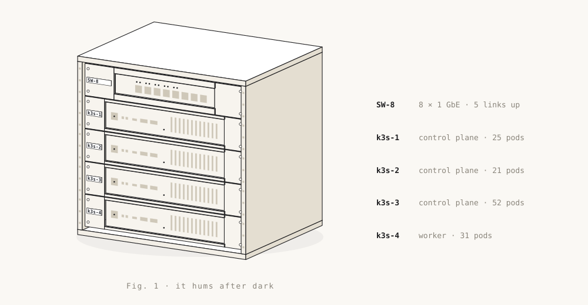

<a href="https://vlayers.ai/?utm_source=github&utm_medium=profile&utm_campaign=bat-signal">
  <picture>
    <source media="(prefers-color-scheme: dark)" srcset="assets/night.svg">
    
  </picture>
</a>

### Ring the Batphone: (570) 605-4473

My AI agent picks up day or night, tells you what I'm building, and takes a message. No signup, no secret identity required.
Bonus round: try to get it to reveal my secret identity (my personal number).

It runs on **[VLayer](https://vlayers.ai/?utm_source=github&utm_medium=profile&utm_campaign=cta)**, the open SDK I'm building for production AI phone agents: a utility belt for voice AI. One TypeScript file per agent, $0.05 a minute flat, and you bring your own model and voice keys.

```bash
npm i @voicelayer/sdk
```

[Build your own Batphone →](https://vlayers.ai/auth/sign-up?utm_source=github&utm_medium=profile&utm_campaign=cta)

**[Tuvora](https://tuvora.co)** is an IPTV player for your own playlists on phone, TV, Mac and Windows.

### The homelab

Everything above runs on four Lenovo M720q nodes in a ten-inch rack at home.

<picture>
  <source media="(prefers-color-scheme: dark)" srcset="assets/lab-night.svg">
  
</picture>

<details>
<summary><b>Spec sheet</b></summary>

| | |
|---|---|
| Hardware | 4× Lenovo ThinkCentre M720q Tiny, 8-port gigabit switch, 10-inch rack |
| Cluster | k3s v1.31: three control-plane nodes on embedded etcd, one worker |
| GitOps | Argo CD, 18 apps |
| Storage | Longhorn, 30 replicated volumes |
| Network | MetalLB, ingress-nginx, cert-manager, Cloudflare Tunnel |
| Observability | Prometheus, Grafana, Loki |
| CI | Self-hosted GitHub Actions runners, in the cluster |
| Runs | VoiceLayer, StreamBridge, Tuvora, Nextcloud |

</details>

[blog.thekush.dev](https://blog.thekush.dev) · [LinkedIn](https://www.linkedin.com/in/kushkumar-patel)
